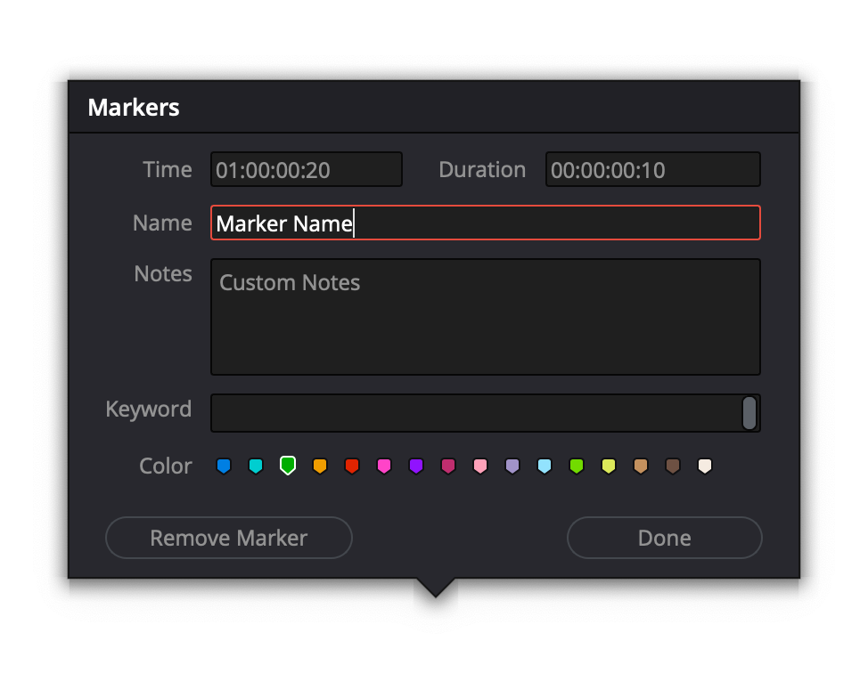

Basic Resolve API
=================

| Some commonly used API functions are described below (*). 
| As with the resolve object, each object is inspectable for properties and functions.

..  important:: 

    You must import the necessary modules in your script to get the Resolve app. 

    ``from python_get_resolve import GetResolve``

    ``resolve = GetResolve()``

Resolve
-------

Fusion()
^^^^^^^^

..  topic:: Description

	  Returns the Fusion object. Starting point for Fusion scripts.

    **Type:** Fusion

GetMediaStorage()
^^^^^^^^^^^^^^^^^

..  topic:: Description

	  Returns the media storage object to query and act on media locations.

    **Type:** MediaStorage

..  code-block:: python

    media_storage = resolve.GetMediaStorage()

GetProjectManager()
^^^^^^^^^^^^^^^^^^^

..  topic:: Description

	  Returns the project manager object for currently open database.

    **Type:** ProjectManager

..  code-block:: python

    project_manager = resolve.GetProjectManager()

OpenPage(pageName)
^^^^^^^^^^^^^^^^^^

..  topic:: Description

    Switches to indicated page in DaVinci Resolve. 
    Input can be one of:

    * "media"
    * "cut"
    * "edit"
    * "fusion"
    * "color"
    * "fairlight"
    * "deliver"

    **Type:** Bool

..  code-block:: python

    project_manager = resolve.OpenPage("edit")

GetCurrentPage()
^^^^^^^^^^^^^^^^
..  topic:: Description
    
    Returns the page currently displayed in the main window. Returned value can be one of:

    * "media"
    * "cut"
    * "edit"
    * "fusion"
    * "color"
    * "fairlight"
    * "deliver"
    * None

    **Type:** String

..  code-block:: python

    current_page = resolve.GetCurrentPage()

GetProductName()
^^^^^^^^^^^^^^^^

..  topic:: Description

    Returns product name.

    **Type:** String

..  code-block:: python

    product_name = resolve.GetProductName()

GetVersion()
^^^^^^^^^^^^

..  topic:: Description

    Returns list of product version fields in [major, minor, patch, build, suffix] format.

    **Type:** [version fields]

..  code-block:: python

    version = resolve.GetVersion()

GetVersionString()  
^^^^^^^^^^^^^^^^^^

..  topic:: Description

	Returns product version in "major.minor.patch[suffix].build" format. 

    **Type:** string

..  code-block:: python

    version = resolve.GetVersionString()

LoadLayoutPreset(presetName) 
^^^^^^^^^^^^^^^^^^^^^^^^^^^^

..  topic:: Description

    Loads UI layout from saved preset named 'presetName'. 

    **Type:** Bool 

..  code-block:: python

    resolve.LoadLayoutPreset('Custom Preset') 

UpdateLayoutPreset(presetName)
^^^^^^^^^^^^^^^^^^^^^^^^^^^^^^

..  topic:: Description

    Overwrites preset named 'presetName' with current UI layout. 

    **Type:** Bool

..  code-block:: python

    resolve.UpdateLayoutPreset('Custom Preset') 

ExportLayoutPreset(presetName, presetFilePath)
^^^^^^^^^^^^^^^^^^^^^^^^^^^^^^^^^^^^^^^^^^^^^^

..  topic:: Description

    Exports preset named 'presetName' to path 'presetFilePath'. 

    ``presetName must exist to work``

**Type:** Bool

..  code-block:: python

    resolve.ExportLayoutPreset('Custom Preset', '/Users/admin/Desktop/Custom.preset') 
    

DeleteLayoutPreset(presetName)
^^^^^^^^^^^^^^^^^^^^^^^^^^^^^^

..  topic:: Description

	  Deletes preset named 'presetName'. 

**Type:** Bool

..  code-block:: python

    resolve.DeleteLayoutPreset('Custom Preset') 

SaveLayoutPreset(presetName)
^^^^^^^^^^^^^^^^^^^^^^^^^^^^

..  topic:: Description

	  Saves current UI layout as a preset named 'presetName'. 

**Type:** Bool

..  code-block:: python

    resolve.SaveLayoutPreset('Custom Preset') 

ImportLayoutPreset(presetFilePath, presetName)
^^^^^^^^^^^^^^^^^^^^^^^^^^^^^^^^^^^^^^^^^^^^^^

..  topic:: Description

	  Imports preset from path 'presetFilePath'. The optional argument 'presetName' specifies how the preset shall be named. If not specified, the preset is named based on the filename. 

**Type:** Bool

..  code-block:: python

    resolve.ImportLayoutPreset('/Users/admin/Desktop/Custom.preset', 'Custom Preset') 
    

Quit()     
^^^^^^

..  topic:: Description

	  Quits the Resolve App. 

    **Type:** None

..  code-block:: python

    resolve.Quit() 

ProjectManager
--------------

..  note:: projectManager = resolve.GetProjectManager()

CreateProject(projectName)
^^^^^^^^^^^^^^^^^^^^^^^^^^

..  topic:: Description

    Creates and returns a project if projectName (string) is unique, and None if it is not.
    
    **Returns** Project            

..  code-block:: python

    projectManager.CreateProject('New Project') 

DeleteProject(projectName)                      
^^^^^^^^^^^^^^^^^^^^^^^^^^

..  topic:: Description

    Delete project in the current folder if not currently loaded

    **Returns** Bool   

..  code-block:: python

    projectManager.DeleteProject('New Project') 

LoadProject(projectName)
^^^^^^^^^^^^^^^^^^^^^^^^

..  topic:: Description
    
    Loads and returns the project with name = projectName (string) if there is a match found, and None if there is no matching Project.

    **Returns** Project

..  code-block:: python

    projectManager.LoadProject('New Project') 

GetCurrentProject()
^^^^^^^^^^^^^^^^^^^

..  topic:: Description

    Returns the currently loaded Resolve project.

    **Returns** Project

..  code-block:: python

    currentProject = projectManager.GetCurrentProject()

SaveProject()
^^^^^^^^^^^^^

..  topic:: Description

    Saves the currently loaded project with its own name. Returns True if successful.

    **Returns** Bool
    
..  code-block:: python

    projectManager.SaveProject()
    

CloseProject(project)
^^^^^^^^^^^^^^^^^^^^^

..  topic:: Description

    Closes the specified project without saving.

    **Returns** Bool 

..  code-block:: python

    projectManager.CloseProject('Project01')

CreateFolder(folderName)
^^^^^^^^^^^^^^^^^^^^^^^^

..  topic:: Description

    Creates a folder if folderName (string) is unique.

    **Returns** Bool  

..  code-block:: python

    projectManager.CreateFolder('My Folder')

DeleteFolder(folderName)
^^^^^^^^^^^^^^^^^^^^^^^^

..  topic:: Description

    Deletes the specified folder if it exists. Returns True in case of success.

    **Returns** Bool

..  code-block:: python

    projectManager.DeleteFolder('My Folder')

GetProjectListInCurrentFolder()
^^^^^^^^^^^^^^^^^^^^^^^^^^^^^^^

..  topic:: Description

    Returns a list of project names in current folder.

    **Returns** [project names...]

..  code-block:: python

    project_list = projectManager.GetProjectListInCurrentFolder()

GetFolderListInCurrentFolder()
^^^^^^^^^^^^^^^^^^^^^^^^^^^^^^

..  topic:: Description

    Returns a list of folder names in current folder.

    **Returns** [folder names...]

..  code-block:: python

    folder_list = projectManager.GetFolderListInCurrentFolder()

GotoRootFolder()
^^^^^^^^^^^^^^^^
                                            
..  topic:: Description

    Opens root folder in database.

    **Returns** Bool

..  code-block:: python

    projectManager.GotoRootFolder()

GotoParentFolder()
^^^^^^^^^^^^^^^^^^
                                        
..  topic:: Description

    Opens parent folder of current folder in database if current folder has parent.

    **Returns** Bool

..  code-block:: python

    projectManager.GotoParentFolder()

GetCurrentFolder()
^^^^^^^^^^^^^^^^^^
..  topic:: Description

    Returns the current folder name.

    **Returns** string

..  code-block:: python

    current_folder = projectManager.GetCurrentFolder()

OpenFolder(folderName)
^^^^^^^^^^^^^^^^^^^^^^
..  topic:: Description

    Opens folder under given name.

    **Returns** Bool  

..  code-block:: python

    projectManager.OpenFolder('My Folder')

ImportProject(filePath)
^^^^^^^^^^^^^^^^^^^^^^^
                                      
..  topic:: Description

    Imports a project from the file path provided. Returns True if successful.

    **Returns** Bool

..  code-block:: python

    projectManager.ImportProject('/Users/admin/Desktop/project.drp')

ExportProject(projectName, filePath, withStillsAndLUTs=True)
^^^^^^^^^^^^^^^^^^^^^^^^^^^^^^^^^^^^^^^^^^^^^^^^^^^^^^^^^^^^

..  topic:: Description

    Exports project to provided file path, including stills and LUTs if withStillsAndLUTs is True (enabled by default). Returns True in case of success.

    **Returns** Bool  

..  code-block:: python

    projectManager.ExportProject('my_project', '/Users/admin/Desktop/my_project.drp', withStillsAndLUTs=True)

RestoreProject(filePath)
^^^^^^^^^^^^^^^^^^^^^^^^

..  topic:: Description

    Restores a project from the file path provided. Returns True if successful.

    **Returns** Bool

..  code-block:: python

    projectManager.RestoreProject('/Users/admin/Desktop/my_project.drp')

GetCurrentDatabase()
^^^^^^^^^^^^^^^^^^^^
                                      
..  topic:: Description

    Returns a dictionary (with keys 'DbType', 'DbName' and optional 'IpAddress') corresponding to the current database connection

    **Returns** {dbInfo} 

..  code-block:: python

    current_db = projectManager.GetCurrentDatabase()
    

GetDatabaseList()
^^^^^^^^^^^^^^^^^

..  topic:: Description

    Returns a list of dictionary items (with keys 'DbType', 'DbName' and optional 'IpAddress') corresponding to all the databases added to Resolve

    **Returns** [{dbInfo}]  

..  code-block:: python

    current_db = projectManager.GetCurrentDatabase()

SetCurrentDatabase({dbInfo})
^^^^^^^^^^^^^^^^^^^^^^^^^^^^

..  topic:: Description

    Switches current database connection to the database specified by the keys below, and closes any open project.

    * **'DbType':** 'Disk' or 'PostgreSQL' (string)
    * **'DbName':** database name (string)
    * **'IpAddress':** IP address of the PostgreSQL server (string, optional key - defaults to '127.0.0.1')

    **Returns** Bool

..  code-block:: python

    projectManager.SetCurrentDatabase({'DbType':'PostgreSQL','DbName':'my_db_name', 'IpAddress': '127.0.0.1'})

Project
-------

..  note::  currentProject = projectManager.GetCurrentProject()

GetMediaPool()
^^^^^^^^^^^^^^
   
..  topic:: Description

    Returns the Media Pool object.

    **Returns** MediaPool

..  code-block:: python

    media_pool = currentProject.GetMediaPool()

GetTimelineCount()
^^^^^^^^^^^^^^^^^^

..  topic:: Description

    Returns the number of timelines currently present in the project.

    **Returns** int

..  code-block:: python

    timeline_count = currentProject.GetTimelineCount()

GetTimelineByIndex(idx) 
^^^^^^^^^^^^^^^^^^^^^^^
                                   
..  topic:: Description

    Returns timeline at the given index, 1 <= idx <= project.GetTimelineCount()

    **Returns** Timeline

..  code-block:: python

    timeline = currentProject.GetTimelineByIndex(1)

GetCurrentTimeline()   
^^^^^^^^^^^^^^^^^^^^
                                   
..  topic:: Description

    Returns the currently loaded timeline.

    **Returns** Timeline  

..  code-block:: python

    current_timeline = currentProject.GetCurrentTimeline()

SetCurrentTimeline(timeline)
^^^^^^^^^^^^^^^^^^^^^^^^^^^^
                                   
..  topic:: Description

    Sets given timeline as current timeline for the project. Returns True if successful.

    **Returns** Bool

GetGallery()                                                
^^^^^^^^^^^^

..  topic:: Description

    Returns the Gallery object.

    **Returns** Gallery

..  code-block:: python

    gallery = currentProject.GetGallery()

GetName()
^^^^^^^^^

..  topic:: Description

    Returns project name.

    **Returns** string

..  code-block:: python

    project_name = currentProject.GetName()

SetName(projectName)                                           
^^^^^^^^^^^^^^^^^^^^

..  topic:: Description

    Sets project name if given projectname (string) is unique.

    **Returns** Bool

..  code-block:: python

    currentProject.SetName('New Name')

GetPresetList()
^^^^^^^^^^^^^^^

..  topic:: Description

    Returns a list of presets and their information.

    **Returns** [presets...]  

..  code-block:: python

    preset_list = currentProject.GetPresetList()
     

SetPreset(presetName)                                        
^^^^^^^^^^^^^^^^^^^^^

..  topic:: Description

    Sets preset by given presetName (string) into project.

    **Returns** Bool  

AddRenderJob()
^^^^^^^^^^^^^^

..  topic:: Description

    Adds a render job based on current render settings to the render queue. 
    Returns a unique job id (string) for the new render job.

    **Returns** string  

..  code-block:: python

    render_job_id = currentProject.AddRenderJob()
     

DeleteRenderJob(jobId)                                      
^^^^^^^^^^^^^^^^^^^^^^

..  topic:: Description

    Deletes render job for input job id (string).

    **Returns** Bool  

..  code-block:: python

    render_job_id = currentProject.DeleteRenderJob('9dcfee97-7faf-4026-ac90-1a68480b5ca3')

DeleteAllRenderJobs()
^^^^^^^^^^^^^^^^^^^^^

..  topic:: Description

    Deletes all render jobs in the queue.

    **Returns** Bool 

..  code-block:: python

    currentProject.DeleteAllRenderJobs()

GetRenderJobList()                              
^^^^^^^^^^^^^^^^^^

..  topic:: Description

    Returns a list of render jobs and their information.

    **Returns** [render jobs...]   

..  code-block:: python

    renderjob_list = currentProject.GetRenderJobList()

GetRenderPresetList()
^^^^^^^^^^^^^^^^^^^^^

..  topic:: Description

    Returns a list of render presets and their information.

    **Returns** [presets...]

..  code-block:: python

    renderpreset_list = currentProject.GetRenderPresetList()

StartRendering(jobId1, jobId2, ...)                        
^^^^^^^^^^^^^^^^^^^^^^^^^^^^^^^^^^^

..  topic:: Description

    Starts rendering jobs indicated by the input job ids.

    **Returns** Bool    

..  code-block:: python

    currentProject.StartRendering('9dcfee97-7faf-4026-ac90-1a68480b5ca3', '4fcfea93-3faf-4023-ac88-2a68480c5dd6')

StartRendering([jobIds...], isInteractiveMode=False)    
^^^^^^^^^^^^^^^^^^^^^^^^^^^^^^^^^^^^^^^^^^^^^^^^^^^^

..  topic:: Description

    Starts rendering jobs indicated by the input job ids.

    **Returns** Bool       
                                                                      
..  note:: 

    The optional "isInteractiveMode", when set, enables error feedback in the UI during rendering.

..  code-block:: python

    currentProject.StartRendering(['9dcfee97-7faf-4026-ac90-1a68480b5ca3', '4fcfea93-3faf-4023-ac88-2a68480c5dd6'], isInteractiveMode = False)

StartRendering(isInteractiveMode=False)
^^^^^^^^^^^^^^^^^^^^^^^^^^^^^^^^^^^^^^^

..  topic:: Description

    Starts rendering all queued render jobs. 

    **Returns** Bool

..  note:: 

    The optional "isInteractiveMode", when set, enables error feedback in the UI during rendering.

..  code-block:: python

    currentProject.StartRendering(isInteractiveMode = True)

StopRendering()
^^^^^^^^^^^^^^^
                                                
..  topic:: Description

    Stops any current render processes.

    **Returns** None

..  code-block:: python

    currentProject.StopRendering()

IsRenderingInProgress()
^^^^^^^^^^^^^^^^^^^^^^^

..  topic:: Description

    Returns True if rendering is in progress.

    **Returns** Bool

..  code-block:: python

    if currentProject.IsRenderingInProgress():
        print('Render in progress')
    else:
        print('Nothing is rendering')

LoadRenderPreset(presetName)
^^^^^^^^^^^^^^^^^^^^^^^^^^^^

..  topic:: Description

    Sets a preset as current preset for rendering if presetName (string) exists.

    **Returns** Bool

..  code-block:: python

    currentProject.LoadRenderPreset('My preset')

SaveAsNewRenderPreset(presetName)

..  topic:: Description

    Creates new render preset by given name if presetName(string) is unique.

    **Returns** Bool

..  code-block:: python

    currentProject.SaveAsNewRenderPreset('My preset')

SetRenderSettings({settings})
^^^^^^^^^^^^^^^^^^^^^^^^^^^^^

..  topic:: Description

    Sets given settings for rendering. Settings is a dict, with support for the keys:

    **Returns** Bool
                                                                        
    Refer to :doc:`"Looking up render settings" for more information <../API_render>` section for information for supported settings

..  code-block:: python

    currentProject.SetRenderSettings({"SelectAllFrames": True, "CustomName": 'My_Movie.mov', "ExportVideo": True, "ExportAudio": True, "FormatWidth": 1920, "FormatHeight": 1080, "FrameRate": 23.976)})

GetRenderJobStatus(jobId)
^^^^^^^^^^^^^^^^^^^^^^^^^

..  topic:: Description

    Returns a dict with job status and completion percentage of the job by given jobId (string).

    **Returns** {status info}

..  code-block:: python

    job01_status = currentProject.GetRenderJobStatus('9dcfee97-7faf-4026-ac90-1a68480b5ca3')

GetSetting(settingName)
^^^^^^^^^^^^^^^^^^^^^^^

..  topic:: Description

    Returns value of project setting (indicated by settingName, string). 
    :doc:`Check the Project and Clip properties <../API_project_clip>` section for information

    **Returns** string

..  code-block:: python

    currentProject.GetSetting(settingName)

SetSetting(settingName, settingValue)
^^^^^^^^^^^^^^^^^^^^^^^^^^^^^^^^^^^^^

..  topic:: Description

    Sets the project setting (indicated by settingName, string) to the value (settingValue, string). 
    :doc:`Check the Project and Clip properties <../API_project_clip>` section for information

    **Returns** Bool

..  code-block:: python

    currentProject.SetSetting(settingName, settingValue)

GetRenderFormats()
^^^^^^^^^^^^^^^^^^

..  topic:: Description

    Returns a dict (format -> file extension) of available render formats.

    **Returns** {render formats..}

..  code-block:: python

    render_formats = currentProject.GetRenderFormats()
    '''
    {'AVI': 'avi', 'BRAW': 'braw', 'Cineon': 'cin', 'DCP': 'dcp',
     'DPX': 'dpx', 'EXR': 'exr', 'IMF': 'imf', 'JPEG 2000': 'j2c',
      'MJ2': 'mj2', 'MKV': 'mkv', 'MP4': 'mp4', 'MTS': 'mts', 
      'MXF OP-Atom': 'mxf', 'MXF OP1A': 'mxf_op1a', 'Panasonic AVC': 'pavc',
       'QuickTime': 'mov', 'TIFF': 'tif', 'Wave': 'wav'}
    '''

GetRenderCodecs(renderFormat)
^^^^^^^^^^^^^^^^^^^^^^^^^^^^^

..  topic:: Description

    Returns a dict (codec description -> codec name) of available codecs for given render format (string).

    **Returns** {render codecs...}
    
..  code-block:: python

    render_codecs = currentProject.GetRenderCodecs('MP4')
    #{'H.264': 'H264', 'H.265': 'H265'}

GetCurrentRenderFormatAndCodec()
^^^^^^^^^^^^^^^^^^^^^^^^^^^^^^^^

..  topic:: Description

    Returns a dict with currently selected format 'format' and render codec 'codec'.

    **Returns** {format, codec}   

..  code-block:: python

    render_format_codecs = currentProject.GetCurrentRenderFormatAndCodec()
    #{'format': 'mov', 'codec': 'ProRes422'}

SetCurrentRenderFormatAndCodec(format, codec)                  
^^^^^^^^^^^^^^^^^^^^^^^^^^^^^^^^^^^^^^^^^^^^^

..  topic:: Description

    Sets given render format (string) and render codec (string) as options for rendering.

    **Returns** Bool

..  code-block:: python

    currentProject.SetCurrentRenderFormatAndCodec('mov', 'ProRes422')

GetCurrentRenderMode()
^^^^^^^^^^^^^^^^^^^^^^

..  topic:: Description

    Returns the render mode: 0 - Individual clips, 1 - Single clip.

    **Returns** int    

..  code-block:: python

    currentProject.GetCurrentRenderMode()

SetCurrentRenderMode(renderMode)
^^^^^^^^^^^^^^^^^^^^^^^^^^^^^^^^

..  topic:: Description

    Sets the render mode. Specify renderMode = 0 for Individual clips, 1 for Single clip.

    **Returns** Bool 

..  code-block:: python

    currentProject.SetCurrentRenderMode(1)

GetRenderResolutions(format, codec)
^^^^^^^^^^^^^^^^^^^^^^^^^^^^^^^^^^^

..  topic:: Description

    Returns list of resolutions applicable for the given render format (string) and render codec (string). 
    
    Returns full list of resolutions if no argument is provided. Each element in the list is a dictionary with 2 keys "Width" and "Height".

    **Returns** [{Resolution}]

..  code-block:: python

    resolution = currentProject.GetRenderResolutions('mov', 'ProRes422')
    '''
    [{'Width': 720, 'Height': 480}, {'Width': 720, 'Height': 486}, {'Width': 720, 'Height': 576}, 
    {'Width': 1280, 'Height': 720}, {'Width': 1280, 'Height': 1080}, {'Width': 1920, 'Height': 1080}, 
    {'Width': 3840, 'Height': 2160}, {'Width': 7680, 'Height': 4320}, {'Width': 1828, 'Height': 1332}, 
    {'Width': 1828, 'Height': 1556}, {'Width': 1998, 'Height': 1080}, {'Width': 2048, 'Height': 858}, 
    {'Width': 2048, 'Height': 1080}, {'Width': 2048, 'Height': 1152}, {'Width': 2048, 'Height': 1556}, 
    {'Width': 3072, 'Height': 2048}, {'Width': 3654, 'Height': 2664}, {'Width': 3656, 'Height': 3112}, 
    {'Width': 3996, 'Height': 2160}, {'Width': 4096, 'Height': 1716}, {'Width': 4096, 'Height': 2160}, 
    {'Width': 4096, 'Height': 3112}]
    '''

RefreshLUTList()
^^^^^^^^^^^^^^^^

..  topic:: Description

    Refreshes LUT List

    **Returns** Bool 

..  code-block:: python

    currentProject.RefreshLUTList()

MediaStorage
------------

..  note:: media_storage = resolve.GetMediaStorage()

    
GetMountedVolumeList()
^^^^^^^^^^^^^^^^^^^^^^
                                 
..  topic:: Description

    Returns list of folder paths corresponding to mounted volumes displayed in Resolve's Media Storage.

    **Returns** [paths...]  

..  code-block:: python

    mounted_volumes = media_storage.GetMountedVolumeList()
    #['/Users/admin/Movies/DaVinci Resolve Studio', '/Volumes/Macintosh HD']

GetSubFolderList(folderPath)
^^^^^^^^^^^^^^^^^^^^^^^^^^^^

..  topic:: Description

    Returns list of folder paths in the given absolute folder path.

    **Returns** [paths...]  

..  code-block:: python

    subfolders = media_storage.GetSubFolderList('/Volumes/Macintosh HD')
    #['/Volumes/Macintosh HD/Applications', '/Volumes/Macintosh HD/Library', '/Volumes/Macintosh HD/System', '/Volumes/Macintosh HD/Users']

GetFileList(folderPath)                                 
^^^^^^^^^^^^^^^^^^^^^^^
..  topic:: Description

    Returns list of media and file listings in the given absolute folder path. 
    Note that media listings may be logically consolidated entries.

    **Returns** [paths...] 

..  code-block:: python

    file_list = media_storage.GetFileList('/Volumes/Macintosh HD/Users/admin/Movies/')

RevealInStorage(path)
^^^^^^^^^^^^^^^^^^^^^

..  topic:: Description

    Expands and displays given file/folder path in Resolve’s Media Storage.

    **Returns** Bool 

..  code-block:: python

    media_storage.RevealInStorage('/Volumes/Macintosh HD/Users/admin/Desktop')

AddItemListToMediaPool(item1, item2, ...)
^^^^^^^^^^^^^^^^^^^^^^^^^^^^^^^^^^^^^^^^^

..  topic:: Description

    Adds specified file/folder paths from Media Storage into current Media Pool folder. 
    Input is one or more file/folder paths. Returns a list of the MediaPoolItems created.

    **Returns** [clips...]

..  code-block:: python

    clips_added = media_storage.AddItemListToMediaPool('/Volumes/Macintosh HD/Users/admin/Desktop', '/Volumes/Macintosh HD/Users/admin/Movies')
    #[<PyRemoteObject object at 0x7fa28007a7f8>, <PyRemoteObject object at 0x7fa28007a9d8>, <PyRemoteObject object at 0x7fa28007ad98>]

AddItemListToMediaPool([items...])
^^^^^^^^^^^^^^^^^^^^^^^^^^^^^^^^^^

..  topic:: Description

    Adds specified file/folder paths from Media Storage into current Media Pool folder. Input is an array of file/folder paths. 
    Returns a list of the MediaPoolItems created.

    **Returns** [clips...]

..  code-block:: python

    clips_added = media_storage.AddItemListToMediaPool(['/Volumes/Macintosh HD/Users/admin/Desktop', '/Volumes/Macintosh HD/Users/admin/Movies'])
    #[<PyRemoteObject object at 0x7fa28007a7f8>, <PyRemoteObject object at 0x7fa28007a9d8>, <PyRemoteObject object at 0x7fa28007ad98>]

AddClipMattesToMediaPool(MediaPoolItem, [paths], stereoEye)
^^^^^^^^^^^^^^^^^^^^^^^^^^^^^^^^^^^^^^^^^^^^^^^^^^^^^^^^^^^

..  topic:: Description

    Adds specified media files as mattes for the specified MediaPoolItem. 
    StereoEye is an optional argument for specifying which eye to add the matte to for stereo clips ("left" or "right"). Returns True if successful.

    **Returns** Bool

..  note:: Not tested yet

    media_storage.AddClipMattesToMediaPool(MediaPoolItem, ['/Volumes/Macintosh HD/Users/admin/Movies/lefteye.mov'], "left")
    media_storage.AddClipMattesToMediaPool(MediaPoolItem, ['/Volumes/Macintosh HD/Users/admin/Movies/righteye.mov'], "right")

AddTimelineMattesToMediaPool([paths])             
^^^^^^^^^^^^^^^^^^^^^^^^^^^^^^^^^^^^^

..  topic:: Description

    Adds specified media files as timeline mattes in current media pool folder. Returns a list of created MediaPoolItems.

    **Returns** [MediaPoolItems] 

..  note:: Not tested yet

    media_storage.AddTimelineMattesToMediaPool([''/Volumes/Macintosh HD/Users/admin/Movies/lefteye.mov', '/Volumes/Macintosh HD/Users/admin/Movies/righteye.mov'])

MediaPool
---------

..  note::  media_pool = currentProject.GetMediaPool()

GetRootFolder()
^^^^^^^^^^^^^^^
                                              
..  topic:: Description

    Returns root Folder of Media Pool
    
    **Returns** Folder

..  code-block:: python

    root_folder = media_pool.GetRootFolder()
    #Folder (0x0x600017cec380) [App: 'Resolve' on 127.0.0.1, UUID: 3923b295-9579-4657-be42-33b4f4594a93]

AddSubFolder(folder, name)
^^^^^^^^^^^^^^^^^^^^^^^^^^
                                   
..  topic:: Description

    Adds new subfolder under specified Folder object with the given name.

    **Returns** Folder

..  code-block:: python

    root_folder = media_pool.GetRootFolder()
    media_pool.AddSubFolder(root_folder, 'New_Sub01')
    #New subfolder 'New_Sub01' at Root level in the MediaPool

CreateEmptyTimeline(name)                                  
^^^^^^^^^^^^^^^^^^^^^^^^^

..  topic:: Description

    Adds new timeline with given name.

    **Returns** Timeline

..  code-block:: python

    media_pool.CreateEmptyTimeline('New Timeline')

AppendToTimeline(clip1, clip2, ...)
^^^^^^^^^^^^^^^^^^^^^^^^^^^^^^^^^^^
                
..  topic:: Description

    Appends specified MediaPoolItem objects in the current timeline. Returns the list of appended timelineItems.

    **Returns** [TimelineItem]
    
..  code-block:: python

    root_folder = media_pool.GetRootFolder()
    clip_list = root_folder.GetClipList()
    media_pool.AppendToTimeline(clip_list[0], clip_list[1])
    #append the first 2 clips from root folder to the current timeline

AppendToTimeline([clips])                            
^^^^^^^^^^^^^^^^^^^^^^^^^

..  topic:: Description

    Appends specified MediaPoolItem objects in the current timeline. Returns the list of appended timelineItems.

    **Returns** [TimelineItem]

..  code-block:: python

    root_folder = media_pool.GetRootFolder()
    clip_list = root_folder.GetClipList()
    media_pool.AppendToTimeline([clip_list[0], clip_list[1]])
    #append the first 2 clips from root folder to the current timeline

AppendToTimeline([{clipInfo}, ...])
^^^^^^^^^^^^^^^^^^^^^^^^^^^^^^^^^^^
                 
..  topic:: Description

    Appends list of clipInfos specified as dict:
    
    * "mediaPoolItem"
    * "startFrame" (int)
    * "endFrame" (int)
    * (optional) "mediaType" (int; 1 - Video only, 2 - Audio only)
  
    Returns the list of appended timelineItems.

    **Returns** [TimelineItem]
    
..  code-block:: python

    root_folder = media_pool.GetRootFolder()
    clip_list = root_folder.GetClipList()
    media_pool.AppendToTimeline([{"mediaPoolItem":clip_list[0], "startFrame": 0, "endFrame": 10, "mediaType": 2}])
    #appends the first clip from root folder, frames 0 to 10, only audio. 

CreateTimelineFromClips(name, clip1, clip2,...)
^^^^^^^^^^^^^^^^^^^^^^^^^^^^^^^^^^^^^^^^^^^^^^^
            
..  topic:: Description

    Creates new timeline with specified name, and appends the specified MediaPoolItem objects.

    **Returns** Timeline

..  code-block:: python

    root_folder = media_pool.GetRootFolder()
    clip_list = root_folder.GetClipList()
    media_pool.CreateTimelineFromClips('My Amazing Timeline', clip_list[0], clip_list[1])
    #create a timeline named 'My Amazing Timeline' with first 2 clips from root folder

CreateTimelineFromClips(name, [clips])
^^^^^^^^^^^^^^^^^^^^^^^^^^^^^^^^^^^^^^

..  topic:: Description

    Creates new timeline with specified name, and appends the specified MediaPoolItem objects.

    **Returns** Timeline 

..  code-block:: python

    root_folder = media_pool.GetRootFolder()
    clip_list = root_folder.GetClipList()
    media_pool.CreateTimelineFromClips('My Amazing Timeline', [clip_list[0], clip_list[1]])
    #create a timeline named 'My Amazing Timeline' with first 2 clips from root folder

CreateTimelineFromClips(name, [{clipInfo}])
^^^^^^^^^^^^^^^^^^^^^^^^^^^^^^^^^^^^^^^^^^^

..  topic:: Description

    Creates new timeline with specified name, appending the list of clipInfos specified as a dict of "mediaPoolItem", "startFrame" (int), "endFrame" (int).

    **Returns** Timeline

..  code-block:: python

    root_folder = media_pool.GetRootFolder()
    clip_list = root_folder.GetClipList()
    media_pool.CreateTimelineFromClips('My Amazing Timeline', [{"mediaPoolItem":clip_list[0], "startFrame": 0, "endFrame": 10}, {"mediaPoolItem":clip_list[1], "startFrame": 0, "endFrame": 10}])
    #create a timeline named 'My Amazing Timeline' with first 2 clips, first 10 frames, from root folder

ImportTimelineFromFile(filePath, {importOptions}) 
^^^^^^^^^^^^^^^^^^^^^^^^^^^^^^^^^^^^^^^^^^^^^^^^^

..  topic:: Description

    Creates timeline based on parameters within given file and optional importOptions dict, with support for the keys:
                                                                          
    * "timelineName": string, specifies the name of the timeline to be created
    * "importSourceClips": Bool, specifies whether source clips should be imported, True by default
    * "sourceClipsPath": string, specifies a filesystem path to search for source clips if the media is inaccessible in their original path and if "importSourceClips" is True
    * "sourceClipsFolders": List of Media Pool folder objects to search for source clips if the media is not present in current folder and if "importSourceClips" is False
    * "interlaceProcessing": Bool, specifies whether to enable interlace processing on the imported timeline being created. valid only for AAF import

    **Returns** Timeline

..  code-block:: python

    root_folder = media_pool.GetRootFolder()
    media_pool.ImportTimelineFromFile('/Users/admin/Desktop/exported_timeline.aaf', {"timelineName": 'NewImport Timeline'})

DeleteTimelines([timeline])
^^^^^^^^^^^^^^^^^^^^^^^^^^^

..  topic:: Description

    Deletes specified timelines in the media pool.

    **Returns** Bool 

..  code-block:: python

    first_timeline =  currentProject.GetTimelineByIndex(1)
    second_timeline = currentProject.GetTimelineByIndex(2)

    media_pool.DeleteTimelines([first_timeline, second_timeline])

GetCurrentFolder()
^^^^^^^^^^^^^^^^^^

..  topic:: Description

    Returns currently selected Folder.

    **Returns** Folder

..  code-block:: python

    curent_folder = media_pool.GetCurrentFolder()
    #Folder (0x0x600017cec380) [App: 'Resolve' on 127.0.0.1, UUID: 3723b295-9579-4657-be42-33b4f4594a93]

SetCurrentFolder(Folder)
^^^^^^^^^^^^^^^^^^^^^^^^

..  topic:: Description

    Sets current folder by given Folder.
    
    **Returns** Bool

..  code-block:: python

    root_folder = media_pool.GetRootFolder()
    folder_list = root_folder.GetSubFolderList()

    media_pool.SetCurrentFolder(folder_list[0])

DeleteClips([clips])
^^^^^^^^^^^^^^^^^^^^

..  topic:: Description

    Deletes specified clips or timeline mattes in the media pool

    **Returns** Bool

..  code-block:: python

    root_folder = media_pool.GetRootFolder()
    clip_list = root_folder.GetClipList()
    media_pool.DeleteClips([clip_list[0], clip_list[1]])
    #deletes the first 2 clips in the root folder

DeleteFolders([subfolders])
^^^^^^^^^^^^^^^^^^^^^^^^^^^

..  topic:: Description

    Deletes specified subfolders in the media pool

    **Returns** Bool

..  code-block:: python

    root_folder = media_pool.GetRootFolder()
    folder_list = root_folder.GetSubFolderList()
    media_pool.DeleteFolders([folder_list[0], folder_list[1]])
    #deletes the first 2 subfolders of the root folder

MoveClips([clips], targetFolder)
^^^^^^^^^^^^^^^^^^^^^^^^^^^^^^^^

..  topic:: Description

    Moves specified clips to target folder.

    **Returns** Bool

..  code-block:: python

    root_folder = media_pool.GetRootFolder()
    folder_list = root_folder.GetSubFolderList()
    clip_list = root_folder.GetClipList()
    media_pool.MoveClips([clip_list[0], clip_list[1]], folder_list[1])
    #moves the first 2 clips from Root folder to second subfolder

MoveFolders([folders], targetFolder)
^^^^^^^^^^^^^^^^^^^^^^^^^^^^^^^^^^^^

..  topic:: Description

    Moves specified folders to target folder.

    **Returns** Bool

..  code-block:: python

    root_folder = media_pool.GetRootFolder()
    folder_list = root_folder.GetSubFolderList()
    subfolder02_content = folder_list[1].GetSubFolderList()
    media_pool.MoveFolders([subfolder02_content[0], subfolder02_content[1]], root_folder)
    #moves the first 2 folders of second's root subfolder to the root folder

GetClipMatteList(MediaPoolItem)                             
^^^^^^^^^^^^^^^^^^^^^^^^^^^^^^^

..  topic:: Description

    Get mattes for specified MediaPoolItem, as a list of paths to the matte files.

    **Returns** [paths]

..  code-block:: python

    root_folder = media_pool.GetRootFolder()
    folder_list = root_folder.GetSubFolderList()
    clip_list = root_folder.GetClipList()

    matte_list = media_pool.GetClipMatteList(clip_list[0])

GetTimelineMatteList(Folder)
^^^^^^^^^^^^^^^^^^^^^^^^^^^^

..  topic:: Description

    Get mattes in specified Folder, as list of MediaPoolItems.

    **Returns** [MediaPoolItems] 

..  code-block:: python

    root_folder = media_pool.GetRootFolder()
    matte_list_in_root = media_pool.GetTimelineMatteList(root_folder)

DeleteClipMattes(MediaPoolItem, [paths])
^^^^^^^^^^^^^^^^^^^^^^^^^^^^^^^^^^^^^^^^

..  topic:: Description

    Delete mattes based on their file paths, for specified MediaPoolItem. Returns True on success.

    **Returns** Bool

..  note:: Not tested yet

    root_folder = media_pool.GetRootFolder()
    first_timeline =  currentProject.GetTimelineByIndex(1)

    media_pool.DeleteClipMattes(first_timeline, ['/Users/admin/Desktop/matte.mov'])

RelinkClips([MediaPoolItem], folderPath)
^^^^^^^^^^^^^^^^^^^^^^^^^^^^^^^^^^^^^^^^

..  topic:: Description

    Update the folder location of specified media pool clips with the specified folder path.

    **Returns** Bool

..  code-block:: python

    root_folder = media_pool.GetRootFolder()
    clip_list = root_folder.GetClipList()

    media_pool.RelinkClips([clip_list[0], clip_list[1]], '/Users/admin/Movies/')
    #relink first 2 clips of root mediaPool to the specified folder path

UnlinkClips([MediaPoolItem])
^^^^^^^^^^^^^^^^^^^^^^^^^^^^

..  topic:: Description

    Unlink specified media pool clips.

    **Returns** Bool

..  code-block:: python

    root_folder = media_pool.GetRootFolder()
    clip_list = root_folder.GetClipList()

    media_pool.UnlinkClips([clip_list[0]])
    #unlink first clip of root mediaPool

ImportMedia([items...])
^^^^^^^^^^^^^^^^^^^^^^^

..  topic:: Description

    Imports specified file/folder paths into current Media Pool folder. Input is an array of file/folder paths. Returns a list of the MediaPoolItems created.

    **Returns** [MediaPoolItems] 

..  code-block:: python

    media_pool.ImportMedia(['/Users/admin/Movies/sample1.mov', '/Users/admin/Movies/sample2.mov'])
    #import clips in current media pool folder

ImportMedia([{clipInfo}])                          
^^^^^^^^^^^^^^^^^^^^^^^^^

..  topic:: Description

    Imports file path(s) into current Media Pool folder as specified in list of clipInfo dict. Returns a list of the MediaPoolItems created.
    Each clipInfo gets imported as one MediaPoolItem unless 'Show Individual Frames' is turned on.
    
    Example: ImportMedia([{"FilePath":"file_%03d.dpx", "StartIndex":1, "EndIndex":100}]) would import clip "file_[001-100].dpx".

    **Returns** [MediaPoolItems]              

..  code-block:: python

    dpx_sequence1 = {"FilePath":"file_%03d.dpx", "StartIndex":1, "EndIndex":100}
    media_pool.ImportMedia([dpx_sequence1])
    #import dpx sequence file_[001-100].dpx in current media pool folder

ExportMetadata(fileName, [clips])
^^^^^^^^^^^^^^^^^^^^^^^^^^^^^^^^^

..  topic:: Description

    Exports metadata of specified clips to 'fileName' in CSV format.
    If no clips are specified, all clips from media pool will be used.

    **Returns** Bool

..  code-block:: python

    root_folder = media_pool.GetRootFolder()
    clip_list = root_folder.GetClipList()
    media_pool.ExportMetadata('/Users/admin/Desktop/metadata.csv', [clip_list[0], clip_list[1]])
    #export CSV file on Desktop containing first 2 clips metadata

Folder
------

..  note::  curent_folder = media_pool.GetCurrentFolder()

GetClipList()
^^^^^^^^^^^^^

..  topic:: Description

    Returns a list of clips (items) within the folder.

    **Returns** [clips...]
    
..  code-block:: python

    root_folder = media_pool.GetRootFolder()
    clip_list = root_folder.GetClipList()
    #[<PyRemoteObject object at 0x7fe25807a930>, <PyRemoteObject object at 0x7fe25807a948>, <PyRemoteObject object at 0x7fe25807a960>]

GetName()
^^^^^^^^^

..  topic:: Description

    Returns the media folder name.

    **Returns** string

..  code-block:: python

    root_folder = media_pool.GetRootFolder()
    root_folder.GetName()
    #Master

GetSubFolderList()
^^^^^^^^^^^^^^^^^^

..  topic:: Description

    Returns a list of subfolders in the folder.

    **Returns** [folders...]

..  code-block:: python

    root_folder = media_pool.GetRootFolder()
    root_subfolders = root_folder.GetSubFolderList()
    #[<PyRemoteObject object at 0x7fef3007a828>, <PyRemoteObject object at 0x7fef3007a840>, <PyRemoteObject object at 0x7fef3007a858>, <PyRemoteObject object at 0x7fef3007a870>]

MediaPoolItem
-------------

GetName()
^^^^^^^^^

..  topic:: Description

    Returns the clip name.

    **Returns** string

..  code-block:: python

    root_folder = media_pool.GetRootFolder()
    clip_list = root_folder.GetClipList()
    first_clip_name = clip_list[0].GetName()

GetMetadata(metadataType=None)
^^^^^^^^^^^^^^^^^^^^^^^^^^^^^^

..  topic:: Description

    Returns the metadata value for the key 'metadataType'.
    If no argument is specified, a dict of all set metadata properties is returned.

    **Returns** string|dict 

..  note:: Not tested yet

    root_folder = media_pool.GetRootFolder()
    clip_list = root_folder.GetClipList()
    first_clip_name = clip_list[0].GetMetadata()

SetMetadata(metadataType, metadataValue)
^^^^^^^^^^^^^^^^^^^^^^^^^^^^^^^^^^^^^^^^

..  topic:: Description

    Sets the given metadata to metadataValue (string). Returns True if successful.

    **Returns** Bool 

SetMetadata({metadata})                                       
^^^^^^^^^^^^^^^^^^^^^^^

..  topic:: Description

    Sets the item metadata with specified 'metadata' dict. Returns True if successful.

    **Returns** Bool 

GetMediaId()
^^^^^^^^^^^^

..  topic:: Description

    Returns the unique ID for the MediaPoolItem.

    **Returns** string 

..  code-block:: python

    root_folder = media_pool.GetRootFolder()
    clip_list = root_folder.GetClipList()
    first_clip_id = clip_list[0].GetMediaId()
    #c0dc4522-ef60-4e3d-9adb-352eb868aaac

AddMarker(frameId, color, name, note, duration,customData)               
^^^^^^^^^^^^^^^^^^^^^^^^^^^^^^^^^^^^^^^^^^^^^^^^^^^^^^^^^^

..  topic:: Description

    Creates a new marker at given frameId position and with given marker information. 
    'customData' is optional and helps to attach user specific data to the marker.
          
    **Returns** Bool

..  code-block:: python

    root_folder = media_pool.GetRootFolder()
    clip_list = root_folder.GetClipList()
    clip_list[0].AddMarker(20.0, "Green", "Marker Name", "Custom Notes", 10, 'secret_word')
    #adds marker to the first clip of the mediapool

.. _MediaPoolItem GetMarkers():

GetMarkers()                                           
^^^^^^^^^^^^

..  topic:: Description

    Returns a dict (frameId -> {information}) of all markers and dicts with their information.
                                                                          
    Example of output format: {96.0: {'color': 'Green', 'duration': 1.0, 'note': '', 'name': 'Marker 1', 'customData': ''}, ...}
    In the above example - there is one 'Green' marker at offset 96 (position of the marker)

    **Returns** {markers...}

..  code-block:: python

    root_folder = media_pool.GetRootFolder()
    clip_list = root_folder.GetClipList()
    first_clip_markers = clip_list[0].GetMarkers()
    #{20: {'color': 'Green', 'duration': 10, 'note': 'Custom Notes', 'name': 'Marker Name', 'customData': 'secret_word'}}

GetMarkerByCustomData(customData)
^^^^^^^^^^^^^^^^^^^^^^^^^^^^^^^^^

..  topic:: Description

    Returns marker {information} for the first matching marker with specified customData.

    **Returns** {markers...} 

..  code-block:: python

    root_folder = media_pool.GetRootFolder()
    clip_list = root_folder.GetClipList()
    first_clip_marker = clip_list[0].GetMarkerByCustomData('secret_word')
    #{20: {'color': 'Green', 'duration': 10, 'note': 'Custom Notes', 'name': 'Marker Name', 'customData': 'secret_word'}}

UpdateMarkerCustomData(frameId, customData)
^^^^^^^^^^^^^^^^^^^^^^^^^^^^^^^^^^^^^^^^^^^

..  topic:: Description

    Updates customData (string) for the marker at given frameId position.

    CustomData is not exposed via UI and is useful for scripting developer to attach any user specific data to markers.

    **Returns** Bool

..  code-block:: python

    root_folder = media_pool.GetRootFolder()
    clip_list = root_folder.GetClipList()
    clip_list[0].UpdateMarkerCustomData(20, 'New CustomData')
    #{20: {'color': 'Green', 'duration': 10, 'note': 'Custom Notes', 'name': 'Marker Name', 'customData': 'New CustomData'}}

GetMarkerCustomData(frameId)
^^^^^^^^^^^^^^^^^^^^^^^^^^^^

..  topic:: Description

    Returns customData string for the marker at given frameId position.

    **Returns** string

..  code-block:: python

    root_folder = media_pool.GetRootFolder()
    clip_list = root_folder.GetClipList()
    clip_list[0].GetMarkerCustomData(20)
    #New CustomData

DeleteMarkersByColor(color)                                   
^^^^^^^^^^^^^^^^^^^^^^^^^^^

..  topic:: Description

    Delete all markers of the specified color from the media pool item. "All" as argument deletes all color markers.

    **Returns** Bool 

..  code-block:: python

    root_folder = media_pool.GetRootFolder()
    clip_list = root_folder.GetClipList()
    clip_list[0].DeleteMarkersByColor('Green') 

DeleteMarkerAtFrame(frameNum)                                  
^^^^^^^^^^^^^^^^^^^^^^^^^^^^^

..  topic:: Description

    Delete marker at frame number from the media pool item.

    **Returns** Bool

..  code-block:: python

    root_folder = media_pool.GetRootFolder()
    clip_list = root_folder.GetClipList()
    clip_list[0].DeleteMarkerAtFrame(20)

DeleteMarkerByCustomData(customData)                           
^^^^^^^^^^^^^^^^^^^^^^^^^^^^^^^^^^^^

..  topic:: Description

    Delete first matching marker with specified customData.

    **Returns** Bool

..  code-block:: python

    root_folder = media_pool.GetRootFolder()
    clip_list = root_folder.GetClipList()
    clip_list[0].DeleteMarkerByCustomData('New CustomData')

AddFlag(color)
^^^^^^^^^^^^^^

..  topic:: Description

    Adds a flag with given color (string).

    **Returns** Bool  

..  code-block:: python

    root_folder = media_pool.GetRootFolder()
    clip_list = root_folder.GetClipList()
    clip_list[0].AddFlag('Red')
    

GetFlagList()
^^^^^^^^^^^^^

..  topic:: Description

    Returns a list of flag colors assigned to the item.

    **Returns** [colors...] 

..  code-block:: python

    root_folder = media_pool.GetRootFolder()
    clip_list = root_folder.GetClipList()
    first_clip_flags = clip_list[0].GetFlagList()
    #['Red', 'Blue']

ClearFlags(color)
^^^^^^^^^^^^^^^^^

..  topic:: Description

    Clears the flag of the given color if one exists. An "All" argument is supported and clears all flags.

    **Returns** Bool

..  code-block:: python

    root_folder = media_pool.GetRootFolder()
    clip_list = root_folder.GetClipList()
    clip_list[0].ClearFlags('All')

GetClipColor()
^^^^^^^^^^^^^^

..  topic:: Description

    Returns the item color as a string.

    **Returns** string

..  code-block:: python

    root_folder = media_pool.GetRootFolder()
    clip_list = root_folder.GetClipList()
    first_clip_color = clip_list[0].GetClipColor()

SetClipColor(colorName)
^^^^^^^^^^^^^^^^^^^^^^^

..  topic:: Description

    Sets the item color based on the colorName (string).
    
    **Returns** Bool 

..  code-block:: python

    root_folder = media_pool.GetRootFolder()
    clip_list = root_folder.GetClipList()
    clip_list[0].SetClipColor('Blue')

ClearClipColor()
^^^^^^^^^^^^^^^^

..  topic:: Description

    Clears the item color.

    **Returns** Bool

..  code-block:: python

    root_folder = media_pool.GetRootFolder()
    clip_list = root_folder.GetClipList()
    clip_list[0].ClearClipColor()

GetClipProperty(propertyName=None)
^^^^^^^^^^^^^^^^^^^^^^^^^^^^^^^^^^

..  topic:: Description

    Returns the property value for the key 'propertyName'. 

    If no argument is specified, a dict of all clip properties is returned. Check the section below for more information.

    **Returns** string|dict

..  code-block:: python

    root_folder = media_pool.GetRootFolder()
    clip_list = root_folder.GetClipList()
    first_clip_filename = clip_list[0].GetClipProperty('File Name')
    #sample.mov
    first_clip_properties = clip_list[0].GetClipProperty(propertyName=None)
    """{'Alpha mode': 'None', 'Angle': '', 'Audio Bit Depth': '16', 'Audio Ch': '6', 'Audio Codec': 'Linear PCM', 
    'Audio Offset': '', 'Bit Depth': '10', 'Camera #': '', 'Clip Color': 'Blue', 'Clip Name': 'HD_24_mono.mov', 
    'Comments': '', 'Data Level': 'Auto', 'Date Added': 'Sun Jan 30 2022 13:29:53', 'Date Created': 'Fri Mar 18 2016 16:47:44', 
    'Date Modified': 'Fri Mar 18 16:47:44 2016', 'Description': '', 'Drop frame': '0', 'Duration': '00:00:30:00', 
    'Enable Deinterlacing': '0', 'End': '719', 'End TC': '01:00:30:00', 'FPS': 24.0, 'Field Dominance': 'Auto', 
    'File Name': 'sample.mov', 'File Path': '/Users/admin/Movies/sample.mov', 'Flags': '', 'Format': 'QuickTime', 
    'Frames': '720', 'Good Take': '', 'H-FLIP': 'Off', 'IDT': '', 'In': '', 'Input Color Space': 'Rec.709 (Scene)', 
    'Input LUT': '', 'Input Sizing Preset': 'None', 'Keyword': '', 'Noise Reduction': '', 'Offline Reference': '', 
    'Out': '', 'PAR': 'Square', 'Proxy': 'None', 'Proxy Media Path': '', 'Reel Name': '', 'Resolution': '1920x1080', 
    'Roll/Card': '', 'S3D Sync': '', 'Sample Rate': '48000', 'Scene': '', 'Sharpness': '', 'Shot': '', 'Slate TC': '01:00:00:00', 
    'Start': '0', 'Start KeyKode': '', 'Start TC': '01:00:00:00', 'Synced Audio': '', 'Take': '', 'Type': 'Video + Audio', 
    'Usage': '0', 'V-FLIP': 'Off', 'Video Codec': 'Apple ProRes 422', 'Super Scale': 1}"""

SetClipProperty(propertyName, propertyValue)
^^^^^^^^^^^^^^^^^^^^^^^^^^^^^^^^^^^^^^^^^^^^

..  topic:: Description

    Sets the given property to propertyValue (string). 

    Refer to section :doc:`"Looking up Project and Clip properties"<../API_project_clip>` for information.

    **Returns** Bool   

..  note:: Not tested yet

    root_folder = media_pool.GetRootFolder()
    clip_list = root_folder.GetClipList()
    clip_list[0].SetClipProperty("superScale", 3)

LinkProxyMedia(proxyMediaFilePath)
^^^^^^^^^^^^^^^^^^^^^^^^^^^^^^^^^^

..  topic:: Description

    Links proxy media located at path specified by arg 'proxyMediaFilePath' with the current clip. 'proxyMediaFilePath' should be absolute clip path.

    **Returns** Bool

..  code-block:: python

    root_folder = media_pool.GetRootFolder()
    clip_list = root_folder.GetClipList()
    clip_list[0].LinkProxyMedia('/Users/admin/Desktop/proxy.mov')

UnlinkProxyMedia()
^^^^^^^^^^^^^^^^^^

..  topic:: Description

    Unlinks any proxy media associated with clip.

    **Returns** Bool

..  code-block:: python

    root_folder = media_pool.GetRootFolder()
    clip_list = root_folder.GetClipList()
    clip_list[0].UnlinkProxyMedia()

ReplaceClip(filePath)
^^^^^^^^^^^^^^^^^^^^^

..  topic:: Description

    Replaces the underlying asset and metadata of MediaPoolItem with the specified absolute clip path.

    **Returns** Bool

..  code-block:: python

    root_folder = media_pool.GetRootFolder()
    clip_list = root_folder.GetClipList()
    clip_list[0].ReplaceClip('/Users/admin/Movies/New_Media.mov')

Timeline
--------

..  note::  current_timeline = currentProject.GetCurrentTimeline()

GetName()
^^^^^^^^^

..  topic:: Description

    Returns the timeline name.

    **Returns** string

..  code-block:: python

    timeline_name = current_timeline.GetName()

SetName(timelineName)
^^^^^^^^^^^^^^^^^^^^^

..  topic:: Description

    Sets the timeline name if timelineName (string) is unique. Returns True if successful.

    **Returns** Bool

..  code-block:: python

    current_timeline.SetName('Better Timeline name')

GetStartFrame()
^^^^^^^^^^^^^^^

..  topic:: Description

    Returns the frame number at the start of timeline.

    **Returns** int

..  code-block:: python

    start_frame = current_timeline.GetStartFrame()
    #86400 for a timeline starting at 01:00:00:00

GetEndFrame()
^^^^^^^^^^^^^

..  topic:: Description

    Returns the frame number at the end of timeline.

    **Returns** int 

..  code-block:: python

    end_frame = current_timeline.GetEndFrame()

GetTrackCount(trackType)                                        
^^^^^^^^^^^^^^^^^^^^^^^^

..  topic:: Description

    Returns the number of tracks for the given track type ("audio", "video" or "subtitle").

    **Returns** int

..  code-block:: python

    video_track_count = current_timeline.GetTrackCount("video")

GetItemListInTrack(trackType, index)
^^^^^^^^^^^^^^^^^^^^^^^^^^^^^^^^^^^^

..  topic:: Description

    Returns a list of timeline items on that track (based on trackType and index). 1 <= index <= GetTrackCount(trackType).

    **Returns** [items...]

..  code-block:: python

    timeline_items = current_timeline.GetItemListInTrack("video", 1)
    #returns a list of video items from the current video track V1
    #[<PyRemoteObject object at 0x7fdbb807a978>, <PyRemoteObject object at 0x7fdbb807a990>]

AddMarker(frameId, color, name, note, duration, customData)
^^^^^^^^^^^^^^^^^^^^^^^^^^^^^^^^^^^^^^^^^^^^^^^^^^^^^^^^^^^

..  topic:: Description

    Creates a new marker at given frameId position and with given marker information. 
    'customData' is optional and helps to attach user specific data to the marker.
         
    **Returns** Bool 

..  code-block:: python

    current_timeline.AddMarker(20.0, "Green", "Marker Name", "Custom Notes", 10, 'secret_word')

.. _Timeline GetMarkers():

GetMarkers()
^^^^^^^^^^^^

..  topic:: Description

    Returns a dict (frameId -> {information}) of all markers and dicts with their information.                                                                

    Example: a value of {96.0: {'color': 'Green', 'duration': 1.0, 'note': '', 'name': 'Marker 1', 'customData': ''}, ...} indicates a single green marker at timeline offset 96

    **Returns** {markers...}

..  code-block:: python

    markers = current_timeline.GetMarkers()
    #{20: {'color': 'Green', 'duration': 10, 'note': 'Custom Notes', 'name': 'Marker Name', 'customData': 'secret_word'}}

GetMarkerByCustomData(customData)
^^^^^^^^^^^^^^^^^^^^^^^^^^^^^^^^^

..  topic:: Description

    Returns marker {information} for the first matching marker with specified customData.

    **Returns** {markers...}

..  code-block:: python

    marker = current_timeline.GetMarkerByCustomData('secret_word')
    #{20: {'color': 'Green', 'duration': 10, 'note': 'Custom Notes', 'name': 'Marker Name', 'customData': 'secret_word'}}

UpdateMarkerCustomData(frameId, customData)                    
^^^^^^^^^^^^^^^^^^^^^^^^^^^^^^^^^^^^^^^^^^^

..  topic:: Description

    Updates customData (string) for the marker at given frameId position. CustomData is not exposed via UI and is useful for scripting developer to attach any user specific data to markers.

    **Returns** Bool

..  code-block:: python

    current_timeline.UpdateMarkerCustomData(20, 'New CustomData')
    #{20: {'color': 'Green', 'duration': 10, 'note': 'Custom Notes', 'name': 'Marker Name', 'customData': 'New CustomData'}}

GetMarkerCustomData(frameId)
^^^^^^^^^^^^^^^^^^^^^^^^^^^^

..  topic:: Description

    Returns customData string for the marker at given frameId position.

    **Returns** string

..  code-block:: python

    current_timeline.GetMarkerCustomData(20)
    #New CustomData

DeleteMarkersByColor(color)
^^^^^^^^^^^^^^^^^^^^^^^^^^^

..  topic:: Description

    Deletes all timeline markers of the specified color. An "All" argument is supported and deletes all timeline markers.

    **Returns** Bool

..  code-block:: python

    current_timeline.DeleteMarkersByColor('Green') 

DeleteMarkerAtFrame(frameNum)
^^^^^^^^^^^^^^^^^^^^^^^^^^^^^

..  topic:: Description

    Deletes the timeline marker at the given frame number.

    **Returns** Bool

..  code-block:: python

    current_timeline.DeleteMarkerAtFrame(20)
    

DeleteMarkerByCustomData(customData)
^^^^^^^^^^^^^^^^^^^^^^^^^^^^^^^^^^^^

..  topic:: Description

    Delete first matching marker with specified customData.

    **Returns** Bool

..  code-block:: python

    current_timeline.DeleteMarkerByCustomData('New CustomData')

ApplyGradeFromDRX(path, gradeMode, item1, item2, ...)           
^^^^^^^^^^^^^^^^^^^^^^^^^^^^^^^^^^^^^^^^^^^^^^^^^^^^^

..  topic:: Description

    Loads a still from given file path (string) and applies grade to Timeline Items with gradeMode (int): 0 - "No keyframes", 1 - "Source Timecode aligned", 2 - "Start Frames aligned".

    **Returns** Bool

..  note:: Not tested yet

    #

ApplyGradeFromDRX(path, gradeMode, [items])                    
^^^^^^^^^^^^^^^^^^^^^^^^^^^^^^^^^^^^^^^^^^^

..  topic:: Description

    Loads a still from given file path (string) and applies grade to Timeline Items with gradeMode (int): 0 - "No keyframes", 1 - "Source Timecode aligned", 2 - "Start Frames aligned".

    **Returns** Bool

..  note:: Not tested yet

    #

GetCurrentTimecode()
^^^^^^^^^^^^^^^^^^^^

..  topic:: Description

    Returns a string timecode representation for the current playhead position, while on Cut, Edit, Color, Fairlight and Deliver pages.

    **Returns** string

..  code-block:: python

    current_timecode = current_timeline.GetCurrentTimecode()
    #01:00:00:00

SetCurrentTimecode(timecode)
^^^^^^^^^^^^^^^^^^^^^^^^^^^^

..  topic:: Description

    Sets current playhead position from input timecode for Cut, Edit, Color, Fairlight and Deliver pages.

    **Returns** Bool 

..  code-block:: python

    current_timeline.SetCurrentTimecode('01:00:10:00')

GetCurrentVideoItem()
^^^^^^^^^^^^^^^^^^^^^

..  topic:: Description

    Returns the current video timeline item.

    **Returns** item

..  code-block:: python

    current_video_item = current_timeline.GetCurrentVideoItem()
    #Timeline item (0x0x600017de9320) [App: 'Resolve' on 127.0.0.1, UUID: 3723b295-9579-4657-be42-33b4f4594a93]

GetCurrentClipThumbnailImage()
^^^^^^^^^^^^^^^^^^^^^^^^^^^^^^

..  topic:: Description

    Returns a dict (keys "width", "height", "format" and "data") with data containing raw thumbnail image data (RGB 8-bit image data encoded in base64 format) for current media in the Color Page.
    An example of how to retrieve and interpret thumbnails is provided in 6_get_current_media_thumbnail.py in the Examples folder.
    
    ``CurrentPage must be the Color Page``

    **Returns** {thumbnailData}

..  code-block:: python

    current_thumbnail = current_timeline.GetCurrentClipThumbnailImage()
    thumbnail_format = current_thumbnail['format']
    #RGB 8 bit
    

GetTrackName(trackType, trackIndex)
^^^^^^^^^^^^^^^^^^^^^^^^^^^^^^^^^^^

..  topic:: Description

    Returns the track name for track indicated by trackType ("audio", "video" or "subtitle") and index. 1 <= trackIndex <= GetTrackCount(trackType).

    **Returns** string

..  code-block:: python

    V1_track_name = current_timeline.GetTrackName("video", 1)
    #Video 1

SetTrackName(trackType, trackIndex, name)
^^^^^^^^^^^^^^^^^^^^^^^^^^^^^^^^^^^^^^^^^

..  topic:: Description

    Sets the track name (string) for track indicated by trackType ("audio", "video" or "subtitle") and index. 1 <= trackIndex <= GetTrackCount(trackType).

    **Returns** Bool

..  code-block:: python

    current_timeline.SetTrackName("video", 1, 'Best track V1')

DuplicateTimeline(timelineName)
^^^^^^^^^^^^^^^^^^^^^^^^^^^^^^^

..  topic:: Description

    Duplicates the timeline and returns the created timeline, with the (optional) timelineName, on success.

    **Returns** timeline

..  code-block:: python

    current_timeline.DuplicateTimeline('New Timeline Copy')

CreateCompoundClip([timelineItems], {clipInfo})
^^^^^^^^^^^^^^^^^^^^^^^^^^^^^^^^^^^^^^^^^^^^^^^

..  topic:: Description

    Creates a compound clip of input timeline items with an optional clipInfo map: {"startTimecode" : "00:00:00:00", "name" : "Compound Clip 1"}. 
    It returns the created timeline item.

    **Returns** timelineItem

..  code-block:: python

    timeline_items = current_timeline.GetItemListInTrack("video", 1)
    clip_info = {"startTimecode" : "00:00:00:00", "name" : "Compound Clip 1"}

    current_timeline.CreateCompoundClip([timeline_items[0], timeline_items[1]], clip_info)
    #new compound clip from first 2 items in current timeline

CreateFusionClip([timelineItems])
^^^^^^^^^^^^^^^^^^^^^^^^^^^^^^^^^

..  topic:: Description

    Creates a Fusion clip of input timeline items. It returns the created timeline item.

    **Returns** timelineItem

..  code-block:: python

    timeline_items = current_timeline.GetItemListInTrack("video", 1)

    current_timeline.CreateFusionClip([timeline_items[0], timeline_items[1]])
    #new fusion clip from first 2 items in current timeline

ImportIntoTimeline(filePath, {importOptions})
^^^^^^^^^^^^^^^^^^^^^^^^^^^^^^^^^^^^^^^^^^^^^

..  topic:: Description

    Imports timeline items from an AAF file and optional importOptions dict into the timeline, with support for the keys:

    * "autoImportSourceClipsIntoMediaPool": Bool, specifies if source clips should be imported into media pool, True by default
    * "ignoreFileExtensionsWhenMatching": Bool, specifies if file extensions should be ignored when matching, False by default
    * "linkToSourceCameraFiles": Bool, specifies if link to source camera files should be enabled, False by default
    * "useSizingInfo": Bool, specifies if sizing information should be used, False by default
    * "importMultiChannelAudioTracksAsLinkedGroups": Bool, specifies if multi-channel audio tracks should be imported as linked groups, False by default
    * "insertAdditionalTracks": Bool, specifies if additional tracks should be inserted, True by default
    * "insertWithOffset": string, specifies insert with offset value in timecode format - defaults to "00:00:00:00", applicable if "insertAdditionalTracks" is False
    * "sourceClipsPath": string, specifies a filesystem path to search for source clips if the media is inaccessible in their original path and if "ignoreFileExtensionsWhenMatching" is True
    * "sourceClipsFolders": string, list of Media Pool folder objects to search for source clips if the media is not present in current folder

    **Returns** Bool

..  code-block:: python

    aaf_file = '/Users/admin/Desktop/exported_timeline.aaf'
    import_options = {"autoImportSourceClipsIntoMediaPool": True, "ignoreFileExtensionsWhenMatching": True}
    current_timeline.ImportIntoTimeline(aaf_file, import_options)

Export(fileName, exportType, exportSubtype)
^^^^^^^^^^^^^^^^^^^^^^^^^^^^^^^^^^^^^^^^^^^

..  topic:: Description

    Exports timeline to 'fileName' as per input exportType & exportSubtype format.

    **Returns** Bool

    Refer to section :doc:`"Looking up timeline exports properties"<../API_timeline_export>` for information on the parameters.

..  code-block:: python

    current_timeline.Export('/Users/admin/Desktop/exported_timeline.aaf', resolve.EXPORT_AAF, resolve.EXPORT_AAF_NEW)

GetSetting(settingName)
^^^^^^^^^^^^^^^^^^^^^^^

..  topic:: Description

    Returns value of timeline setting (indicated by settingName : string). 

    Refer to section :doc:`"Looking up Project and Clip properties"<../API_project_clip>` for information.

    **Returns** string

..  code-block:: python

    timeline_settings = current_timeline.GetSetting()
    timeline_playback_fps = current_timeline.GetSetting('timelinePlaybackFrameRate')
    #23.976

SetSetting(settingName, settingValue)
^^^^^^^^^^^^^^^^^^^^^^^^^^^^^^^^^^^^^

..  topic:: Description

    Sets timeline setting (indicated by settingName : string) to the value (settingValue : string). 
    
    Refer to section :doc:`"Looking up Project and Clip properties"<../API_project_clip>` for information.

    **Returns** Bool

..  code-block:: python

    success = current_timeline.SetSetting('timelineOutputResolutionWidth', '1920')
    #True if the Settings was modified properly
    #WARNING: The 'Use Project Settings' option might prevent some parameters change. 

InsertGeneratorIntoTimeline(generatorName)
^^^^^^^^^^^^^^^^^^^^^^^^^^^^^^^^^^^^^^^^^^

..  topic:: Description

    Inserts a generator (indicated by generatorName : string) into the timeline.

    Generator List:

    * '10 Step'
    * '100mV Steps'
    * 'BT.2111 Color Bar HLG Narrow'
    * 'BT.2111 Color Bar PQ Full' 
    * 'BT.2111 Color Bar PQ Narrow'
    * 'EBU Color Bar'
    * 'Four Color Gradient'
    * 'Grey Scale'
    * 'SMPTE Color Bar'
    * 'Solid Color'
    * 'Window'
    * 'YCbCr Ramp'

    **Returns** TimelineItem

..  code-block:: python

    current_timeline.InsertGeneratorIntoTimeline('SMPTE Color Bar')

InsertFusionGeneratorIntoTimeline(generatorName)
^^^^^^^^^^^^^^^^^^^^^^^^^^^^^^^^^^^^^^^^^^^^^^^^

..  topic:: Description

    Inserts a Fusion generator (indicated by generatorName : string) into the timeline.
    
    Generator List:

    * 'Contours'
    * 'Noise Gradient'
    * 'Paper'
    * 'Texture Background'

    **Returns** TimelineItem

..  note::  Not tested yet

    current_timeline.InsertFusionGeneratorIntoTimeline('Noise Gradient')

InsertOFXGeneratorIntoTimeline(generatorName)
^^^^^^^^^^^^^^^^^^^^^^^^^^^^^^^^^^^^^^^^^^^^^

..  topic:: Description

    Inserts an OFX generator (indicated by generatorName : string) into the timeline.

    **Returns** TimelineItem

..  note::  Not tested yet

    current_timeline.InsertOFXGeneratorIntoTimeline('OFX Generator')

InsertTitleIntoTimeline(titleName)
^^^^^^^^^^^^^^^^^^^^^^^^^^^^^^^^^^

..  topic:: Description

    Inserts a title (indicated by titleName : string) into the timeline.

    Title List:

    * 'Left Lower Third'
    * 'Middle Lower Third'
    * 'Right Lower Third'
    * 'Scroll'
    * 'Text'

    **Returns** TimelineItem

..  code-block:: python

    current_timeline.InsertTitleIntoTimeline('Text')

InsertFusionTitleIntoTimeline(titleName)              
^^^^^^^^^^^^^^^^^^^^^^^^^^^^^^^^^^^^^^^^

..  topic:: Description

    Inserts a Fusion title (indicated by titleName : string) into the timeline.

    Fusion Title List:

    * 'Background Reveal'
    * 'Background Reveal Lower Third'
    * 'Call Out'
    * ...

    **Returns** TimelineItem 

..  note::  Not tested yet

    current_timeline.InsertFusionTitleIntoTimeline('Background Reveal')

GrabStill()
^^^^^^^^^^^

..  topic:: Description

    Grabs still from the current video clip. Returns a GalleryStill object.

    **Returns** galleryStill

..  code-block:: python

    current_timeline.GrabStill()

GrabAllStills(stillFrameSource)
^^^^^^^^^^^^^^^^^^^^^^^^^^^^^^^

..  topic:: Description

    Grabs stills from all the clips of the timeline at 'stillFrameSource' (1 - First frame, 2 - Middle frame). 
    Returns the list of GalleryStill objects.

    **Returns** [galleryStill]

..  code-block:: python

    current_timeline.GrabAllStills(2)
    #grab a still of each clips from middle

TimelineItem
------------

GetName()
^^^^^^^^^

..  topic:: Description

    Returns the item name.

    **Returns** string 

..  code-block:: python

    timeline_items = current_timeline.GetItemListInTrack("video", 1)
    first_timeline_item_name = timeline_items[0].GetName()

GetDuration()
^^^^^^^^^^^^^

..  topic:: Description

    Returns the item duration.

    **Returns** int

..  code-block:: python

    timeline_items = current_timeline.GetItemListInTrack("video", 1)
    first_timeline_item_duration = timeline_items[0].GetDuration()

    
GetEnd()
^^^^^^^^

..  topic:: Description

    Returns the end frame position on the timeline.

    **Returns** int 

..  code-block:: python

    timeline_items = current_timeline.GetItemListInTrack("video", 1)
    first_timeline_item_end = timeline_items[0].GetEnd()

GetFusionCompCount()
^^^^^^^^^^^^^^^^^^^^

..  topic:: Description

    Returns number of Fusion compositions associated with the timeline item.

    **Returns** int

..  code-block:: python

    timeline_items = current_timeline.GetItemListInTrack("video", 1)
    timeline_items[0].GetFusionCompCount()

GetFusionCompByIndex(compIndex)                          
^^^^^^^^^^^^^^^^^^^^^^^^^^^^^^^

..  topic:: Description

    Returns the Fusion composition object based on given index. 1 <= compIndex <= timelineItem.GetFusionCompCount()

    **Returns** fusionComp

GetFusionCompNameList()
^^^^^^^^^^^^^^^^^^^^^^^

..  topic:: Description

    Returns a list of Fusion composition names associated with the timeline item.

    **Returns** [names...]

..  code-block:: python

    timeline_items = current_timeline.GetItemListInTrack("video", 1)
    timeline_items[0].GetFusionCompNameList()

GetFusionCompByName(compName)                            
^^^^^^^^^^^^^^^^^^^^^^^^^^^^^

..  topic:: Description

    Returns the Fusion composition object based on given name.

    **Returns** fusionComp

..  note:: Not tested yet

    timeline_items = current_timeline.GetItemListInTrack("video", 1)
    timeline_items[0].GetFusionCompByName()

GetLeftOffset()
^^^^^^^^^^^^^^^

..  topic:: Description

    Returns the maximum extension by frame for clip from left side.

    **Returns** int 

..  code-block:: python

    timeline_items = current_timeline.GetItemListInTrack("video", 1)
    first_clip_left_offset = timeline_items[0].GetLeftOffset()

GetRightOffset()
^^^^^^^^^^^^^^^^

..  topic:: Description

    Returns the maximum extension by frame for clip from right side.

    **Returns** int

..  code-block:: python

    timeline_items = current_timeline.GetItemListInTrack("video", 1)
    first_clip_right_offset = timeline_items[0].GetRightOffset()

GetStart()
^^^^^^^^^^

..  topic:: Description

    Returns the start frame position on the timeline.

    **Returns** int 

..  code-block:: python

    timeline_items = current_timeline.GetItemListInTrack("video", 1)
    first_clip_start_frame = timeline_items[0].GetStart()
    #86400 if timeline starts at 01:00:00:00

SetProperty(propertyKey, propertyValue)
^^^^^^^^^^^^^^^^^^^^^^^^^^^^^^^^^^^^^^^

..  topic:: Description

    Sets the value of property "propertyKey" to value "propertyValue"

    Refer to :doc:`"Looking up Timeline item properties" for more information <../API_timeline_items>`

    **Returns** Bool

..  code-block:: python

    timeline_items = current_timeline.GetItemListInTrack("video", 1)
    timeline_items[0].SetProperty('ZoomX', 2.0)

GetProperty(propertyKey)
^^^^^^^^^^^^^^^^^^^^^^^^

..  topic:: Description

    returns the value of the specified key
    if no key is specified, the method returns a dictionary(python) or table(lua) for all supported keys

    **Returns** int/[key:value]

..  code-block:: python

    timeline_items = current_timeline.GetItemListInTrack("video", 1)
    first_clip_pan = timeline_items[0].GetProperty('Pan')
    #0.0
    first_clip_properties = timeline_items[0].GetProperty()
    {'Pan': 0.0, 'Tilt': 0.0, 'ZoomX': 1.0, 'ZoomY': 1.0, 'ZoomGang': True, 'RotationAngle': 0.0, 'AnchorPointX': 0.0, 
    'AnchorPointY': 0.0, 'Pitch': 0.0, 'Yaw': 0.0, 'FlipX': False, 'FlipY': False, 'CropLeft': 0.0, 'CropRight': 0.0, 
    'CropTop': 0.0, 'CropBottom': 0.0, 'CropSoftness': 0.0, 'CropRetain': False, 'DynamicZoomEase': 0, 'CompositeMode': 0, 
    'Opacity': 100.0, 'Distortion': 0.0, 'RetimeProcess': 0, 'MotionEstimation': 0, 'Scaling': 0, 'ResizeFilter': 0}

AddMarker(frameId, color, name, note, duration,customData)
^^^^^^^^^^^^^^^^^^^^^^^^^^^^^^^^^^^^^^^^^^^^^^^^^^^^^^^^^^

..  topic:: Description

    Creates a new marker at given frameId position and with given marker information. 'customData' is optional and helps to attach user specific data to the marker.
          
    **Returns** Bool

..  note:: Not tested yet

    timeline_items = current_timeline.GetItemListInTrack("video", 1)
    success = timeline_items[0].AddMarker(20, "Green", "Marker Name", "Custom Notes", 10, 'secret_word')
    #adds marker to the first clip of the timeline

  
GetMarkers()
^^^^^^^^^^^^

..  topic:: Description

    Returns a dict (frameId -> {information}) of all markers and dicts with their information.

    **Returns** {markers...} 

    Example: a value of {96.0: {'color': 'Green', 'duration': 1.0, 'note': '', 'name': 'Marker 1', 'customData': ''}, ...} indicates a single green marker at clip offset 96

..  note:: Not tested yet

    timeline_items = current_timeline.GetItemListInTrack("video", 1)
    markers = timeline_items[0].GetMarkers()

GetMarkerByCustomData(customData)
^^^^^^^^^^^^^^^^^^^^^^^^^^^^^^^^^

..  topic:: Description

    Returns marker {information} for the first matching marker with specified customData.

    **Returns** {markers...} 

..  note:: Not tested yet

    timeline_items = current_timeline.GetItemListInTrack("video", 1)
    marker = timeline_items[0].GetMarkerByCustomData('secret_word')

UpdateMarkerCustomData(frameId, customData)
^^^^^^^^^^^^^^^^^^^^^^^^^^^^^^^^^^^^^^^^^^^

..  topic:: Description

    Updates customData (string) for the marker at given frameId position. CustomData is not exposed via UI and is useful for scripting developer to attach any user specific data to markers.

    **Returns** Bool
    
..  note:: Not tested yet

    timeline_items = current_timeline.GetItemListInTrack("video", 1)
    marker = timeline_items[0].UpdateMarkerCustomData(20.0, 'new custom data')

GetMarkerCustomData(frameId)                                 
^^^^^^^^^^^^^^^^^^^^^^^^^^^^

..  topic:: Description

    Returns customData string for the marker at given frameId position.

    **Returns** string

..  note:: Not tested yet

    timeline_items = current_timeline.GetItemListInTrack("video", 1)
    marker = timeline_items[0].GetMarkerCustomData(20.0)

DeleteMarkersByColor(color)
^^^^^^^^^^^^^^^^^^^^^^^^^^^

..  topic:: Description

    Delete all markers of the specified color from the timeline item. "All" as argument deletes all color markers.

    **Returns** Bool

..  note:: Not tested yet

    timeline_items = current_timeline.GetItemListInTrack("video", 1)
    timeline_items[0].DeleteMarkersByColor('Red')

DeleteMarkerAtFrame(frameNum)
^^^^^^^^^^^^^^^^^^^^^^^^^^^^^

..  topic:: Description

    Delete marker at frame number from the timeline item.

    **Returns** Bool

..  note:: Not tested yet

    timeline_items = current_timeline.GetItemListInTrack("video", 1)
    timeline_items[0].DeleteMarkerAtFrame(20)

DeleteMarkerByCustomData(customData)                           
^^^^^^^^^^^^^^^^^^^^^^^^^^^^^^^^^^^^

..  topic:: Description

    Delete first matching marker with specified customData.

    **Returns** Bool

..  note:: Not tested yet

    timeline_items = current_timeline.GetItemListInTrack("video", 1)
    timeline_items[0].DeleteMarkerByCustomData('new custom data')

AddFlag(color)
^^^^^^^^^^^^^^

..  topic:: Description

    Adds a flag with given color (string).

    **Returns** Bool

..  code-block:: python

    timeline_items = current_timeline.GetItemListInTrack("video", 1)
    timeline_items[0].AddFlag('Red')

GetFlagList()
^^^^^^^^^^^^^

..  topic:: Description

    Returns a list of flag colors assigned to the item.

    **Returns** [colors...]

..  code-block:: python

    timeline_items = current_timeline.GetItemListInTrack("video", 1)
    timeline_items[0].GetFlagList()

ClearFlags(color)
^^^^^^^^^^^^^^^^^

..  topic:: Description

    Clear flags of the specified color. An "All" argument is supported to clear all flags. 

    **Returns** Bool

..  code-block:: python

    timeline_items = current_timeline.GetItemListInTrack("video", 1)
    timeline_items[0].ClearFlags('Red')

GetClipColor()
^^^^^^^^^^^^^^

..  topic:: Description

    Returns the item color as a string.

    **Returns** string 

..  code-block:: python

    timeline_items = current_timeline.GetItemListInTrack("video", 1)
    timeline_items[0].GetClipColor()

SetClipColor(colorName)
^^^^^^^^^^^^^^^^^^^^^^^

..  topic:: Description

    Sets the item color based on the colorName (string).

    **Returns** Bool

..  code-block:: python

    timeline_items = current_timeline.GetItemListInTrack("video", 1)
    timeline_items[0].SetClipColor('Green')
    

ClearClipColor()
^^^^^^^^^^^^^^^^

..  topic:: Description

    Clears the item color.

    **Returns** Bool

..  code-block:: python

    timeline_items = current_timeline.GetItemListInTrack("video", 1)
    timeline_items[0].ClearClipColor()

AddFusionComp()
^^^^^^^^^^^^^^^

..  topic:: Description

    Adds a new Fusion composition associated with the timeline item.

    **Returns** fusionComp

..  note:: Not tested yet

    timeline_items[0].AddFusionComp()

ImportFusionComp(path)
^^^^^^^^^^^^^^^^^^^^^^

..  topic:: Description

    Imports a Fusion composition from given file path by creating and adding a new composition for the item.

    **Returns** fusionComp

..  note:: Not tested yet

    timeline_items[0].ImportFusionComp('/Users/admin/Movies/comp.mov')

ExportFusionComp(path, compIndex)
^^^^^^^^^^^^^^^^^^^^^^^^^^^^^^^^^

..  topic:: Description

    Exports the Fusion composition based on given index to the path provided.

    **Returns** Bool

..  note:: Not tested yet

    timeline_items[0].ExportFusionComp('/Users/admin/Movies/comp.mov', 1)

DeleteFusionCompByName(compName)
^^^^^^^^^^^^^^^^^^^^^^^^^^^^^^^^

..  topic:: Description

    Deletes the named Fusion composition.

    **Returns** Bool

..  note:: Not tested yet

    timeline_items[0].DeleteFusionCompByName('compName')

LoadFusionCompByName(compName)                           
^^^^^^^^^^^^^^^^^^^^^^^^^^^^^^

..  topic:: Description

    Loads the named Fusion composition as the active composition.

    **Returns** fusionComp

..  note:: Not tested yet

    timeline_items[0].LoadFusionCompByName('compName')

RenameFusionCompByName(oldName, newName)
^^^^^^^^^^^^^^^^^^^^^^^^^^^^^^^^^^^^^^^^

..  topic:: Description

    Renames the Fusion composition identified by oldName.

    **Returns** Bool

..  note:: Not tested yet

    timeline_items[0].RenameFusionCompByName('oldName', 'newName')

AddVersion(versionName, versionType)
^^^^^^^^^^^^^^^^^^^^^^^^^^^^^^^^^^^^

..  topic:: Description

    Adds a new color version for a video clipbased on versionType (0 - local, 1 - remote).

    **Returns** Bool

..  code-block:: python

    timeline_items[0].AddVersion('My version', 0)

GetCurrentVersion()
^^^^^^^^^^^^^^^^^^^

..  topic:: Description

    Returns the current version of the video clip. The returned value will have the keys versionName and versionType(0 - local, 1 - remote).

    **Returns** {versionName...}

..  code-block:: python

    timeline_items[0].GetCurrentVersion()
    #{'versionName': 'My version', 'versionType': 0}

DeleteVersionByName(versionName, versionType)
^^^^^^^^^^^^^^^^^^^^^^^^^^^^^^^^^^^^^^^^^^^^^

..  topic:: Description

    Deletes a color version by name and versionType (0 - local, 1 - remote).

    **Returns** Bool

..  note:: Not tested yet

    timeline_items[0].DeleteVersionByName('My version', 0)

LoadVersionByName(versionName, versionType)
^^^^^^^^^^^^^^^^^^^^^^^^^^^^^^^^^^^^^^^^^^^

..  topic:: Description

    Loads a named color version as the active version. versionType: 0 - local, 1 - remote.

    **Returns** Bool

..  code-block:: python

    timeline_items[0].LoadVersionByName('My version', 0)

RenameVersionByName(oldName, newName, versionType)             
^^^^^^^^^^^^^^^^^^^^^^^^^^^^^^^^^^^^^^^^^^^^^^^^^^

..  topic:: Description

    Renames the color version identified by oldName and versionType (0 - local, 1 - remote).

    **Returns** Bool

..  code-block:: python

    timeline_items[0].RenameVersionByName('My version', 'My version2', 0)

GetVersionNameList(versionType)
^^^^^^^^^^^^^^^^^^^^^^^^^^^^^^^

..  topic:: Description

    Returns a list of all color versions for the given versionType (0 - local, 1 - remote).

    **Returns** [names...]

..  code-block:: python

    version_list = timeline_items[0].GetVersionNameList(0)
    #['Version 1', 'My version', 'My version2', 'My version3']

GetMediaPoolItem()
^^^^^^^^^^^^^^^^^^

..  topic:: Description

    Returns the media pool item corresponding to the timeline item if one exists.

    **Returns** MediaPoolItem

..  code-block:: python

    mediapool_item = timeline_items[0].GetMediaPoolItem()
    #Media pool item (0x0x600023d8be90) [App: 'Resolve' on 127.0.0.1, UUID: 3723b295-9579-4657-be42-33b4f4594a93]

GetStereoConvergenceValues()
^^^^^^^^^^^^^^^^^^^^^^^^^^^^

..  topic:: Description

    Returns a dict (offset -> value) of keyframe offsets and respective convergence values.

    **Returns** {keyframes...}

..  code-block:: python

    timeline_items[0].GetStereoConvergenceValues()
    #{92: 0.0}

GetStereoLeftFloatingWindowParams()
^^^^^^^^^^^^^^^^^^^^^^^^^^^^^^^^^^^

..  topic:: Description

    For the LEFT eye -> returns a dict (offset -> dict) of keyframe offsets and respective floating window params. Value at particular offset includes the left, right, top and bottom floating window values.

    **Returns** {keyframes...} 

..  code-block:: python

    timeline_items[0].GetStereoLeftFloatingWindowParams()
    #{92: {'left': 0.0, 'right': 0.0, 'top': 0.0, 'bottom': 0.0}}

GetStereoRightFloatingWindowParams()              
^^^^^^^^^^^^^^^^^^^^^^^^^^^^^^^^^^^^

..  topic:: Description

    For the RIGHT eye -> returns a dict (offset -> dict) of keyframe offsets and respective floating window params. Value at particular offset includes the left, right, top and bottom floating window values.

    **Returns** {keyframes...}  

..  code-block:: python

    timeline_items[0].GetStereoRightFloatingWindowParams()

SetLUT(nodeIndex, lutPath)
^^^^^^^^^^^^^^^^^^^^^^^^^^

..  topic:: Description

    Sets LUT on the node mapping the node index provided, 1 <= nodeIndex <= total number of nodes.
    The lutPath can be an absolute path, or a relative path (based off custom LUT paths or the master LUT path).
    The operation is successful for valid lut paths that Resolve has already discovered (see Project.RefreshLUTList).

    **Returns** Bool

..  note:: Not tested yet

    lut_applied = timeline_items[0].SetLUT(1, '/Users/admin/Movies/lut.3dl')

SetCDL([CDL map])
^^^^^^^^^^^^^^^^^

..  topic:: Description

    Keys of map are: "NodeIndex", "Slope", "Offset", "Power", "Saturation", where 1 <= NodeIndex <= total number of nodes.
    
    Example python code - SetCDL({"NodeIndex" : "1", "Slope" : "0.5 0.4 0.2", "Offset" : "0.4 0.3 0.2", "Power" : "0.6 0.7 0.8", "Saturation" : "0.65"})

    **Returns** Bool

..  note:: Not tested yet

    cdl_applied = timeline_items[0].SetCDL({"NodeIndex" : "1", "Slope" : "0.5 0.4 0.2", "Offset" : "0.4 0.3 0.2", "Power" : "0.6 0.7 0.8", "Saturation" : "0.65"})

AddTake(mediaPoolItem, startFrame, endFrame)
^^^^^^^^^^^^^^^^^^^^^^^^^^^^^^^^^^^^^^^^^^^^

..  topic:: Description

    Adds mediaPoolItem as a new take. Initializes a take selector for the timeline item if needed. 
    By default, the full clip extents is added. startFrame (int) and endFrame (int) are optional arguments used to specify the extents.

    **Returns** Bool

..  code-block:: python

    mediapool_item = timeline_items[0].GetMediaPoolItem()
    timeline_items[0].AddTake(mediapool_item)

GetSelectedTakeIndex()
^^^^^^^^^^^^^^^^^^^^^^

..  topic:: Description

    Returns the index of the currently selected take, or 0 if the clip is not a take selector.

    **Returns** int

..  code-block:: python

    timeline_items[0].GetSelectedTakeIndex()

GetTakesCount()
^^^^^^^^^^^^^^^

..  topic:: Description

    Returns the number of takes in take selector, or 0 if the clip is not a take selector.

    **Returns** int

..  code-block:: python

    timeline_items[0].GetTakesCount()

GetTakeByIndex(idx)
^^^^^^^^^^^^^^^^^^^

..  topic:: Description

    Returns a dict (keys "startFrame", "endFrame" and "mediaPoolItem") with take info for specified index.

    **Returns** {takeInfo...}

..  code-block:: python

    timeline_items[0].GetTakeByIndex(1)
    #{'mediaPoolItem': <PyRemoteObject object at 0x7fc9f007a960>, 'startFrame': 0, 'endFrame': 704}

DeleteTakeByIndex(idx)
^^^^^^^^^^^^^^^^^^^^^^

..  topic:: Description

    Deletes a take by index, 1 <= idx <= number of takes.

    **Returns** Bool

..  code-block:: python

    timeline_items[0].DeleteTakeByIndex(1)

SelectTakeByIndex(idx)
^^^^^^^^^^^^^^^^^^^^^^

..  topic:: Description

    Selects a take by index, 1 <= idx <= number of takes.

    **Returns** Bool 

..  code-block:: python

    timeline_items[0].SelectTakeByIndex(1)

FinalizeTake()
^^^^^^^^^^^^^^

..  topic:: Description

    Finalizes take selection.

    **Returns** Bool

..  code-block:: python

    timeline_items[0].FinalizeTake()

CopyGrades([tgtTimelineItems])
^^^^^^^^^^^^^^^^^^^^^^^^^^^^^^

..  topic:: Description

    Copies the current grade to all the items in tgtTimelineItems list. 
    Returns True on success and False if any error occured.

    **Returns** Bool 

..  code-block:: python

    timeline_items[0].CopyGrades([timeline_items[1], timeline_items[2]])
    #copy grade from first item to second and third timeline item

Gallery
-------

..  note::  gallery = currentProject.GetGallery()

GetAlbumName(galleryStillAlbum)
^^^^^^^^^^^^^^^^^^^^^^^^^^^^^^^

..  topic:: Description

    Returns the name of the GalleryStillAlbum object 'galleryStillAlbum'.

    **Returns** string

..  code-block:: python

    current_still_album = gallery.GetCurrentStillAlbum()
    album_name = gallery.GetAlbumName(current_still_album)
    #Stills 1

SetAlbumName(galleryStillAlbum, albumName)
^^^^^^^^^^^^^^^^^^^^^^^^^^^^^^^^^^^^^^^^^^

..  topic:: Description

    Sets the name of the GalleryStillAlbum object 'galleryStillAlbum' to 'albumName'.

    **Returns** Bool

..  code-block:: python

    still_albums = gallery.GetGalleryStillAlbums()  
    gallery.SetAlbumName(still_albums[0], 'Old Stills')
    #rename the first StillAlbum

GetCurrentStillAlbum()
^^^^^^^^^^^^^^^^^^^^^^

..  topic:: Description

    Returns current album as a GalleryStillAlbum object.

    **Returns** galleryStillAlbum

..  code-block:: python

    current_still_album = gallery.GetCurrentStillAlbum()
    #GalleryStillAlbum (0x0x600023ec4b00) [App: 'Resolve' on 127.0.0.1, UUID: 3723b295-9579-4657-be42-33b4f4594a93]

SetCurrentStillAlbum(galleryStillAlbum)
^^^^^^^^^^^^^^^^^^^^^^^^^^^^^^^^^^^^^^^
..  topic:: Description

    Sets current album to GalleryStillAlbum object 'galleryStillAlbum'.

    **Returns** Bool

..  code-block:: python

    still_albums = gallery.GetGalleryStillAlbums()  
    gallery.SetCurrentStillAlbum(still_albums[1])
    #change the StillAlbum to the second

GetGalleryStillAlbums()
^^^^^^^^^^^^^^^^^^^^^^^

..  topic:: Description

    Returns the gallery albums as a list of GalleryStillAlbum objects.

    **Returns** [galleryStillAlbum]

..  code-block:: python

    still_albums = gallery.GetGalleryStillAlbums()
    #[<PyRemoteObject object at 0x7fccf807a990>, <PyRemoteObject object at 0x7fccf807a9a8>]

GalleryStillAlbum
-----------------

GetStills()
^^^^^^^^^^^

..  topic:: Description

    Returns the list of GalleryStill objects in the album.

    **Returns** [galleryStill]

..  code-block:: python

    current_still_album = gallery.GetCurrentStillAlbum()
    stills = current_still_album.GetStills()
    #[<PyRemoteObject object at 0x7fa8d801a990>]
    
GetLabel(galleryStill)
^^^^^^^^^^^^^^^^^^^^^^

..  topic:: Description

    Returns the label of the galleryStill.

    **Returns** string

..  code-block:: python

    current_still_album = gallery.GetCurrentStillAlbum()
    stills = current_still_album.GetStills()

    current_still_album.GetLabel(stills[0])
    #Label ot the first still in the current galleryStill

SetLabel(galleryStill, label)
^^^^^^^^^^^^^^^^^^^^^^^^^^^^^

..  topic:: Description

    Sets the new 'label' to GalleryStill object 'galleryStill'.

    **Returns** Bool

..  code-block:: python

    current_still_album = gallery.GetCurrentStillAlbum()
    stills = current_still_album.GetStills()

    current_still_album.SetLabel(stills[0], 'Best label')
    #change label ot the first still in the current galleryStill

ExportStills([galleryStill], folderPath, filePrefix, format)
^^^^^^^^^^^^^^^^^^^^^^^^^^^^^^^^^^^^^^^^^^^^^^^^^^^^^^^^^^^^

..  topic:: Description

    Exports list of GalleryStill objects '[galleryStill]' to directory 'folderPath', with filename prefix 'filePrefix', using file format 'format' (supported formats: dpx, cin, tif, jpg, png, ppm, bmp, xpm).

    **Returns** Bool

..  code-block:: python

    current_still_album = gallery.GetCurrentStillAlbum()
    stills = current_still_album.GetStills()

    current_still_album.ExportStills([stills[0], stills[1]], '/Users/admin/Desktop/', 'stills_ProjectA_', 'png')
    #export first 2 stills to folder

DeleteStills([galleryStill])
^^^^^^^^^^^^^^^^^^^^^^^^^^^^

..  topic:: Description

    Deletes specified list of GalleryStill objects '[galleryStill]'.

..  code-block:: python

    current_still_album = gallery.GetCurrentStillAlbum()
    stills = current_still_album.GetStills()

    current_still_album.DeleteStills([stills[0], stills[1]])
    #delete first and second still in the current galleryStill

GalleryStill                                                             
------------

..  topic:: Description

    This class does not provide any API functions but the object type is used by functions in other classes.

    **Returns** Bool
