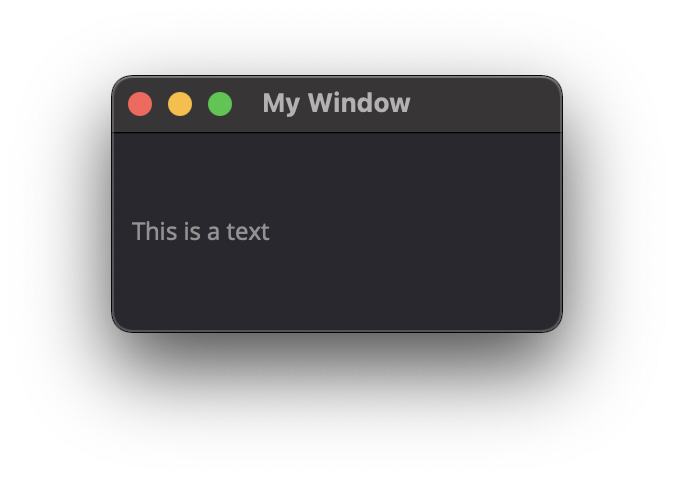
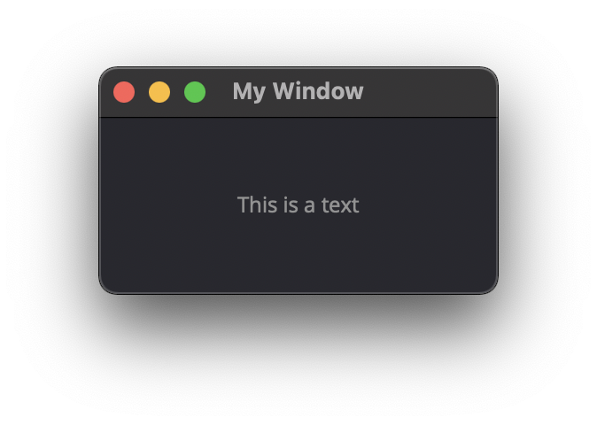
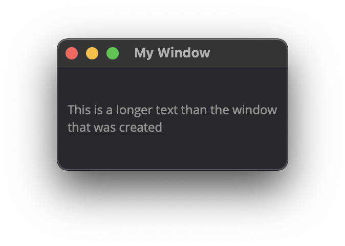
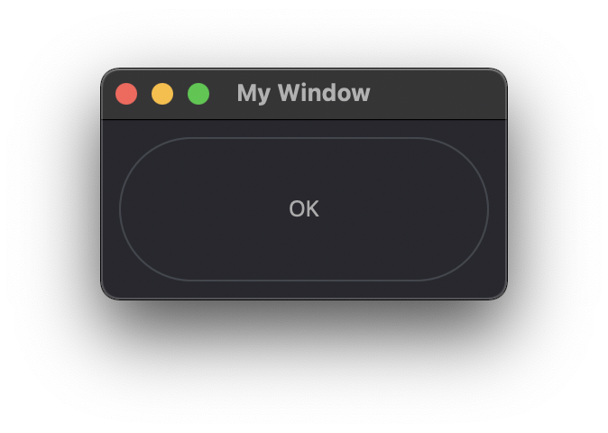
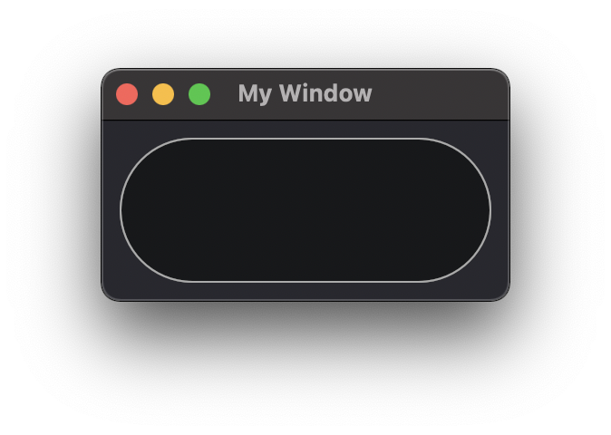
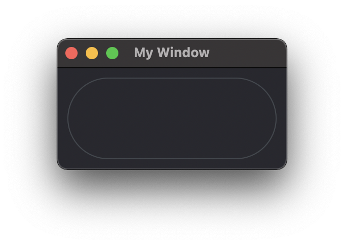
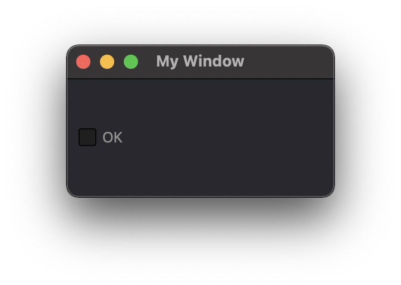
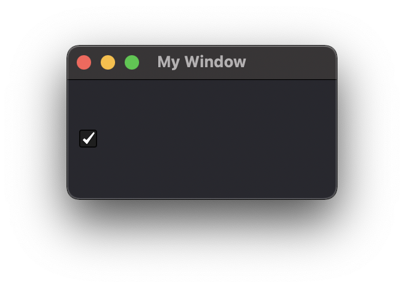
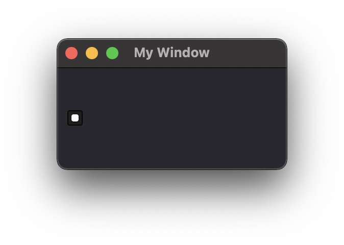
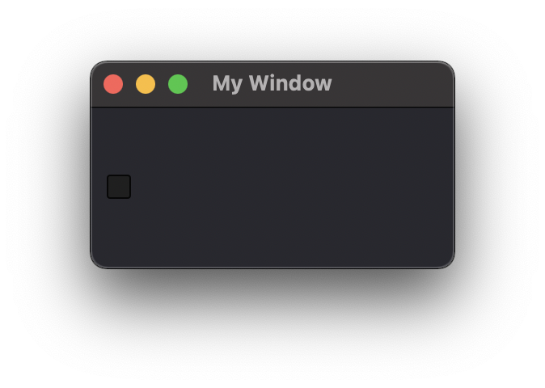

Attributes
==========

The element's ID is used to find, manage, and dispatch events for that element. GUI elements also support a set of common attributes including 
Enabled, Hidden, Visible, Font, WindowTitle, BackgroundColor, Geometry, ToolTip, StatusTip, StyleSheet, WindowOpacity, MinimumSize, MaximumSize, 
and FixedSize. Some other common GUI elements and their main attributes include:

..  note:: 
	For better management of elements, define an ID attribute. Not all example will contain an ID but keep that in mind. 
	You can then use the win.Find('ID') to find and update an element and update an attribute win.Find('myButton').Text = "Processing..."

Label
-----

Text
^^^^

..  topic:: Description

	This label attribute is used to display Text on the element. 

**Type:** string

..  code-block:: python

	ui.Label({ 'Text': "This is a text" })

Alignment 
^^^^^^^^^

**Type:** ({'Parameter': bool})

..  topic:: Description

	This label attribute is used to display Text on the element.

	* AlignCenter
	* AlignHCenter
	* AlignVCenter
	* AlignTop
	* Others to list...

..  code-block:: python

	ui.Label({ 'Text': "This is a text", 'Alignment': { 'AlignCenter' : True } })

FrameStyle
^^^^^^^^^^

**Type:** 

..  topic:: Description

	This label attribute is used to Style

..  note:: Not yet tested

	ui.Label({ 'FrameStyle': "" })

WordWrap
^^^^^^^^

**Type:** bool

..  topic:: Description

	This label attribute enable Wordwrap when the Text attribute is longer than the window's width

..  code-block:: python
	
	ui.Label({ 'Text': "This is a longer text than the window that was created" , 'WordWrap': True })

Indent
^^^^^^

**Type:** bool

..  topic:: Description

	This label attribute

..  note:: Not yet tested

	ui.Label({ 'Indent': "" })

Margin
^^^^^^

**Type:** 

..  topic:: Description

	This label attribute

..  note:: Not yet tested

	ui.Label({ 'Margin': "" })

Button
------

Text
^^^^

**Type:** string

..  topic:: Description	

	This label attribute is used to display Text on the element. 

..  code-block:: 

    ui.Button({ 'ID': 'ok_btn',  'Text': "OK" })

Down
^^^^

**Type:** bool

..  topic:: Description

	This label attribute is used to 

..  note:: Not yet tested

    ui.Button({ 'ID': 'ok_btn',  'Down': "" })

Checkable
^^^^^^^^^

**Type:** bool

..  topic:: Description
	
	This label attribute is used to 

..  note:: Not yet tested

    ui.Button({ 'ID': 'ok_btn',  'Checkable': True })

+------------+------------+
| |checkon|  | |checkoff| |
+------------+------------+

Checked
^^^^^^^

**Type:** bool

..  topic:: Description	
	This label attribute is used to 

..  note:: Not yet tested

    ui.Button({ 'ID': 'ok_btn',  'Checked': True })

Icon
^^^^

**Type:** 

..  topic:: Description	
	This label attribute is used to 

..  note:: Not yet tested

    ui.Button({ 'ID': 'ok_btn',  'Icon': "" })

IconSize
^^^^^^^^

**Type:** bool

..  topic:: Description	
	This label attribute is used to 

..  note:: Not yet tested

    ui.Button({ 'ID': 'ok_btn',  'IconSize': "" })

Flat
^^^^

**Type:** bool

..  topic:: Description	
	This label attribute is used to 

..  note:: Not yet tested

    ui.Button({ 'ID': 'ok_btn',  'Flat': "" })

CheckBox
--------

Text
^^^^

**Type:** string

..  topic:: Description		
	This label attribute is used to display Text on the element. 

..  code-block:: 

    ui.CheckBox({ 'ID': 'ok_btn',  'Text': "OK" })

Down
^^^^

**Type:** bool

..  topic:: Description		
	This label attribute is used to 

..  note:: Not yet tested

    ui.CheckBox({ 'ID': 'ok_btn',  'Down': "" })

Checkable
^^^^^^^^^

**Type:** bool

..  topic:: Description		
	This label attribute is used to 

..  note:: Not yet tested

    ui.CheckBox({ 'ID': 'ok_btn',  'Checkable': True })

Checked
^^^^^^^

**Type:** bool

..  topic:: Description		
	This label attribute is used to 

..  code-block:: python

    ui.CheckBox({ 'ID': 'ok_btn',  'Checked': True })

Tristate
^^^^^^^^

**Type:**

..  topic:: Description		
	This label attribute is used to activate a 3 state checkbox

..  code-block:: python

    ui.CheckBox({ 'ID': 'ok_btn',  'Tristate': True })

+---------+---------+---------+
| |img1|  | |img2|  | |img3|  |
+---------+---------+---------+

CheckState
^^^^^^^^^^

**Type:**

..  topic:: Description		
	This label attribute is used to 

..  note:: Not yet tested

    ui.CheckBox({ 'ID': 'ok_btn',  'CheckState': "" })

ComboBox
--------

ItemText
^^^^^^^^

**Type:**

..  topic:: Description		
	This label attribute is used to display Text on the element. 

..  note:: Not yet tested

    ui.ComboBox({ 'ID': 'combo_1',  'ItemText': "OK" })

Editable
^^^^^^^^

**Type:**bool

..  topic:: Description	
	This label attribute is used to 

..  note:: Not yet tested

    ui.ComboBox({ 'ID': 'ok_btn',  'Editable': "" })

CurrentIndex
^^^^^^^^^^^^

**Type:**

..  topic:: Description	
	This label attribute is used to 

..  note:: Not yet tested

    ui.ComboBox({ 'ID': 'ok_btn',  'CurrentIndex': "" })

CurrentText
^^^^^^^^^^^

**Type:**string

..  topic:: Description	
	This label attribute is used to 

..  note:: Not yet tested

    ui.ComboBox({ 'ID': 'ok_btn',  'CurrentText': "" })

Count
^^^^^

**Type:**int

..  topic:: Description	
	This label attribute is used to 

..  note:: Not yet tested

    ui.ComboBox({ 'ID': 'ok_btn',  'Count': "" })

SpinBox
-------

Value
^^^^^

**Type:**

..  topic:: Description		
	This label attribute is used to

..  note:: Not yet tested

    ui.SpinBox({ 'ID': 'spin_1',  'Value': "OK" })

Minimum
^^^^^^^

**Type:**

..  topic:: Description		
	This label attribute is used to

..  note:: Not yet tested

    ui.SpinBox({ 'ID': 'spin_1',  'Minimum': "OK" })

Maximum
^^^^^^^

**Type:**

..  topic:: Description		
	This label attribute is used to

..  note:: Not yet tested

    ui.SpinBox({ 'ID': 'spin_1',  'Maximum': "" })

SingleStep
^^^^^^^^^^

**Type:**

..  topic:: Description		
	This label attribute is used to

..  note:: Not yet tested

    ui.SpinBox({ 'ID': 'spin_1',  'SingleStep': "" })

Prefix
^^^^^^

**Type:**

..  topic:: Description		
	This label attribute is used to

..  note:: Not yet tested

    ui.SpinBox({ 'ID': 'spin_1',  'Prefix': "" })

Suffix
^^^^^^

**Type:**

..  topic:: Description		
	This label attribute is used to

..  note:: Not yet tested

    ui.SpinBox({ 'ID': 'spin_1',  'Suffix': "" })

Alignment
^^^^^^^^^

**Type:**

..  topic:: Description		
	This label attribute is used to

..  note:: Not yet tested

    ui.SpinBox({ 'ID': 'spin_1',  'Alignment': "OK" })

ReadOnly
^^^^^^^^

**Type:** bool

..  topic:: Description		
	This label attribute is used to

..  note:: Not yet tested

    ui.SpinBox({ 'ID': 'spin_1',  'ReadOnly': True })

Wrapping
^^^^^^^^

**Type:** bool

..  topic:: Description		
	This label attribute is used to

..  note:: Not yet tested

    ui.SpinBox({ 'ID': 'spin_1',  'Wrapping': True })

Slider
------

Value
^^^^^

**Type:**

..  topic:: Description		
	This label attribute is used to

..  note:: Not yet tested

    ui.Slider({ 'ID': 'slider_1',  'Value': "" })

Minimum
^^^^^^^

**Type:**

..  topic:: Description		
	This label attribute is used to

..  note:: Not yet tested

    ui.Slider({ 'ID': 'slider_1',  'Minimum': "" })

Maximum
^^^^^^^

**Type:**

..  topic:: Description		
	This label attribute is used to

..  note:: Not yet tested

    ui.Slider({ 'ID': 'slider_1',  'Maximum': "" })

SingleStep
^^^^^^^^^^

**Type:**

..  topic:: Description		
	This label attribute is used to

..  note:: Not yet tested

    ui.Slider({ 'ID': 'slider_1',  'SingleStep': "" })

PageStep
^^^^^^^^

**Type:**

..  topic:: Description		
	This label attribute is used to

..  note:: Not yet tested

    ui.Slider({ 'ID': 'slider_1',  'PageStep': "" })

Orientation
^^^^^^^^^^^

**Type:**

..  topic:: Description		
	This label attribute is used to

..  note:: Not yet tested

    ui.Slider({ 'ID': 'slider_1',  'Orientation': "" })

Tracking
^^^^^^^^

**Type:**

..  topic:: Description		
	This label attribute is used to

..  note:: Not yet tested

    ui.Slider({ 'ID': 'slider_1',  'Tracking': "" })

SliderPosition
^^^^^^^^^^^^^^

**Type:**

..  topic:: Description		
	This label attribute is used to

..  note:: Not yet tested

    ui.Slider({ 'ID': 'slider_1',  'SliderPosition': "" })

LineEdit
--------

Text
^^^^

**Type:** string

..  topic:: Description		
	This label attribute is used to

..  note:: Not yet tested

    ui.LineEdit({ 'ID': 'le_1',  'Text': "" })

PlaceholderText
^^^^^^^^^^^^^^^

**Type:** string

..  topic:: Description		
	This label attribute is used to

..  note:: Not yet tested

    ui.LineEdit({ 'ID': 'le_1',  'PlaceholderText': "" })

Font
^^^^

**Type:** 

..  topic:: Description		
	This label attribute is used to

..  note:: Not yet tested

    ui.LineEdit({ 'ID': 'le_1',  'Font': "" })

MaxLength
^^^^^^^^^

**Type:** int

..  topic:: Description		
	This label attribute is used to

..  note:: Not yet tested

    ui.LineEdit({ 'ID': 'le_1',  'MaxLength': 50 })

ReadOnly
^^^^^^^^

**Type:** bool

..  topic:: Description		
	This label attribute is used to set the LineEdit to be Read-Only. 

..  code-block:: python

    ui.LineEdit({ 'ID': 'le_1',  'ReadOnly': True })

Modified
^^^^^^^^

**Type:** 

..  topic:: Description		
	This label attribute is used to

..  note:: Not yet tested

    ui.LineEdit({ 'ID': 'le_1',  'Modified': "" })

ClearButtonEnabled
^^^^^^^^^^^^^^^^^^

**Type:** bool

..  topic:: Description		
	This label attribute is used to

..  note:: Not yet tested

    ui.LineEdit({ 'ID': 'le_1',  'ClearButtonEnabled': True })

TextEdit
--------

Text
^^^^

**Type:** string

..  topic:: Description		
	This label attribute is used to

..  note:: Not yet tested

    ui.TextEdit({ 'ID': 'te_1',  'Text': "" })

PlaceholderText
^^^^^^^^^^^^^^^

**Type:** string

..  topic:: Description		
	This label attribute is used to

..  note:: Not yet tested

    ui.TextEdit({ 'ID': 'te_1',  'PlaceholderText': "" })

HTML
^^^^

**Type:** string

..  topic:: Description		
	This label attribute is used to

..  note:: Not yet tested

    ui.TextEdit({ 'ID': 'te_1',  'HTML': "" })

Font
^^^^

**Type:** 

..  topic:: Description		
	This label attribute is used to

..  note:: Not yet tested

    ui.TextEdit({ 'ID': 'te_1',  'Font': "" })

Alignment
^^^^^^^^^

**Type:** dict

..  topic:: Description		
	This label attribute is used to

..  note:: Not yet tested

    ui.TextEdit({ 'ID': 'te_1',  'Alignment': "" })

ReadOnly
^^^^^^^^

**Type:** bool

..  topic:: Description		
	This label attribute is used to

..  note:: Not yet tested

    ui.TextEdit({ 'ID': 'te_1',  'ReadOnly': True })

TextColor
^^^^^^^^^

**Type:** dict(r,g,b)

..  topic:: Description		
	This label attribute is used to

..  note:: Not yet tested

    ui.TextEdit({ 'ID': 'te_1',  'TextColor': {'R':1, 'G':1, 'B':0} })

TextBackgroundColor
^^^^^^^^^^^^^^^^^^^

**Type:** string

..  topic:: Description		
	This label attribute is used to

..  note:: Not yet tested

    ui.TextEdit({ 'ID': 'te_1',  'TextBackgroundColor': "" })

TabStopWidth
^^^^^^^^^^^^

**Type:** int

..  topic:: Description		
	This label attribute is used to

..  note:: Not yet tested

    ui.TextEdit({ 'ID': 'te_1',  'TabStopWidth': 50 })

Lexer
^^^^^

**Type:** 

..  topic:: Description		
	This label attribute is used to

..  note:: Not yet tested

    ui.TextEdit({ 'ID': 'te_1',  'Lexer':  })

LexerColors
^^^^^^^^^^^

**Type:** 

..  topic:: Description		
	This label attribute is used to

..  note:: Not yet tested

    ui.TextEdit({ 'ID': 'te_1',  'LexerColors': })

ColorPicker
-----------

Text
^^^^

**Type:** string

..  topic:: Description		
	This label attribute is used to

..  note:: Not yet tested

    ui.ColorPicker({ 'ID': 'colorpicker_1',  'Text': "" })

Color
^^^^^

**Type:** dict

..  topic:: Description		
	This label attribute is used to

..  note:: Not yet tested

    ui.ColorPicker({ 'ID': 'colorpicker_1',  'Color': "" })

Tracking
^^^^^^^^

**Type:** bool

..  topic:: Description		
	This label attribute is used to

..  note:: Not yet tested

    ui.ColorPicker({ 'ID': 'colorpicker_1',  'Tracking': True })

DoAlpha
^^^^^^^

**Type:** bool

..  topic:: Description		
	This label attribute is used to include Alpha value in the RGB ColorPicker

..  code-block:: python

    ui.ColorPicker({ 'ID': 'colorpicker_1',  'DoAlpha': True })

Font
----

Family
^^^^^^

**Type:** string

..  topic:: Description		
	This label attribute is used to

..  note:: Not yet tested

    ui.Font({ 'Family': "" })

StyleName
^^^^^^^^^

**Type:** string

..  topic:: Description		
	This label attribute is used to

..  note:: Not yet tested

    ui.Font({ 'StyleName': "" })

PointSize
^^^^^^^^^

**Type:** int

..  topic:: Description		
	This label attribute is used to

..  note:: Not yet tested

    ui.Font({ 'PointSize': 12 })

PixelSize
^^^^^^^^^

**Type:** int

..  topic:: Description		
	This label attribute is used to

..  note:: Not yet tested

    ui.Font({ 'PixelSize': 14 })

Bold
^^^^

**Type:** bool

..  topic:: Description		
	This label attribute is used to

..  note:: Not yet tested

    ui.Font({ 'Bold': True })

Italic
^^^^^^

**Type:** bool

..  topic:: Description		
	This label attribute is used to

..  note:: Not yet tested

    ui.Font({ 'Italic': True })

Underline
^^^^^^^^^

**Type:** bool

..  topic:: Description		
	This label attribute is used to

..  note:: Not yet tested

    ui.Font({ 'Underline': True })

Overline
^^^^^^^^

**Type:** bool

..  topic:: Description		
	This label attribute is used to

..  note:: Not yet tested

    ui.Font({ 'Overline': True })

StrikeOut
^^^^^^^^^

**Type:** bool

..  topic:: Description		
	This label attribute is used to

..  note:: Not yet tested

    ui.Font({ 'StrikeOut': True })

Kerning
^^^^^^^

**Type:** bool

..  topic:: Description		
	This label attribute is used to

..  note:: Not yet tested

    ui.Font({ 'Kerning': True })

Weight
^^^^^^

**Type:** int, float

..  topic:: Description		
	This label attribute is used to set a size relative to other element of the group . Element with Weight 0.5 will be twice the size of an element with Weight 0.25

..  note:: Not yet tested

    ui.Font({ 'Weight': 0.25 })

Stretch
^^^^^^^

**Type:** bool

..  topic:: Description		
	This label attribute is used to

..  note:: Not yet tested

    ui.Font({ 'Stretch': True })

MonoSpaced
^^^^^^^^^^

**Type:** bool

..  topic:: Description		
	This label attribute is used to

..  note:: Not yet tested

    ui.Font({ 'MonoSpaced': True })

Icon
----

File
^^^^

**Type:** string

..  topic:: Description		
	This label attribute is used to point at the image file to use for the Icon Element

	* .png 
	* .jpg

..  note:: Not yet tested

    ui.Font({ 'File': "" })

Tabbar
------

CurrentIndex
^^^^^^^^^^^^

**Type:** int

..  topic:: Description		
	This label attribute is used to 

..  note:: Not yet tested

    ui.Tabbar({ 'CurrentIndex': 1 })

TabsClosable
^^^^^^^^^^^^

**Type:** bool

..  topic:: Description		
	This label attribute is used to 

..  note:: Not yet tested

    ui.Tabbar({ 'TabsClosable': True })

Expanding
^^^^^^^^^

**Type:** bool

..  topic:: Description		
	This label attribute is used to 

..  note:: Not yet tested

    ui.Tabbar({ 'Expanding': True })

AutoHide
^^^^^^^^

**Type:** bool

..  topic:: Description		
	This label attribute is used to 

..  note:: Not yet tested

    ui.Tabbar({ 'AutoHide': True })

Movable
^^^^^^^

**Type:** bool

..  topic:: Description		
	This label attribute is used to 

..  note:: Not yet tested

    ui.Tabbar({ 'Movable': True })

DrawBase
^^^^^^^^

**Type:** bool

..  topic:: Description		
	This label attribute is used to 

..  note:: Not yet tested

    ui.Tabbar({ 'DrawBase': True })

UsesScrollButtons
^^^^^^^^^^^^^^^^^

**Type:** bool

..  topic:: Description		
	This label attribute is used to 

..  note:: Not yet tested

    ui.Tabbar({ 'UsesScrollButtons': True })

DocumentMode
^^^^^^^^^^^^

**Type:** bool

..  topic:: Description		
	This label attribute is used to 

..  note:: Not yet tested

    ui.Tabbar({ 'DocumentMode': True })

ChangeCurrentOnDrag
^^^^^^^^^^^^^^^^^^^

**Type:** bool

..  topic:: Description		
	This label attribute is used to 

..  note:: Not yet tested

    ui.Tabbar({ 'ChangeCurrentOnDrag': True })

Tree
----

ColumnCount
^^^^^^^^^^^

**Type:** int

..  topic:: Description		
	This label attribute is used to 

..  note:: Not yet tested

    ui.Tree({ 'ID':'my_tree', 'ColumnCount': 1 })

SortingEnabled
^^^^^^^^^^^^^^

**Type:** bool

..  topic:: Description		
	This label attribute is used to 

..  note:: Not yet tested

    ui.Tree({ 'ID':'my_tree', 'SortingEnabled': True })

ItemsExpandable
^^^^^^^^^^^^^^^

**Type:** bool

..  topic:: Description		
	This label attribute is used to 

..  note:: Not yet tested

    ui.Tree({ 'ID':'my_tree', 'ItemsExpandable': True })

ExpandsOnDoubleClick
^^^^^^^^^^^^^^^^^^^^

**Type:** bool

..  topic:: Description		
	This label attribute is used to 

..  note:: Not yet tested

    ui.Tree({ 'ID':'my_tree', 'ExpandsOnDoubleClick': True })

AutoExpandDelay
^^^^^^^^^^^^^^^

**Type:** bool

..  topic:: Description		
	This label attribute is used to 

..  note:: Not yet tested

    ui.Tree({ 'ID':'my_tree', 'AutoExpandDelay': True })

HeaderHidden
^^^^^^^^^^^^

**Type:** bool

..  topic:: Description		
	This label attribute is used to 

..  note:: Not yet tested

    ui.Tree({ 'ID':'my_tree', 'HeaderHidden': True })

IconSize
^^^^^^^^

**Type:** int

..  topic:: Description		
	This label attribute is used to 

..  note:: Not yet tested

    ui.Tree({ 'ID':'my_tree', 'IconSize': 12 })

RootIsDecorated
^^^^^^^^^^^^^^^

**Type:** bool

..  topic:: Description		
	This label attribute is used to 

..  note:: Not yet tested

    ui.Tree({ 'ID':'my_tree', 'RootIsDecorated': True })

Animated
^^^^^^^^

**Type:** bool

..  topic:: Description		
	This label attribute is used to 

..  note:: Not yet tested

    ui.Tree({ 'ID':'my_tree', 'Animated': True })

AllColumnsShowFocus
^^^^^^^^^^^^^^^^^^^

**Type:** bool

..  topic:: Description		
	This label attribute is used to 

..  note:: Not yet tested

    ui.Tree({ 'ID':'my_tree', 'AllColumnsShowFocus': True })

WordWrap
^^^^^^^^

**Type:** bool

..  topic:: Description		
	This label attribute is used to 

..  note:: Not yet tested

    ui.Tree({ 'ID':'my_tree', 'WordWrap': True })

TreePosition
^^^^^^^^^^^^

**Type:** 

..  topic:: Description		
	This label attribute is used to 

..  note:: Not yet tested

    ui.Tree({ 'ID':'my_tree', 'TreePosition':  })

SelectionBehavior
^^^^^^^^^^^^^^^^^

**Type:** 

..  topic:: Description		
	This label attribute is used to 

..  note:: Not yet tested

    ui.Tree({ 'ID':'my_tree', 'SelectionBehavior':  })

SelectionMode
^^^^^^^^^^^^^

**Type:** 

..  topic:: Description		
	This label attribute is used to 

..  note:: Not yet tested

    ui.Tree({ 'ID':'my_tree', 'SelectionMode':  })

UniformRowHeights
^^^^^^^^^^^^^^^^^

**Type:** bool

..  topic:: Description		
	This label attribute is used to 

..  note:: Not yet tested

    ui.Tree({ 'ID':'my_tree', 'UniformRowHeights': True })

Indentation
^^^^^^^^^^^

**Type:** bool

..  topic:: Description		
	This label attribute is used to 

..  note:: Not yet tested

    ui.Tree({ 'ID':'my_tree', 'Indentation': True })

VerticalScrollMode
^^^^^^^^^^^^^^^^^^

**Type:** bool

..  topic:: Description		
	This label attribute is used to 

..  note:: Not yet tested

    ui.Tree({ 'ID':'my_tree', 'VerticalScrollMode': True })

HorizontalScrollMode
^^^^^^^^^^^^^^^^^^^^

**Type:** bool

..  topic:: Description		
	This label attribute is used to 

..  note:: Not yet tested

    ui.Tree({ 'ID':'my_tree', 'HorizontalScrollMode': True })

AutoScroll
^^^^^^^^^^

**Type:** bool

..  topic:: Description		
	This label attribute is used to 

..  note:: Not yet tested

    ui.Tree({ 'ID':'my_tree', 'AutoScroll': True })

AutoScrollMargin
^^^^^^^^^^^^^^^^

**Type:** bool

..  topic:: Description		
	This label attribute is used to 

..  note:: Not yet tested

    ui.Tree({ 'ID':'my_tree', 'AutoScrollMargin': True })

TabKeyNavigation
^^^^^^^^^^^^^^^^

**Type:** bool

..  topic:: Description		
	This label attribute is used to 

..  note:: Not yet tested

    ui.Tree({ 'ID':'my_tree', 'TabKeyNavigation': True })

AlternatingRowColors
^^^^^^^^^^^^^^^^^^^^

**Type:** bool

..  topic:: Description		
	This label attribute is used to 

..  note:: Not yet tested

    ui.Tree({ 'ID':'my_tree', 'AlternatingRowColors': True })

FrameStyle
^^^^^^^^^^

**Type:** 

..  topic:: Description		
	This label attribute is used to 

..  note:: Not yet tested

    ui.Tree({ 'ID':'my_tree', 'FrameStyle':  })

LineWidth
^^^^^^^^^

**Type:** int

..  topic:: Description		
	This label attribute is used to 

..  note:: Not yet tested

    ui.Tree({ 'ID':'my_tree', 'LineWidth': 2 })

MidLineWidth
^^^^^^^^^^^^

**Type:** int

..  topic:: Description		
	This label attribute is used to 

..  note:: Not yet tested

    ui.Tree({ 'ID':'my_tree', 'MidLineWidth': 2 })

FrameRect
^^^^^^^^^

**Type:** bool

..  topic:: Description		
	This label attribute is used to 

..  note:: Not yet tested

    ui.Tree({ 'ID':'my_tree', 'FrameRect': True })

FrameShape
^^^^^^^^^^

**Type:** 

..  topic:: Description		
	This label attribute is used to 

..  note:: Not yet tested

    ui.Tree({ 'ID':'my_tree', 'FrameShape':  })

FrameShadow
^^^^^^^^^^^

**Type:** bool

..  topic:: Description		
	This label attribute is used to 

..  note:: Not yet tested

    ui.Tree({ 'ID':'my_tree', 'FrameShadow': True })

TreeItem
--------

Selected
^^^^^^^^

**Type:** bool

..  topic:: Description		
	This label attribute is used to 

..  note:: Not yet tested

    ui.TreeItem({ 'Selected': True })

Hidden
^^^^^^

**Type:** bool

..  topic:: Description		
	This label attribute is used to 

..  note:: Not yet tested

    ui.TreeItem({ 'Hidden': True })

Expanded
^^^^^^^^

**Type:** bool

..  topic:: Description		
	This label attribute is used to 

..  note:: Not yet tested

    ui.TreeItem({ 'Expanded': True })

Disabled
^^^^^^^^

**Type:** bool

..  topic:: Description		
	This label attribute is used to 

..  note:: Not yet tested

    ui.TreeItem({ 'Disabled': True })

FirstColumnSpanned
^^^^^^^^^^^^^^^^^^

**Type:** bool

..  topic:: Description		
	This label attribute is used to 

..  note:: Not yet tested

    ui.TreeItem({ 'Selected': True })

Flags
^^^^^

**Type:** bool

..  topic:: Description		
	This label attribute is used to 

..  note:: Not yet tested

    ui.TreeItem({ 'Selected': True })

ChildIndicatorPolicy
^^^^^^^^^^^^^^^^^^^^

**Type:** bool

..  topic:: Description		
	This label attribute is used to 

..  note:: Not yet tested

    ui.TreeItem({ 'Selected': True })

Some elements also have property arrays, indexed by item or column (zero-based), e.g. newItem.Text[2] = 'Third column text'

Combo
-----

ItemText[ ]
^^^^^^^^^^^

**Type:** string

..  topic:: Description		
	This label attribute is used to 

..  note:: Not yet tested

    newItem.Text[2] = 'Third column text'

TabBar Property Array
---------------------

TabText[ ]
^^^^^^^^^^

**Type:** string

..  topic:: Description		
	This label attribute is used to 

..  note:: Not yet tested

    newItem.TabText[2] = "Third Tab Text"

TabToolTip[ ]
^^^^^^^^^^^^^

**Type:** string

..  topic:: Description		
	This label attribute is used to 

..  note:: Not yet tested

    newItem.TabToolTip[2] = "Third Tab Tooltip Text"

TabWhatsThis[ ]
^^^^^^^^^^^^^^^

**Type:** string

..  topic:: Description		
	This label attribute is used to 

..  note:: Not yet tested

    newItem.TabWhatsThis[2] = "Third Tab WhatsThis Text"

TabTextColor[ ]
^^^^^^^^^^^^^^^

**Type:** dict

..  topic:: Description		
	This label attribute is used to 

..  note:: Not yet tested

    newItem.TabTextColor[2] = {'R':1, 'G':1, 'B':1}

Tree Property Array
-------------------

ColumnWidth[ ]
^^^^^^^^^^^^^^

**Type:** int

..  topic:: Description		
	This label attribute is used to 

..  note:: Not yet tested

    newItem.ColumnWidth[2] = 50

Treeitem Property Array
-----------------------

Text[ ]
^^^^^^^

**Type:** string

..  topic:: Description		
	This label attribute is used to 

..  note:: Not yet tested

    newItem.Text[2] = 'Text inside Tree in third row'

StatusTip[ ]
^^^^^^^^^^^^

**Type:** string

..  topic:: Description		
	This label attribute is used to 

..  note:: Not yet tested

    newItem.StatusTip[2] = 'StatusTip inside Tree in third row'

ToolTip[ ]
^^^^^^^^^^

**Type:** string

..  topic:: Description		
	This label attribute is used to 

..  note:: Not yet tested

    newItem.ToolTip[2] = 'ToolTip inside Tree in third row'

WhatsThis[ ]
^^^^^^^^^^^^

**Type:** string

..  topic:: Description		
	This label attribute is used to 

..  note:: Not yet tested

    newItem.WhatsThis[2] = 'WhatsThis inside Tree in third row'

SizeHint[ ]
^^^^^^^^^^^

**Type:** int

..  topic:: Description		
	This label attribute is used to 

..  note:: Not yet tested

    newItem.SizeHint[2] = 'SizeHint inside Tree in third row'

TextAlignment[ ]
^^^^^^^^^^^^^^^^

**Type:** string

..  topic:: Description		
	This label attribute is used to 

..  note:: Not yet tested

    newItem.TextAlignment[2] = 'TextAlignment inside Tree in third row'

CheckState[ ]
^^^^^^^^^^^^^

**Type:** bool

..  topic:: Description		
	This label attribute is used to 

..  note:: Not yet tested

    newItem.CheckState[2] = 'CheckState inside Tree in third row'

BackgroundColor[ ]
^^^^^^^^^^^^^^^^^^

**Type:** dict

..  topic:: Description		
	This label attribute is used to 

..  note:: Not yet tested

    newItem.BackgroundColor[2] = {'R':1, 'G':1, 'B':1}

TextColor[ ]
^^^^^^^^^^^^

**Type:** dict

..  topic:: Description		
	This label attribute is used to change the color of the text

..  note:: Not yet tested

    newItem.TextColor[2] = {'R':1, 'G':1, 'B':1}

Icon[ ]
^^^^^^^

**Type:** string

..  topic:: Description		
	This label attribute is used to 

..  note:: Not yet tested

    newItem.Icon[2] = 

Font[ ]
^^^^^^^

**Type:** string

..  topic:: Description		
	This label attribute is used to 

..  note:: Not yet tested

    newItem.Font[2] = 'Font inside Tree in third row'

	
Some elements like Label and Button will automatically recognise and render basic HTML in their Text attributes, 
and TextEdit is capable of displaying and returning HTML too. 
Element attributes can be specified when creating the element, or can be read or changed later:

..  code-block:: python

	win.Find('myButton').Text = "Processing..."

Timer
-----

Interval
^^^^^^^^

**Type:** int

..  topic:: Description		
	This attribute is used to set a time in milisecs

..  code-block:: python

	ui.Timer({ 'ID': 'MyTimer', 'Interval': 1000 })  # 1000 millisecs
    mytimer.Start() Start() and Stop()   to add in the UI_elements_func.rst
	dispatcher['On']['Timeout'] = OnTimer

Singleshot
^^^^^^^^^^

**Type:** int

..  topic:: Description		
	This attribute is used to

..  note:: Not yet tested
	ui.Timer({ 'ID': 'MyTimer', 'Singleshot': 1000 })

RemainingTime
^^^^^^^^^^^^^

**Type:** int

..  topic:: Description		
	This attribute is used to

..  note:: Not yet tested
	ui.Timer({ 'ID': 'MyTimer', 'RemainingTime': 1000 })

IsActive
^^^^^^^^

**Type:** bool

..  topic:: Description		
	This attribute is used to

..  note:: Not yet tested
	ui.Timer({ 'ID': 'MyTimer', 'IsActive': True })

