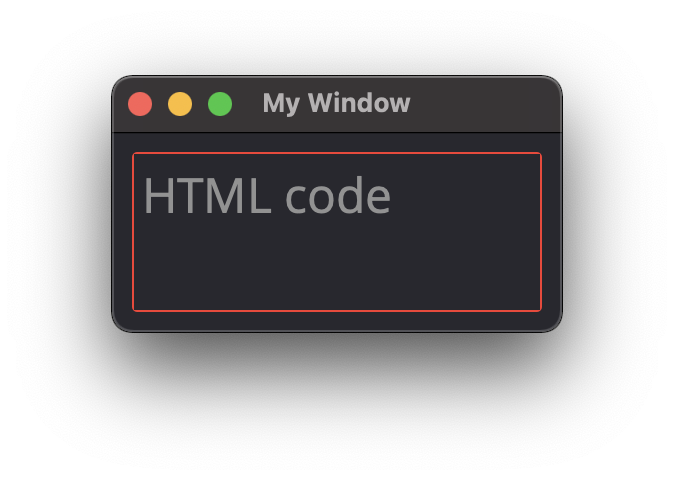
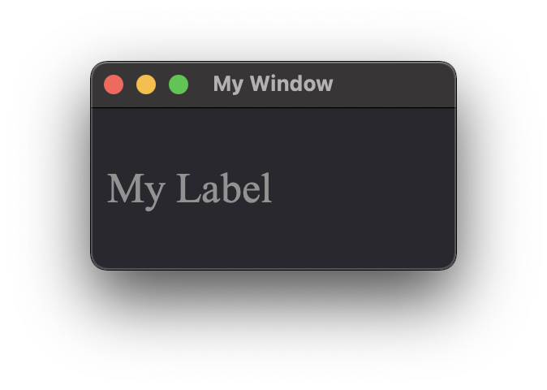
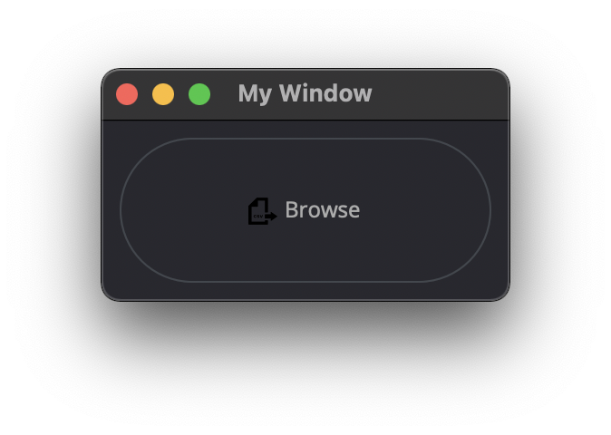

Attributes
==========

The element's ID is used to find, manage, and dispatch events for that element. GUI elements also support a set of common attributes including 
Enabled, Hidden, Visible, Font, WindowTitle, BackgroundColor, Geometry, ToolTip, StatusTip, StyleSheet, WindowOpacity, MinimumSize, MaximumSize, 
and FixedSize. Some other common GUI elements and their main attributes include:

..  note:: 
	For better management of elements, define an ID attribute. Not all example will contain an ID but keep that in mind. 
	You can then use the win.Find('ID') to find and update an element and update an attribute win.Find('myButton').Text = "Processing..."

You need to create a Window with a dictionnary of parameter and list of item to contain your element and attribute. 
Check :ref:`UI Element Layout page <UI_elements_layout>` for more details

Label
-----

.. _Label Text:

Text
^^^^

..  topic:: Description

	This label attribute is used to display Text on the element. 

**Type:** string

..  code-block:: python

	ui.Label({ 'ID':'label_1', 'Text': "This is a text" })

..  image:: images/UI_label_text.png
	:width: 400px
	:align: center

Alignment 
^^^^^^^^^

**Type:** ({'Parameter': bool})

..  topic:: Description

	This label attribute is used to display Text on the element.

	* AlignCenter
	* AlignHCenter
	* AlignVCenter
	* AlignTop
	* Others to list...

..  code-block:: python

	ui.Label({ 'ID':'label_1', 'Text': "This is a text", 'Alignment': { 'AlignCenter' : True } })

FrameStyle
^^^^^^^^^^

**Type:** 

..  topic:: Description

	This label attribute is used to Style

..  note:: Not yet tested

	ui.Label({ 'ID':'label_1', 'FrameStyle': "" })

WordWrap
^^^^^^^^

**Type:** bool

..  topic:: Description

	This label attribute enable Wordwrap when the Text attribute is longer than the window's width

..  code-block:: python
	
	ui.Label({ 'ID':'label_1', 'Text': "This is a longer text than the window that was created" , 'WordWrap': True })

..  image:: images/UI_label_wordwrap.png
	:width: 400px
	:align: center

Indent
^^^^^^

**Type:** bool

..  topic:: Description

	This label attribute

..  note:: Not yet tested

	ui.Label({ 'ID':'label_1', 'Indent': "" })

Margin
^^^^^^

**Type:** 

..  topic:: Description

	This label attribute

..  note:: Not yet tested

	ui.Label({ 'ID':'label_1', 'Margin': "" })

Button
------

.. _Button Text:

Text
^^^^

**Type:** string

..  topic:: Description	

	This label attribute is used to display Text on the element. 

..  code-block:: 

    ui.Button({ 'ID': 'ok_btn',  'Text': "OK" })

..  image:: images/UI_button_text.png
	:width: 400px
	:align: center

Down
^^^^

**Type:** bool

..  topic:: Description

	This label attribute is used to 

..  note:: Not yet tested

    ui.Button({ 'ID': 'ok_btn',  'Down': "" })

Checkable
^^^^^^^^^

**Type:** bool

..  topic:: Description
	
	This label attribute is used to 

..  note:: Not yet tested

    ui.Button({ 'ID': 'ok_btn',  'Checkable': True })

..  |checkon| image:: images/UI_button_checkable_on.png
	:width: 300pt

+------------+------------+
| |checkon|  | |checkoff| |
+------------+------------+

Checked
^^^^^^^

**Type:** bool

..  topic:: Description	
	This label attribute is used to 

..  note:: Not yet tested

    ui.Button({ 'ID': 'ok_btn',  'Checked': True })

Icon
^^^^

**Type:** 

..  topic:: Description	
	This label attribute is used to 

..  note:: Not yet tested

    ui.Button({ 'ID': 'ok_btn',  'Icon': "" })

IconSize
^^^^^^^^

**Type:** bool

..  topic:: Description	
	This label attribute is used to 

..  note:: Not yet tested

    ui.Button({ 'ID': 'ok_btn',  'IconSize': "" })

Flat
^^^^

**Type:** bool

..  topic:: Description	
	This label attribute is used to 

..  note:: Not yet tested

    ui.Button({ 'ID': 'ok_btn',  'Flat': "" })

CheckBox
--------

Text
^^^^

**Type:** string

..  topic:: Description		
	This label attribute is used to display Text on the element. 

..  code-block:: 

    ui.CheckBox({ 'ID': 'checkbox_1',  'Text': "OK" })

..  image:: images/UI_checkbox_text.png
	:width: 400px
	:align: center

Down
^^^^

**Type:** bool

..  topic:: Description		
	This label attribute is used to 

..  note:: Not yet tested

    ui.CheckBox({ 'ID': 'checkbox_1',  'Down': "" })

Checkable
^^^^^^^^^

**Type:** bool

..  topic:: Description		
	This label attribute is used to 

..  note:: Not yet tested

    ui.CheckBox({ 'ID': 'checkbox_1',  'Checkable': True })

Checked
^^^^^^^

**Type:** bool

..  topic:: Description		
	This label attribute is used to 

..  code-block:: python

    ui.CheckBox({ 'ID': 'checkbox_1',  'Checked': True })

..  image:: images/UI_checkbox_checked.png
	:width: 400px
	:align: center

Tristate
^^^^^^^^

**Type:**

..  topic:: Description		
	This label attribute is used to activate a 3 state checkbox

..  code-block:: python

    ui.CheckBox({ 'ID': 'checkbox_1',  'Tristate': True })

.. 	|tri1| image:: images/UI_checkbox_tristate1.png
    :width: 300pt

..  |tri2| image:: images/UI_checkbox_tristate2.png
	:width: 300pt

..  |tri3| image:: images/UI_checkbox_tristate3.png
	:width: 300pt

+---------+---------+---------+
| |tri1|  | |tri2|  | |tri3|  |
+---------+---------+---------+

CheckState
^^^^^^^^^^

**Type:**

..  topic:: Description		
	This label attribute is used to 

..  note:: Not yet tested

    ui.CheckBox({ 'ID': 'checkbox_1',  'CheckState': "" })

ComboBox
--------

ItemText
^^^^^^^^

**Type:**

..  topic:: Description		
	This label attribute is used to

..  note:: Not yet tested

    ui.ComboBox({ 'ID': 'combo_1',  'ItemText': 'test' })

Editable
^^^^^^^^

**Type:**bool

..  topic:: Description	
	This label attribute is used to 

..  note:: Not yet tested

    ui.ComboBox({ 'ID': 'combo_1',  'Editable': "" })

CurrentIndex
^^^^^^^^^^^^

**Type:**

..  topic:: Description	
	This label attribute is used to 

..  note:: Not yet tested

    ui.ComboBox({ 'ID': 'combo_1',  'CurrentIndex': "" })

CurrentText
^^^^^^^^^^^

**Type:**string

..  topic:: Description	
	This label attribute is used to 

..  note:: Not yet tested

    ui.ComboBox({ 'ID': 'combo_1',  'CurrentText': "" })

Count
^^^^^

**Type:**int

..  topic:: Description	
	This label attribute is used to 

..  note:: Not yet tested

    ui.ComboBox({ 'ID': 'combo_1',  'Count': 3 })

SpinBox
-------

Value
^^^^^

**Type:** int

..  topic:: Description		
	This spinbox attribute is used to set the current SpinBox value (default max=99)

..  code-block:: python

    ui.SpinBox({ 'ID': 'spin_1',  'Value': 10 })

Minimum
^^^^^^^

**Type:** int

..  topic:: Description

	This spinbox attribute is used to set a Minimum value to the SpinBox

..  code-block:: python

    ui.SpinBox({ 'ID': 'spin_1',  'Minimum': 5 })

Maximum
^^^^^^^

**Type:** int

..  topic:: Description		

	This spinbox attribute is used to set a Maximum value to the SpinBox

..  code-block:: python

    ui.SpinBox({ 'ID': 'spin_1',  'Maximum': 8 })

SingleStep
^^^^^^^^^^

**Type:** int

..  topic:: Description	

	This spinbox attribute is used to set the step value of the SpinBox

..  code-block:: python

    ui.SpinBox({ 'ID': 'spin_1',  'SingleStep': 2 })

Prefix
^^^^^^

**Type:** string

..  topic:: Description	

	This spinbox attribute is used add a text prefix to the spinbox value

..  code-block:: python

    ui.SpinBox({ 'ID': 'spin_1',  'Prefix': "ABC_0" })

Suffix
^^^^^^

**Type:** string

..  topic:: Description	

	This spinbox attribute is used add a text suffix to the spinbox value

..  code-block:: python

    ui.SpinBox({ 'ID': 'spin_1',  'Suffix': '_XYZ' })

..  image:: images/UI_spinbox_suffix.png
	:width: 400px
	:align: center

Alignment
^^^^^^^^^

**Type:**

..  topic:: Description		

	This label attribute is used to

..  note:: Not yet tested

    ui.SpinBox({ 'ID': 'spin_1',  'Alignment': "" })

ReadOnly
^^^^^^^^

**Type:** bool

..  topic:: Description	

	This spinbox attribute is used limit the spinbox usage to the side arrows. Keyboard entry disabled

..  code-block:: python

    ui.SpinBox({ 'ID': 'spin_1',  'ReadOnly': True })

Wrapping
^^^^^^^^

**Type:** bool

..  topic:: Description

	This spinbox attribute is used to allow the value to return to the Minimum value when passed Maximum and vice-versa

..  code-block:: python

    ui.SpinBox({ 'ID': 'spin_1',  'Wrapping': True })

Slider
------

Value
^^^^^

**Type:** int

..  topic:: Description	

	This slider attribute is used to set the slider value

..  code-block:: python

    ui.Slider({ 'ID': 'slider_1',  'Value': 5 })

Minimum
^^^^^^^

**Type:** int

..  topic:: Description		

	This slider attribute is used to set a Minimum value to the Slider

..  code-block:: python

    ui.Slider({ 'ID': 'slider_1',  'Minimum': 2 })

Maximum
^^^^^^^

**Type:** int

..  topic:: Description	

	This slider attribute is used to set a Maximum value to the Slider

..  code-block:: python

    ui.Slider({ 'ID': 'slider_1',  'Maximum': 8 })

SingleStep
^^^^^^^^^^

**Type:** int

..  topic:: Description		

	This slider attribute is used to set the step value of the slider

..  code-block:: python

    ui.Slider({ 'ID': 'slider_1',  'SingleStep': 2 })

PageStep
^^^^^^^^

**Type:**

..  topic:: Description		

	This label attribute is used to

..  note:: Not yet tested

    ui.Slider({ 'ID': 'slider_1',  'PageStep': "" })

Orientation
^^^^^^^^^^^

**Type:** string

..  topic:: Description		

	This slider attribute is used to set the orientation of the slider

	* Vertical
	* Horizontal
	* ...

..  code-block:: python

    ui.Slider({ 'ID': 'slider_1',  'Orientation': 'Vertical' })

Tracking
^^^^^^^^

**Type:**

..  topic:: Description	

	This label attribute is used to

..  note:: Not yet tested

    ui.Slider({ 'ID': 'slider_1',  'Tracking': "" })

SliderPosition
^^^^^^^^^^^^^^

**Type:**

..  topic:: Description	

	This label attribute is used to

..  note:: Not yet tested

    ui.Slider({ 'ID': 'slider_1',  'SliderPosition': ""})

LineEdit
--------

Text
^^^^

**Type:** string

..  topic:: Description	

	This attribute is used to set and display the Text in the LineEdit box. For Multi-Line text, use the TextEdit_ element.  

..  note:: Not yet tested

    ui.LineEdit({ 'ID': 'le_1',  'Text': "My Text" })

PlaceholderText
^^^^^^^^^^^^^^^

**Type:** string

..  topic:: Description		

	This attribute is used to display a text in the lineEdit box. 
	The PlaceholderText will be replaced by user input. 

..  code-block:: python

    ui.LineEdit({ 'ID': 'le_1',  'PlaceholderText': "My Placeholder text" })

Font
^^^^

**Type:** 

..  topic:: Description		
	This attribute is used to

..  note:: Not yet tested

    ui.LineEdit({ 'ID': 'le_1',  'Font': "" })

MaxLength
^^^^^^^^^

**Type:** int

..  topic:: Description

	This attribute is used to limit the user input to x(int) character

..  code-block:: python

    ui.LineEdit({ 'ID': 'le_1',  'MaxLength': 10 })

ReadOnly
^^^^^^^^

**Type:** bool

..  topic:: Description		
	This attribute is used to set the LineEdit to be Read-Only. 

..  code-block:: python

    ui.LineEdit({ 'ID': 'le_1',  'ReadOnly': True })

Modified
^^^^^^^^

**Type:** 

..  topic:: Description

	This label attribute is used to

..  note:: Not yet tested

    ui.LineEdit({ 'ID': 'le_1',  'Modified': "" })

ClearButtonEnabled
^^^^^^^^^^^^^^^^^^

**Type:** bool

..  topic:: Description

	This attribute is used to add a button to clear the text field

..  code-block:: python

    ui.LineEdit({ 'ID': 'le_1', 'ClearButtonEnabled': True })

TextEdit
--------

Text
^^^^

**Type:** string

..  topic:: Description		

	This attribute is used to set and display the Text in the TextEdit box. 

..  code-block:: python

    ui.TextEdit({ 'ID': 'te_1',  'Text': "My Text" })

PlaceholderText
^^^^^^^^^^^^^^^

**Type:** string

..  topic:: Description		

	This attribute is used to display a text in the lineEdit box. 
	The PlaceholderText will be replaced by user input. 

..  code-block:: python

    ui.TextEdit({ 'ID': 'te_1',  'PlaceholderText': "My Placeholder Text" })

HTML
^^^^

**Type:** string

..  topic:: Description

	This attribute is used render HTML code inside the TextEdit box

..  code-block:: python

    ui.TextEdit({ 'ID': 'te_1',  'HTML': "<h1>HTML code</h1>" })

Font
^^^^

**Type:** 

..  topic:: Description		

	This label attribute is used to

..  note:: Not yet tested

    ui.TextEdit({ 'ID': 'te_1',  'Font': "" })

Alignment
^^^^^^^^^

**Type:** dict

..  topic:: Description

	This label attribute is used to

..  note:: Not yet tested

    ui.TextEdit({ 'ID': 'te_1',  'Alignment': "" })

ReadOnly
^^^^^^^^

**Type:** bool

..  topic:: Description		
	This label attribute is used to

..  note:: Not yet tested

    ui.TextEdit({ 'ID': 'te_1',  'ReadOnly': True })

TextColor
^^^^^^^^^

**Type:** dict(r,g,b) ?

..  topic:: Description		

	This label attribute is used to

..  note:: Not yet tested

    ui.TextEdit({ 'ID': 'te_1',  'TextColor': )

TextBackgroundColor
^^^^^^^^^^^^^^^^^^^

**Type:** string

..  topic:: Description

	This label attribute is used to

..  note:: Not yet tested

    ui.TextEdit({ 'ID': 'te_1',  'TextBackgroundColor': "blue" })

TabStopWidth
^^^^^^^^^^^^

**Type:** int

..  topic:: Description

	This attribute is used to set the width of the Tab when inserted. 

..  code-block:: python

    ui.TextEdit({ 'ID': 'te_1',  'TabStopWidth': 50 })

Lexer
^^^^^

**Type:** 

..  topic:: Description
	
	This attribute is used to

..  note:: Not yet tested

    ui.TextEdit({ 'ID': 'te_1',  'Lexer':  })

LexerColors
^^^^^^^^^^^

**Type:** 

..  topic:: Description		

	This attribute is used to

..  note:: Not yet tested

    ui.TextEdit({ 'ID': 'te_1',  'LexerColors': })

ColorPicker
-----------

Text
^^^^

**Type:** string

..  topic:: Description	

	This attribute is used to display a Text with the ColorPicker

..  code-block:: python

    ui.ColorPicker({ 'ID': 'colorpicker_1',  'Text': "My ColorPicker" })

..  image:: images/UI_colorpicker_text.png
	:width: 400px
	:align: center

Color
^^^^^

**Type:** dict

..  topic:: Description

	This attribute is used to set a default color to the ColorPicker. 
	Each RGB color using a float value betwee 0 and 1.

..  code-block:: python

    ui.ColorPicker({ 'ID': 'colorpicker_1', 'Color': {'R':0.5, 'G':0, 'B':1.0} })

..  image:: images/UI_colorpicker_color.png
	:width: 400px
	:align: center

Tracking
^^^^^^^^

**Type:** bool

..  topic:: Description

	This label attribute is used to

..  note:: Not yet tested

    ui.ColorPicker({ 'ID': 'colorpicker_1',  'Tracking': True })

DoAlpha
^^^^^^^

**Type:** bool

..  topic:: Description		

	This attribute is used to include Alpha value in the RGB ColorPicker

..  code-block:: python

    ui.ColorPicker({ 'ID': 'colorpicker_1',  'DoAlpha': True })

..  image:: images/UI_colorpicker_doalpha.png
	:width: 400px
	:align: center

Font
----

Family
^^^^^^

**Type:** string

..  topic:: Description

	This attribute is used to set the font family. 
	Combine with an element using text. 

	* Times New Roman
	* Arial
	* Most font family available with CSS

..  code-block:: python

    ui.Label({'Text': "My Label", "Font": ui.Font({ 'Family': "Times New Roman" }),

StyleName
^^^^^^^^^

**Type:** string

..  topic:: Description		
	This label attribute is used to

..  note:: Not yet tested

    ui.Font({ 'StyleName': "" })

PointSize
^^^^^^^^^

**Type:** int

..  topic:: Description	

	This attribute is used to set a size to the Font (pt). 

..  code-block:: python

    ui.Label({'Text': "My Label", "Font": ui.Font({ 'PointSize': 36 }),

PixelSize
^^^^^^^^^

**Type:** int

..  topic:: Description	

	This attribute is used to set a size to the Font (px). 

..  code-block:: python

    ui.Label({'Text': "My Label", "Font": ui.Font({ 'PixelSize': 36 }),

Bold
^^^^

**Type:** bool

..  topic:: Description

	This attribute is used to apply **bold** to the text

..  note:: Do not seems to apply on all fonts

    ui.Label({'Text': "My Label", "Font": ui.Font({ 'Bold': True }),

Italic
^^^^^^

**Type:** bool

..  topic:: Description

	This attribute is used to apply *Italic* to the text

..  code-block:: python

    ui.Label({'Text': "My Label", "Font": ui.Font({ 'Italic': True }),

Underline
^^^^^^^^^

**Type:** bool

..  topic:: Description

	This attribute is used to add a line under the text

..  code-block:: python

    ui.Label({'Text': "My Label", "Font": ui.Font({ 'Underline': True }),

Overline
^^^^^^^^

**Type:** bool

..  topic:: Description

	This attribute is used to add a line on top of the text

..  code-block:: python

    ui.Label({'Text': "My Label", "Font": ui.Font({ 'Overline': True }),

StrikeOut
^^^^^^^^^

**Type:** bool

..  topic:: Description

	This attribute is used to add a line through the text

..  code-block:: python

    ui.Label({'Text': "My Label", "Font": ui.Font({ 'StrikeOut': True }),

Kerning
^^^^^^^

**Type:** 

..  topic:: Description	

	This attribute is used to

..  note:: Not yet tested

    ui.Font({ 'Kerning': 24 })

Weight
^^^^^^

**Type:** int, float

..  topic:: Description

	This attribute is used to set a size relative to other element of the group. 
	Element with Weight 0.5 will be twice the size of an element with Weight 0.25

..  note:: Not yet tested

    ui.Font({ 'Weight': 0.25 })

Stretch
^^^^^^^

**Type:** bool

..  topic:: Description

	This attribute is used to

..  note:: Not yet tested

    ui.Font({ 'Stretch': True })

MonoSpaced
^^^^^^^^^^

**Type:** bool

..  topic:: Description

	This label attribute is used to

..  note:: Not yet tested

    ui.Font({ 'MonoSpaced': True })

Icon
----

File
^^^^

**Type:** string

..  topic:: Description

	This attribute is used to point to an image file path to use for the Icon Element.
	Need to be joint to an element supporting Icon attribute. (ie: ui.Button)

	* .png 
	* .jpg

..  code-block:: python

	ui.Button({ 'ID': "Browse",  'Text': " Browse", "Icon": ui.Icon({'File': r"UserData:/Scripts/images/csv.png"})})

TabBar
------

..  note:: 

	Before you can edit TabBar attributes, you need to create a TabBar element, then use the `UI Element function <UI_elements_func>`_ AddTab()

CurrentIndex
^^^^^^^^^^^^

**Type:** int

..  topic:: Description

	This attribute is used to set the current TabBar index

..  note:: Not yet tested

    ui.TabBar({ 'ID':'tabbar_1', 'CurrentIndex': 3 })
	win.Find('tabbar_1').AddTab('Tab1')
    win.Find('tabbar_1').AddTab('Tab2')

TabsClosable
^^^^^^^^^^^^

**Type:** bool

..  topic:: Description

	This attribute is used to add a button to close tabs

..  code-block:: python

    ui.TabBar({ 'ID':'tabbar_1', 'TabsClosable': True })
	win.Find('tabbar_1').AddTab('Tab1')
    win.Find('tabbar_1').AddTab('Tab2')

..  image:: images/UI_tabbar_TabsClosable.png
	:width: 400px
	:align: center

Expanding
^^^^^^^^^

**Type:** bool

..  topic:: Description
	
	This attribute is used to force tabs to expand or not on Window resize. (default=True)

..  code-block:: python

    ui.TabBar({ 'ID':'tabbar_1', 'Expanding': False })

AutoHide
^^^^^^^^

**Type:** bool

..  topic:: Description
	
	This attribute is used to 

..  note:: Not yet tested

    ui.TabBar({ 'AutoHide': True })

Movable
^^^^^^^

**Type:** bool

..  topic:: Description
	
	This attribute is used to enable Drag'n Drop to reorder tabs (default=False)

..  code-block:: python

    ui.TabBar({ 'ID':'tabbar_1', 'Movable': True })

DrawBase
^^^^^^^^

**Type:** bool

..  topic:: Description
	
	This attribute is used to 

..  note:: Not yet tested

    ui.Tabbar({ 'DrawBase': True })

UsesScrollButtons
^^^^^^^^^^^^^^^^^

**Type:** bool

..  topic:: Description

	This attribute is used to 

..  note:: Not yet tested

    ui.Tabbar({ 'ID':'tabbar_1', 'UsesScrollButtons': True })

DocumentMode
^^^^^^^^^^^^

**Type:** bool

..  topic:: Description

	This attribute is used to 

..  note:: Not yet tested

    ui.Tabbar({ 'DocumentMode': True })

ChangeCurrentOnDrag
^^^^^^^^^^^^^^^^^^^

**Type:** bool

..  topic:: Description
	
	This attribute is used to 

..  note:: Not yet tested

    ui.Tabbar({ 'ChangeCurrentOnDrag': True })

Stack
-----

..  topic:: Description #NotInReadme

	Stack are groups of Elements used with TabBar to manage each pages

..  code-block:: python

	ui.Stack({'ID':'stack_1'})

CurrentIndex
^^^^^^^^^^^^
toolbox_items['Stack'].CurrentIndex = 0

AddChild()
^^^^^^^^^^
toolbox_items['Stack'].AddChild(ui.Button({'ID': "Browse", "Icon": ui.Icon({'File': r"UserData:/Scripts/images/test.gif"}), 'IconSize' : [15, 15]}))

Tree
----

ColumnCount
^^^^^^^^^^^

**Type:** int

..  topic:: Description
	
	This attribute is used to set the number of column in the Tree 

..  code-block:: python

    ui.Tree({ 'ID':'my_tree', 'ColumnCount': 2 })

..  image:: images/UI_tree_columncount.png
	:width: 400px
	:align: center

SortingEnabled
^^^^^^^^^^^^^^

**Type:** bool

..  topic:: Description
	
	This attribute is used to 

..  note:: Not yet tested

    ui.Tree({ 'ID':'my_tree', 'SortingEnabled': True })

ItemsExpandable
^^^^^^^^^^^^^^^

**Type:** bool

..  topic:: Description
	
	This attribute is used to 

..  note:: Not yet tested

    ui.Tree({ 'ID':'my_tree', 'ItemsExpandable': True })

ExpandsOnDoubleClick
^^^^^^^^^^^^^^^^^^^^

**Type:** bool

..  topic:: Description
	
	This attribute is used to 

..  note:: Not yet tested

    ui.Tree({ 'ID':'my_tree', 'ExpandsOnDoubleClick': True })

AutoExpandDelay
^^^^^^^^^^^^^^^

**Type:** bool

..  topic:: Description
	
	This attribute is used to 

..  note:: Not yet tested

    ui.Tree({ 'ID':'my_tree', 'AutoExpandDelay': True })

HeaderHidden
^^^^^^^^^^^^

**Type:** bool

..  topic:: Description
	
	This attribute is used to hide the header row. 

..  code-block:: python

    ui.Tree({ 'ID':'my_tree', 'HeaderHidden': True })

IconSize
^^^^^^^^

**Type:** int

..  topic:: Description
	
	This attribute is used to 

..  note:: Not yet tested

    ui.Tree({ 'ID':'my_tree', 'IconSize': 12 })

RootIsDecorated
^^^^^^^^^^^^^^^

**Type:** bool

..  topic:: Description
	
	This attribute is used to 

..  note:: Not yet tested

    ui.Tree({ 'ID':'my_tree', 'RootIsDecorated': True })

Animated
^^^^^^^^

**Type:** bool

..  topic:: Description
	
	This attribute is used to 

..  note:: Not yet tested

    ui.Tree({ 'ID':'my_tree', 'Animated': True })

AllColumnsShowFocus
^^^^^^^^^^^^^^^^^^^

**Type:** bool

..  topic:: Description

	This attribute is used to 

..  note:: Not yet tested

    ui.Tree({ 'ID':'my_tree', 'AllColumnsShowFocus': True })

WordWrap
^^^^^^^^

**Type:** bool

..  topic:: Description
	
	This attribute is used to 

..  note:: Not yet tested

    ui.Tree({ 'ID':'my_tree', 'WordWrap': True })
	itm = win.Find('my_tree').NewItem()
    itm.Text[0] = "too long text for the cell"
	itm.Text[1] = "this is also too long"
    win.Find('my_tree').AddTopLevelItem(itm)

TreePosition
^^^^^^^^^^^^

**Type:** 

..  topic:: Description

	This attribute is used to 

..  note:: Not yet tested

    ui.Tree({ 'ID':'my_tree', 'TreePosition':  })

SelectionBehavior
^^^^^^^^^^^^^^^^^

**Type:** 

..  topic:: Description
	
	This attribute is used to 

..  note:: Not yet tested

    ui.Tree({ 'ID':'my_tree', 'SelectionBehavior':  })

SelectionMode
^^^^^^^^^^^^^

**Type:** 

..  topic:: Description
	
	This attribute is used to 

..  note:: Not yet tested

    ui.Tree({ 'ID':'my_tree', 'SelectionMode':  })

UniformRowHeights
^^^^^^^^^^^^^^^^^

**Type:** bool

..  topic:: Description
	
	This attribute is used to 

..  note:: Not yet tested

    ui.Tree({ 'ID':'my_tree', 'UniformRowHeights': True })

Indentation
^^^^^^^^^^^

**Type:** bool

..  topic:: Description
	
	This attribute is used to 

..  note:: Not yet tested

    ui.Tree({ 'ID':'my_tree', 'Indentation': True })

VerticalScrollMode
^^^^^^^^^^^^^^^^^^

**Type:** bool

..  topic:: Description
	
	This attribute is used to 

..  note:: Not yet tested

    ui.Tree({ 'ID':'my_tree', 'VerticalScrollMode': True })

HorizontalScrollMode
^^^^^^^^^^^^^^^^^^^^

**Type:** bool

..  topic:: Description

	This attribute is used to 

..  note:: Not yet tested

    ui.Tree({ 'ID':'my_tree', 'HorizontalScrollMode': True })

AutoScroll
^^^^^^^^^^

**Type:** bool

..  topic:: Description
	
	This attribute is used to 

..  note:: Not yet tested

    ui.Tree({ 'ID':'my_tree', 'AutoScroll': True })

AutoScrollMargin
^^^^^^^^^^^^^^^^

**Type:** bool

..  topic:: Description
	
	This attribute is used to 

..  note:: Not yet tested

    ui.Tree({ 'ID':'my_tree', 'AutoScrollMargin': True })

TabKeyNavigation
^^^^^^^^^^^^^^^^

**Type:** bool

..  topic:: Description
	
	This attribute is used to 

..  note:: Not yet tested

    ui.Tree({ 'ID':'my_tree', 'TabKeyNavigation': True })

AlternatingRowColors
^^^^^^^^^^^^^^^^^^^^

**Type:** bool

..  topic:: Description
	
	This attribute is used to 

..  note:: Not yet tested

    ui.Tree({ 'ID':'my_tree', 'AlternatingRowColors': True })

FrameStyle
^^^^^^^^^^

**Type:** 

..  topic:: Description
	
	This attribute is used to 

..  note:: Not yet tested

    ui.Tree({ 'ID':'my_tree', 'FrameStyle':  })

LineWidth
^^^^^^^^^

**Type:** int

..  topic:: Description
	
	This attribute is used to 

..  note:: Not yet tested

    ui.Tree({ 'ID':'my_tree', 'LineWidth': 2 })

MidLineWidth
^^^^^^^^^^^^

**Type:** int

..  topic:: Description
	
	This attribute is used to 

..  note:: Not yet tested

    ui.Tree({ 'ID':'my_tree', 'MidLineWidth': 2 })

FrameRect
^^^^^^^^^

**Type:** bool

..  topic:: Description
	
	This attribute is used to 

..  note:: Not yet tested

    ui.Tree({ 'ID':'my_tree', 'FrameRect': True })

FrameShape
^^^^^^^^^^

**Type:** 

..  topic:: Description
	
	This attribute is used to 

..  note:: Not yet tested

    ui.Tree({ 'ID':'my_tree', 'FrameShape':  })

FrameShadow
^^^^^^^^^^^

**Type:** bool

..  topic:: Description
	
	This attribute is used to 

..  note:: Not yet tested

    ui.Tree({ 'ID':'my_tree', 'FrameShadow': True })

TreeItem
--------

..  note:: 

	Before you can edit TreeItem attributes, you need to create a Tree element, then use the `UI Element function <UI_elements_func>`_ AddItem()

Selected
^^^^^^^^

**Type:** bool

..  topic:: Description
	
	This attribute is used to 

..  note:: Not yet tested

    ui.TreeItem({ 'Selected': True })

Hidden
^^^^^^

**Type:** bool

..  topic:: Description
	
	This attribute is used to 

..  note:: Not yet tested

    ui.TreeItem({ 'Hidden': True })

Expanded
^^^^^^^^

**Type:** bool

..  topic:: Description
	
	This attribute is used to 

..  note:: Not yet tested

    ui.TreeItem({ 'Expanded': True })

Disabled
^^^^^^^^

**Type:** bool

..  topic:: Description
	
	This attribute is used to 

..  note:: Not yet tested

    ui.TreeItem({ 'Disabled': True })

FirstColumnSpanned
^^^^^^^^^^^^^^^^^^

**Type:** bool

..  topic:: Description
	
	This attribute is used to 

..  note:: Not yet tested

    ui.TreeItem({ 'Selected': True })

Flags
^^^^^

**Type:** bool

..  topic:: Description
	
	This attribute is used to 

..  note:: Not yet tested

    ui.TreeItem({ 'Selected': True })

ChildIndicatorPolicy
^^^^^^^^^^^^^^^^^^^^

**Type:** bool

..  topic:: Description
	
	This attribute is used to 

..  note:: Not yet tested

    ui.TreeItem({ 'Selected': True })

Some elements also have property arrays, indexed by item or column (zero-based), e.g. newItem.Text[2] = 'Third column text'

Combo
-----

ItemText[ ]
^^^^^^^^^^^

**Type:** string

..  topic:: Description
	
	This attribute is used to 

..  note:: Not yet tested

    newItem.Text[2] = 'Third column text'

TabBar Property Array
---------------------

TabText[ ]
^^^^^^^^^^

**Type:** string

..  topic:: Description
	
	This attribute is used to 

..  note:: Not yet tested

    newItem.TabText[2] = "Third Tab Text"

TabToolTip[ ]
^^^^^^^^^^^^^

**Type:** string

..  topic:: Description
	
	This attribute is used to 

..  note:: Not yet tested

    newItem.TabToolTip[2] = "Third Tab Tooltip Text"

TabWhatsThis[ ]
^^^^^^^^^^^^^^^

**Type:** string

..  topic:: Description
	
	This attribute is used to 

..  note:: Not yet tested

    newItem.TabWhatsThis[2] = "Third Tab WhatsThis Text"

TabTextColor[index]
^^^^^^^^^^^^^^^^^^^

**Type:** dict

..  topic:: Description
	
	This attribute is used to change the Tab Text color with RGBA dictionary values. 

..  code-block:: python

    ui.TabBar({ 'ID':'tabbar_1'})
	win.Find('tabbar_1').AddTab('Tab1')
	win.Find('tabbar_1').TabTextColor[0] = { 'R':1, 'G': 0, 'B':0, 'A':1 }

Tree Property Array
-------------------

ColumnWidth[ ]
^^^^^^^^^^^^^^

**Type:** int

..  topic:: Description
	
	This attribute is used to 

..  note:: Not yet tested

    newItem.ColumnWidth[2] = 50

Treeitem Property Array
-----------------------

Text[ ]
^^^^^^^

**Type:** string

..  topic:: Description
	
	This attribute is used to 

..  note:: Not yet tested

    newItem.Text[2] = 'Text inside Tree in third row'

StatusTip[ ]
^^^^^^^^^^^^

**Type:** string

..  topic:: Description
	
	This attribute is used to 

..  note:: Not yet tested

    newItem.StatusTip[2] = 'StatusTip inside Tree in third row'

ToolTip[ ]
^^^^^^^^^^

**Type:** string

..  topic:: Description
	
	This attribute is used to 

..  note:: Not yet tested

    newItem.ToolTip[2] = 'ToolTip inside Tree in third row'

WhatsThis[ ]
^^^^^^^^^^^^

**Type:** string

..  topic:: Description
	
	This attribute is used to 

..  note:: Not yet tested

    newItem.WhatsThis[2] = 'WhatsThis inside Tree in third row'

SizeHint[ ]
^^^^^^^^^^^

**Type:** int

..  topic:: Description
	
	This attribute is used to 

..  note:: Not yet tested

    newItem.SizeHint[2] = 'SizeHint inside Tree in third row'

TextAlignment[ ]
^^^^^^^^^^^^^^^^

**Type:** string

..  topic:: Description
	
	This attribute is used to 

..  note:: Not yet tested

    newItem.TextAlignment[2] = 'TextAlignment inside Tree in third row'

CheckState[ ]
^^^^^^^^^^^^^

**Type:** bool

..  topic:: Description
	
	This attribute is used to 

..  note:: Not yet tested

    newItem.CheckState[2] = 'CheckState inside Tree in third row'

BackgroundColor[ ]
^^^^^^^^^^^^^^^^^^

**Type:** dict

..  topic:: Description
	
	This attribute is used to 

..  note:: Not yet tested

    newItem.BackgroundColor[2] = {'R':1, 'G':1, 'B':1}

TextColor[ ]
^^^^^^^^^^^^

**Type:** dict

..  topic:: Description
	
	This attribute is used to change the color of the text

..  note:: Not yet tested

    newItem.TextColor[2] = {'R':1, 'G':1, 'B':1}

Icon[ ]
^^^^^^^

**Type:** string

..  topic:: Description
	
	This attribute is used to 

..  note:: Not yet tested

    newItem.Icon[2] = 

Font[ ]
^^^^^^^

**Type:** string

..  topic:: Description
	
	This attribute is used to 

..  note:: Not yet tested

    newItem.Font[2] = 'Font inside Tree in third row'

	
Some elements like Label and Button will automatically recognise and render basic HTML in their Text attributes, 
and TextEdit is capable of displaying and returning HTML too. 
Element attributes can be specified when creating the element, or can be read or changed later:

..  code-block:: python

	win.Find('myButton').Text = "Processing..."

Timer
-----

Interval
^^^^^^^^

**Type:** int

..  topic:: Description
	
	This attribute is used to set a time in milisecs

..  code-block:: python

	ui.Timer({ 'ID': 'MyTimer', 'Interval': 1000 })  # 1000 millisecs
    mytimer.Start() Start() and Stop()   to add in the UI_elements_func.rst
	dispatcher['On']['Timeout'] = OnTimer

Singleshot
^^^^^^^^^^

**Type:** int

..  topic:: Description
	
	This attribute is used to

..  note:: Not yet tested
	ui.Timer({ 'ID': 'MyTimer', 'Singleshot': 1000 })

RemainingTime
^^^^^^^^^^^^^

**Type:** int

..  topic:: Description
	
	This attribute is used to

..  note:: Not yet tested
	ui.Timer({ 'ID': 'MyTimer', 'RemainingTime': 1000 })

IsActive
^^^^^^^^

**Type:** bool

..  topic:: Description
	
	This attribute is used to

..  note:: Not yet tested
	ui.Timer({ 'ID': 'MyTimer', 'IsActive': True })

