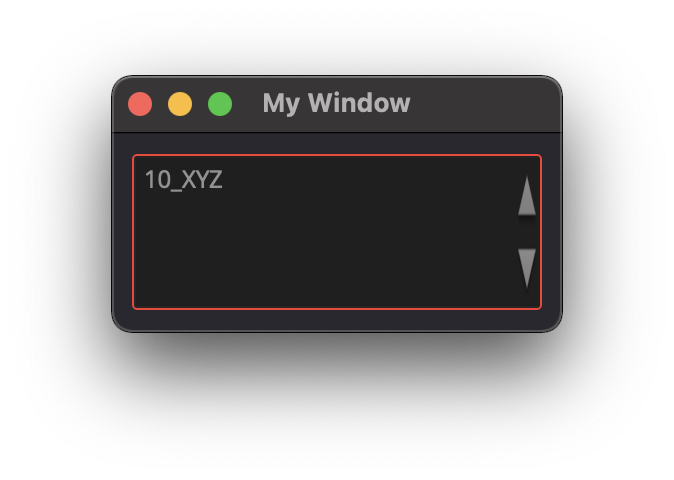

Elements
========

The element's ID is used to find, manage, and dispatch events for that element. GUI elements also support a set of common attributes including 
Enabled, Hidden, Visible, Font, WindowTitle, BackgroundColor, Geometry, ToolTip, StatusTip, StyleSheet, WindowOpacity, MinimumSize, MaximumSize, 
and FixedSize. 

..  note:: 

	For better management of elements, define an ID attribute. Not all example will contain an ID but keep that in mind. 
	
	You can then use the win.Find('ID') to find and update an element and update an attribute win.Find('myButton').Text = "Processing..."

..  important:: You need to create a Window to contain your element and attribute. 

	Check :doc:`UI Element Layout page <UI_elements_layout>` and :doc:`UI Dispatcher functions <UI_dispatcher_func>` for more details.

Window
------

WindowTitle
^^^^^^^^^^^

**Type:** string

..  topic:: Description

	This attribute is used to display a text on the window's title bar. 

..  code-block:: python

    win = dispatcher.AddWindow({
        'ID': "my_window",
        'WindowTitle': 'My Window'
        },
        ui.VGroup([
    		ui.Label({ 'ID': 'label_1', 'Text':'My text' })
        ])
    )

WindowOpacity
^^^^^^^^^^^^^

**Type:** float

..  topic:: Description

	This attribute is used to set the Windows's opacity, (default=1)

..  code-block:: python

    win = dispatcher.AddWindow({
        'ID': "my_window",
        'WindowOpacity': 0.5,  #50% opacity
        },
        ui.VGroup([
    		ui.Label({ 'ID': 'label_1', 'Text':'My text' })
        ])
    )

BackgroundColor
^^^^^^^^^^^^^^^

**Type:** dict RGBA

..  topic:: Description

	This attribute is used change the Window's background color.

..  code-block:: python

    win = dispatcher.AddWindow({
        'ID': "my_window",
        'BackgroundColor': {'R':0.6, 'G':0.1, 'B':0.2, 'A':0.2},
        },
        ui.VGroup([
    		ui.Label({ 'ID': 'label_1', 'Text':'My text' })
        ])
    )

Geometry
^^^^^^^^

**Type:** [posX, posY, width, height]

..  topic:: Description

	This attribute is used to change the Window's position and size.

..  code-block:: python

    win = dispatcher.AddWindow({
        'ID': "my_window",
        'Geometry': [ 400,200,250,125 ],
        },
        ui.VGroup([
    		ui.Label({ 'ID': 'label_1', 'Text':'My text' })
        ])
    )

Label
-----

.. _Label Text:

Text
^^^^

..  topic:: Description

	This label attribute is used to display Text on the element. 

**Type:** string

..  code-block:: python

	ui.Label({ 'ID':'label_1', 'Text': "This is a text" })

Alignment 
^^^^^^^^^

**Type:** ({'Parameter': bool})

..  topic:: Description

	This label attribute is used to align Text inside the Label element. 
	`Check out the qt5 documentation for more details <https://doc.qt.io/qt-5/qt.html#AlignmentFlag-enum>`_

	* AlignCenter
	* AlignLeft
	* AlignRight
	* AlignHCenter
	* AlignVCenter
	* AlignTop
	* AlignBottom
	* AlignJustify
	* AlignBaseline

..  code-block:: python

	ui.Label({ 'ID':'label_1', 'Text': "This is a text", 'Alignment': { 'AlignCenter' : True } })

..  image:: images/UI_label_alignment.png
	:width: 400px
	:align: center

FrameStyle
^^^^^^^^^^

**Type:** int

..  topic:: Description

	This label attribute is used to Style the frame of the Label Element.

	`Check out the qt5 documentation for more details <https://doc.qt.io/qt-5/qframe.html#Shape-enum>`_

	* 0: NoFrame
	* 1: Box
	* 2: Panel
	* 3: WinPanel
	* 4: HLine
	* 5: VLine
	* 6: StyledPanel
	* other to try

..  code-block:: python

	ui.Label({ 'ID': 'label_1', 'Text':'My text', 'FrameStyle': 1 })

WordWrap
^^^^^^^^

**Type:** bool

..  topic:: Description

	This label attribute enable Wordwrap when the Text attribute is longer than the window's width

..  code-block:: python
	
	ui.Label({ 'ID':'label_1', 'Text': "This is a longer text than the window that was created" , 'WordWrap': True })

Indent
^^^^^^

**Type:** bool

..  topic:: Description

	This label attribute

..  note:: Not yet tested

	ui.Label({ 'ID':'label_1', 'Indent': "" })

Margin
^^^^^^

**Type:** 

..  topic:: Description

	This label attribute

..  note:: Not yet tested

	ui.Label({ 'ID':'label_1', 'Margin': "" })

StyleSheet
^^^^^^^^^^

**Type:** string

..  topic:: Description

	This attribute is set to apply a StyleSheet to the Element (similar to CSS)

..  code-block:: python
	
	css_style = f"""
	color: rgb(205, 205, 245); 
	font-family: Garamond; 
	font-weight: bold; 
	font-size: 16px;
	"""

	ui.Label({ 'ID':'label_1', 'StyleSheet': css_style })

MinimumSize
^^^^^^^^^^^

**Type:** [width, height]

..  topic:: Description

	This attribute is used to set a minimum width and height for the element if user resize the window. 

..  code-block:: python

	ui.Label({ 'ID': 'label_1', 'Text':'My text','MinimumSize': [200, 200] })

MaximumSize
^^^^^^^^^^^

**Type:** [width, height]

..  topic:: Description

	This attribute is used to set a maximum width and height for the element if user resize the window. 

..  code-block:: python

	ui.Label({ 'ID': 'label_1', 'Text':'My text','MaximumSize': [400, 400] })

FixedSize
^^^^^^^^^

**Type:** [width, height]

..  topic:: Description

	This attribute is used to set prevent users to resize the window.

..  note:: Not yet tested

	ui.Label({ 'ID': 'label_1', 'Text':'My text','FixedSize': [250, 125] })

Button
------

.. _Button Text:

Text
^^^^

**Type:** string

..  topic:: Description	

	This attribute is used to display Text on the element. 

..  code-block:: 

    ui.Button({ 'ID': 'ok_btn',  'Text': "OK" })

..  image:: images/UI_button_text.png
	:width: 400px
	:align: center

Down
^^^^

**Type:** bool

..  topic:: Description

	This label attribute is used to 

..  note:: Not yet tested

    ui.Button({ 'ID': 'ok_btn',  'Down': "" })

Checkable
^^^^^^^^^

**Type:** bool

..  topic:: Description
	
	This label attribute is used to create a 2 states button. 

..  code-block:: python

    ui.Button({ 'ID': 'ok_btn',  'Checkable': True })

..  |checkon| image:: images/UI_button_checkable_on.png
	:width: 300pt

..  |checkoff| image:: images/UI_button_checkable_off.png
	:width: 300pt

+------------+------------+
| |checkon|  | |checkoff| |
+------------+------------+

Checked
^^^^^^^

**Type:** bool

..  topic:: Description	

	This attribute is used to set the Checked status to a Checkable button

..  code-block:: python

    ui.Button({ 'ID': 'ok_btn', 'Checkable': True, 'Checked': True })

Icon
^^^^

**Type:** 

..  topic:: Description
	
	This attribute is used to add ui.Icon object to the button.

..  code-block:: python

    ui.Button({ 'ID': 'ok_btn',  'Icon': ui.Icon({'File': r"UserData:/Scripts/images/csv.png"}) })

IconSize
^^^^^^^^

**Type:** [int, int]

..  topic:: Description
	
	This attribute is used to resize the Icon with lenght and height numbers. 

..  code-block:: python

	ui.Button({'ID': 'ok_btn',  'Icon': ui.Icon({'File': r"UserData:/Scripts/images/csv.png"}), 'IconSize': [40, 40]})

Flat
^^^^

**Type:** bool

..  topic:: Description
	
	This label attribute is used to 

..  note:: Not yet tested

    ui.Button({ 'ID': 'ok_btn',  'Flat': "" })

CheckBox
--------

Text
^^^^

**Type:** string

..  topic:: Description
	
	This label attribute is used to display Text on the element. 

..  code-block:: 

    ui.CheckBox({ 'ID': 'checkbox_1',  'Text': "OK" })

..  image:: images/UI_checkbox_text.png
	:width: 400px
	:align: center

Down
^^^^

**Type:** bool

..  topic:: Description
	
	This attribute is used to  

..  note:: Not yet tested

    ui.CheckBox({ 'ID': 'checkbox_1',  'Down': "" })

Checkable
^^^^^^^^^

**Type:** bool

..  topic:: Description
	
	This label attribute is used to disable the option to check.  (default=True)

..  code-block:: python

    ui.CheckBox({ 'ID': 'checkbox_1',  'Checkable': False })

Checked
^^^^^^^

**Type:** bool

..  topic:: Description
	
	This label attribute is used to change the checked status of the CheckBox. 

..  code-block:: python

    ui.CheckBox({ 'ID': 'checkbox_1',  'Checked': True })

..  image:: images/UI_checkbox_checked.png
	:width: 400px
	:align: center

Tristate
^^^^^^^^

**Type:**

..  topic:: Description
	
	This label attribute is used to activate a 3 state checkbox

..  code-block:: python

    ui.CheckBox({ 'ID': 'checkbox_1',  'Tristate': True })

.. 	|tri1| image:: images/UI_checkbox_tristate1.png
    :width: 300pt

+---------+---------+---------+
| |tri1|  | |tri2|  | |tri3|  |
+---------+---------+---------+

CheckState
^^^^^^^^^^

**Type:**

..  topic:: Description
	
	This label attribute is used to 

..  note:: Not yet tested

    ui.CheckBox({ 'ID': 'checkbox_1',  'CheckState': "" })

ComboBox
--------

Refer to the :ref:`UI Element Function page <UI_elements_func>` to AddItems to the ComboBox list

ItemText
^^^^^^^^

**Type:**

..  topic:: Description
	
	This label attribute is used to

..  note:: Not yet tested

    ui.ComboBox({ 'ID': 'combo_1',  'ItemText': 'test' })
	win.Find("combo_1").AddItems(["Blue","Cyan","Green","Yellow","Red","Pink","Purple","Fuchsia","Rose","Lavender","Sky","Mint","Lemon","Sand","Cocoa","Cream"])

Editable
^^^^^^^^

**Type:** bool

..  topic:: Description
	
	This attribute is used to allow users to add items to the ComboBox

	Note that those items are not added permanently to the ComboBox list.  

..  code-block:: python

    ui.ComboBox({ 'ID': 'combo_1',  'Editable': True })

CurrentIndex
^^^^^^^^^^^^

**Type:**

..  topic:: Description
	
	This attribute is used to get or change the selected item from the ComboBox
	
..  code-block:: python

    ui.ComboBox({ 'ID': 'combo_1' })
	win.Find("combo_1").AddItems(["Blue","Cyan","Green","Yellow","Red","Pink","Purple","Fuchsia","Rose","Lavender","Sky","Mint","Lemon","Sand","Cocoa","Cream"])
    
	print(win.Find("combo_1").CurrentIndex) #0 will be printed for the first item (default)

	win.Find("combo_1").CurrentIndex =  3 #"Yellow" will be selected

CurrentText
^^^^^^^^^^^

**Type:** string

..  topic:: Description
	
	This attribute is used to get the Text from the selected Item 

..  code-block:: python

    ui.ComboBox({ 'ID': 'combo_1' })

	win.Find("combo_1").AddItems(["Blue","Cyan","Green","Yellow","Red"])
    print(win.Find("combo_1").CurrentText)  # print the first item by default "Blue"

Count
^^^^^

**Type:** int

..  topic:: Description
	
	This label attribute is used to 

..  note:: Not yet tested

    ui.ComboBox({ 'ID': 'combo_1',  'Count': 3 })

SpinBox
-------

Value
^^^^^

**Type:** int

..  topic:: Description
	
	This spinbox attribute is used to set the current SpinBox value (default max=99)

..  code-block:: python

    ui.SpinBox({ 'ID': 'spin_1',  'Value': 10 })

..  image:: images/UI_spinbox_value.png
	:width: 400px
	:align: center

Minimum
^^^^^^^

**Type:** int

..  topic:: Description

	This spinbox attribute is used to set a Minimum value to the SpinBox

..  code-block:: python

    ui.SpinBox({ 'ID': 'spin_1',  'Minimum': 5 })

Maximum
^^^^^^^

**Type:** int

..  topic:: Description		

	This spinbox attribute is used to set a Maximum value to the SpinBox

..  code-block:: python

    ui.SpinBox({ 'ID': 'spin_1',  'Maximum': 8 })

SingleStep
^^^^^^^^^^

**Type:** int

..  topic:: Description	

	This spinbox attribute is used to set the step value of the SpinBox

..  code-block:: python

    ui.SpinBox({ 'ID': 'spin_1',  'SingleStep': 2 })

Prefix
^^^^^^

**Type:** string

..  topic:: Description	

	This spinbox attribute is used add a text prefix to the spinbox value

..  code-block:: python

    ui.SpinBox({ 'ID': 'spin_1',  'Prefix': "ABC_0" })

..  image:: images/UI_spinbox_prefix.png
	:width: 400px
	:align: center

Suffix
^^^^^^

**Type:** string

..  topic:: Description	

	This spinbox attribute is used add a text suffix to the spinbox value

..  code-block:: python

    ui.SpinBox({ 'ID': 'spin_1',  'Suffix': '_XYZ' })

Alignment
^^^^^^^^^

**Type:**

..  topic:: Description		

	This label attribute is used to

..  note:: Not yet tested

    ui.SpinBox({ 'ID': 'spin_1',  'Alignment': "" })

ReadOnly
^^^^^^^^

**Type:** bool

..  topic:: Description	

	This spinbox attribute is used limit the spinbox usage to the side arrows. Keyboard entry disabled

..  code-block:: python

    ui.SpinBox({ 'ID': 'spin_1',  'ReadOnly': True })

Wrapping
^^^^^^^^

**Type:** bool

..  topic:: Description

	This spinbox attribute is used to allow the value to return to the Minimum value when passed Maximum and vice-versa

..  code-block:: python

    ui.SpinBox({ 'ID': 'spin_1',  'Wrapping': True })

Slider
------

Value
^^^^^

**Type:** int

..  topic:: Description	

	This slider attribute is used to set the slider value

..  code-block:: python

    ui.Slider({ 'ID': 'slider_1',  'Value': 5 })

..  image:: images/UI_slider_value.png
	:width: 400px
	:align: center

Minimum
^^^^^^^

**Type:** int

..  topic:: Description		

	This slider attribute is used to set a Minimum value to the Slider

..  code-block:: python

    ui.Slider({ 'ID': 'slider_1',  'Minimum': 2 })

Maximum
^^^^^^^

**Type:** int

..  topic:: Description	

	This slider attribute is used to set a Maximum value to the Slider

..  code-block:: python

    ui.Slider({ 'ID': 'slider_1',  'Maximum': 8 })

SingleStep
^^^^^^^^^^

**Type:** int

..  topic:: Description		

	This slider attribute is used to set the step value of the slider

..  code-block:: python

    ui.Slider({ 'ID': 'slider_1',  'SingleStep': 2 })

PageStep
^^^^^^^^

**Type:**

..  topic:: Description		

	This label attribute is used to

..  note:: Not yet tested

    ui.Slider({ 'ID': 'slider_1',  'PageStep': "" })

Orientation
^^^^^^^^^^^

**Type:** string

..  topic:: Description		

	This slider attribute is used to set the orientation of the slider

	* Vertical
	* Horizontal

..  code-block:: python

    ui.Slider({ 'ID': 'slider_1',  'Orientation': 'Vertical' })

..  image:: images/UI_slider_orientation.png
	:width: 400px
	:align: center

Tracking
^^^^^^^^

**Type:** bool

..  topic:: Description	

	This label attribute is used to... (default=False)

..  note:: Not yet tested

    ui.Slider({ 'ID': 'slider_1',  'Tracking': "" })

SliderPosition
^^^^^^^^^^^^^^

**Type:**

..  topic:: Description	

	This label attribute returns the current Slider value. 

..  code-block:: python

    print(win.Find('slider_1').SliderPosition)  #default=0

LineEdit
--------

Text
^^^^

**Type:** string

..  topic:: Description	

	This attribute is used to set and display the Text in the LineEdit box. For Multi-Line text, use the TextEdit_ element.  

..  note:: Not yet tested

    ui.LineEdit({ 'ID': 'le_1',  'Text': "My Text" })

..  image:: images/UI_lineedit_text.png
	:width: 400px
	:align: center

PlaceholderText
^^^^^^^^^^^^^^^

**Type:** string

..  topic:: Description		

	This attribute is used to display a text in the lineEdit box. 
	The PlaceholderText will be replaced by user input. 

..  code-block:: python

    ui.LineEdit({ 'ID': 'le_1',  'PlaceholderText': "My Placeholder text" })

..  image:: images/UI_lineedit_placeholdertext.png
	:width: 400px
	:align: center

.. _Element Font:

Font
^^^^

**Type:** 

..  topic:: Description
	
	This attribute is used to

..  note:: Not yet tested

    ui.LineEdit({ 'ID': 'le_1',  'Font': "" })

MaxLength
^^^^^^^^^

**Type:** int

..  topic:: Description

	This attribute is used to limit the user input to x(int) character

..  code-block:: python

    ui.LineEdit({ 'ID': 'le_1',  'MaxLength': 10 })

ReadOnly
^^^^^^^^

**Type:** bool

..  topic:: Description

	This attribute is used to set the LineEdit to be Read-Only. 

..  code-block:: python

    ui.LineEdit({ 'ID': 'le_1',  'ReadOnly': True })

Modified
^^^^^^^^

**Type:** 

..  topic:: Description

	This label attribute is used to

..  note:: Not yet tested

    ui.LineEdit({ 'ID': 'le_1',  'Modified': "" })

ClearButtonEnabled
^^^^^^^^^^^^^^^^^^

**Type:** bool

..  topic:: Description

	This attribute is used to add a button to clear the text field

..  code-block:: python

    ui.LineEdit({ 'ID': 'le_1', 'ClearButtonEnabled': True })

..  image:: images/UI_lineedit_ClearButtonEnabled.png
	:width: 400px
	:align: center

TextEdit
--------

Text
^^^^

**Type:** string

..  topic:: Description		

	This attribute is used to set and display the Text in the TextEdit box. 

..  code-block:: python

    ui.TextEdit({ 'ID': 'te_1',  'Text': "My Text" })

..  image:: images/UI_textedit_text.png
	:width: 400px
	:align: center

PlaceholderText
^^^^^^^^^^^^^^^

**Type:** string

..  topic:: Description		

	This attribute is used to display a text in the lineEdit box.

	The PlaceholderText will be replaced by user input. 

..  code-block:: python

    ui.TextEdit({ 'ID': 'te_1',  'PlaceholderText': "My Placeholder Text" })

HTML
^^^^

**Type:** string

..  topic:: Description

	This attribute is used render HTML code inside the TextEdit box

..  code-block:: python

    ui.TextEdit({ 'ID': 'te_1',  'HTML': "<h1>HTML code</h1>" })

..  image:: images/UI_textedit_html.png
	:width: 400px
	:align: center

Font
^^^^

**Type:** ui.Font

..  topic:: Description		

	This attribute is used to specify a Font element with parameters

 .. code-block:: python

    ui.TextEdit({ 'ID': 'te_1',  'Font': ui.Font({ 'Family': "Times New Roman" }) })

Alignment
^^^^^^^^^

**Type:** dict

..  topic:: Description

	This label attribute is used to

..  note:: Not yet tested

    ui.TextEdit({ 'ID': 'te_1',  'Alignment': "" })

ReadOnly
^^^^^^^^

**Type:** bool

..  topic:: Description
	
	This label attribute is used to set the TextEdit to ReadOnly. User cannot add or remove text. 

..  code-block:: python

    ui.TextEdit({ 'ID': 'te_1',  'ReadOnly': True })

TextColor
^^^^^^^^^

**Type:** dict(r,g,b, a) ?

..  topic:: Description		

	This label attribute is used to

..  note:: Not yet tested

    ui.TextEdit({ 'ID': 'te_1',  'TextColor': { 'R':1, 'G': 0, 'B':0, 'A':1 })

TextBackgroundColor
^^^^^^^^^^^^^^^^^^^

**Type:** string

..  topic:: Description

	This label attribute is used to

..  note:: Not yet tested

    ui.TextEdit({ 'ID': 'te_1',  'TextBackgroundColor': "blue" })

TabStopWidth
^^^^^^^^^^^^

**Type:** int

..  topic:: Description

	This attribute is used to set the width of the Tab when inserted. 

..  code-block:: python

    ui.TextEdit({ 'ID': 'te_1',  'TabStopWidth': 50 })

Lexer
^^^^^

**Type:** 

..  topic:: Description
	
	This attribute is used to

..  note:: Not yet tested

    ui.TextEdit({ 'ID': 'te_1',  'Lexer':  })

LexerColors
^^^^^^^^^^^

**Type:** 

..  topic:: Description		

	This attribute is used to

..  note:: Not yet tested

    ui.TextEdit({ 'ID': 'te_1',  'LexerColors': })

ColorPicker
-----------

Text
^^^^

**Type:** string

..  topic:: Description	

	This attribute is used to display a Text with the ColorPicker

..  code-block:: python

    ui.ColorPicker({ 'ID': 'colorpicker_1',  'Text': "My ColorPicker" })

Color
^^^^^

**Type:** dict

..  topic:: Description

	This attribute is used to set a default color to the ColorPicker. 
	Each RGB color using a float value betwee 0 and 1.

..  code-block:: python

    ui.ColorPicker({ 'ID': 'colorpicker_1', 'Color': {'R':0.5, 'G':0, 'B':1.0} })

Tracking
^^^^^^^^

**Type:** bool

..  topic:: Description

	This label attribute is used to

..  note:: Not yet tested

    ui.ColorPicker({ 'ID': 'colorpicker_1',  'Tracking': True })

DoAlpha
^^^^^^^

**Type:** bool

..  topic:: Description		

	This attribute is used to include Alpha value in the RGB ColorPicker

..  code-block:: python

    ui.ColorPicker({ 'ID': 'colorpicker_1',  'DoAlpha': True })

Font
----

Family
^^^^^^

**Type:** string

..  topic:: Description

	This attribute is used to set the font family. 
	Combine with an element using text. 

	* Times New Roman
	* Arial
	* list available font...

..  code-block:: python

    ui.Label({'Text': "My Label", "Font": ui.Font({ 'Family': "Times New Roman" }),

..  image:: images/UI_font_family.png
	:width: 400px
	:align: center

StyleName
^^^^^^^^^

**Type:** string

..  topic:: Description
	
	This label attribute is used to

..  note:: Not yet tested

    ui.Font({ 'StyleName': "" })

PointSize
^^^^^^^^^

**Type:** int

..  topic:: Description	

	This attribute is used to set a size to the Font (pt). 

..  code-block:: python

    ui.Label({'Text': "My Label", "Font": ui.Font({ 'PointSize': 36 }),

PixelSize
^^^^^^^^^

**Type:** int

..  topic:: Description	

	This attribute is used to set a size to the Font (px). 

..  code-block:: python

    ui.Label({'Text': "My Label", "Font": ui.Font({ 'PixelSize': 36 }),

Bold
^^^^

**Type:** bool

..  topic:: Description

	This attribute is used to apply **bold** to the text

..  note:: Do not seems to apply on all fonts

    ui.Label({'Text': "My Label", "Font": ui.Font({ 'Bold': True }),

Italic
^^^^^^

**Type:** bool

..  topic:: Description

	This attribute is used to apply *Italic* to the text

..  code-block:: python

    ui.Label({'Text': "My Label", "Font": ui.Font({ 'Italic': True }),

Underline
^^^^^^^^^

**Type:** bool

..  topic:: Description

	This attribute is used to add a line under the text

..  code-block:: python

    ui.Label({'Text': "My Label", "Font": ui.Font({ 'Underline': True }),

Overline
^^^^^^^^

**Type:** bool

..  topic:: Description

	This attribute is used to add a line on top of the text

..  code-block:: python

    ui.Label({'Text': "My Label", "Font": ui.Font({ 'Overline': True }),

StrikeOut
^^^^^^^^^

**Type:** bool

..  topic:: Description

	This attribute is used to add a line through the text

..  code-block:: python

    ui.Label({'Text': "My Label", "Font": ui.Font({ 'StrikeOut': True }),

Kerning
^^^^^^^

**Type:** 

..  topic:: Description	

	This attribute is used to

..  note:: Not yet tested

    ui.Font({ 'Kerning': 24 })

Weight
^^^^^^

**Type:** int, float

..  topic:: Description

	This attribute is used to set a size relative to other element of the group. 
	Element with Weight 0.5 will be twice the size of an element with Weight 0.25

..  note:: Not yet tested

    ui.Font({ 'Weight': 0.25 })

Stretch
^^^^^^^

**Type:** bool

..  topic:: Description

	This attribute is used to

..  note:: Not yet tested

    ui.Font({ 'Stretch': True })

MonoSpaced
^^^^^^^^^^

**Type:** bool

..  topic:: Description

	This label attribute is used to

..  note:: Not yet tested

    ui.Font({ 'MonoSpaced': True })

.. _Element Icon:

Icon
----

File
^^^^

**Type:** string

..  topic:: Description

	This attribute is used to point to an image file path to use for the Icon Element.
	Need to be joint to an element supporting Icon attribute. (ie: ui.Button)

	* .png 
	* .jpg

..  code-block:: python

	ui.Button({ 'ID': "Browse",  'Text': " Browse", "Icon": ui.Icon({'File': r"UserData:/Scripts/images/csv.png"})})

..  image:: images/UI_icon_file.png
	:width: 400px
	:align: center

TabBar
------

..  note:: 

	Before you can edit TabBar attributes, you need to create a TabBar element, then use the `UI Element function <UI_elements_func>`_ AddTab()
	
	Also note that TabBar has `TabBar Property Array`_

CurrentIndex
^^^^^^^^^^^^

**Type:** int

..  topic:: Description

	This attribute is used to set the current TabBar index

..  note:: Not yet tested

    ui.TabBar({ 'ID':'tabbar_1', 'CurrentIndex': 3 })
	win.Find('tabbar_1').AddTab('Tab1')
    win.Find('tabbar_1').AddTab('Tab2')

TabsClosable
^^^^^^^^^^^^

**Type:** bool

..  topic:: Description

	This attribute is used to add a button to close tabs

..  code-block:: python

    ui.TabBar({ 'ID':'tabbar_1', 'TabsClosable': True })
	win.Find('tabbar_1').AddTab('Tab1')
    win.Find('tabbar_1').AddTab('Tab2')

Expanding
^^^^^^^^^

**Type:** bool

..  topic:: Description
	
	This attribute is used to force tabs to expand or not on Window resize. (default=True)

..  code-block:: python

    ui.TabBar({ 'ID':'tabbar_1', 'Expanding': False })

..  image:: images/UI_tabbar_Expanding.png
	:width: 400px
	:align: center

AutoHide
^^^^^^^^

**Type:** bool

..  topic:: Description
	
	This attribute is used to 

..  note:: Not yet tested

    ui.TabBar({ 'AutoHide': True })

Movable
^^^^^^^

**Type:** bool

..  topic:: Description
	
	This attribute is used to enable Drag'n Drop to reorder tabs (default=False)

..  code-block:: python

    ui.TabBar({ 'ID':'tabbar_1', 'Movable': True })

DrawBase
^^^^^^^^

**Type:** bool

..  topic:: Description
	
	This attribute is used to 

..  note:: Not yet tested

    ui.Tabbar({ 'DrawBase': True })

UsesScrollButtons
^^^^^^^^^^^^^^^^^

**Type:** bool

..  topic:: Description

	This attribute is used to 

..  note:: Not yet tested

    ui.Tabbar({ 'ID':'tabbar_1', 'UsesScrollButtons': True })

DocumentMode
^^^^^^^^^^^^

**Type:** bool

..  topic:: Description

	This attribute is used to 

..  note:: Not yet tested

    ui.Tabbar({ 'DocumentMode': True })

ChangeCurrentOnDrag
^^^^^^^^^^^^^^^^^^^

**Type:** bool

..  topic:: Description
	
	This attribute is used to 

..  note:: Not yet tested

    ui.Tabbar({ 'ChangeCurrentOnDrag': True })

Stack
-----

..  topic:: Description #NotInReadme

	Stack are groups of Elements used with TabBar to manage each pages

..  code-block:: python

	ui.Stack({'ID':'stack_1'})

CurrentIndex
^^^^^^^^^^^^

toolbox_items['Stack'].CurrentIndex = 0

AddChild()
^^^^^^^^^^

toolbox_items['Stack'].AddChild(ui.Button({'ID': "Browse", "Icon": ui.Icon({'File': r"UserData:/Scripts/images/test.gif"}), 'IconSize' : [15, 15]}))

Tree
----

ColumnCount
^^^^^^^^^^^

**Type:** int

..  topic:: Description
	
	This attribute is used to set the number of column in the Tree 

..  code-block:: python

    ui.Tree({ 'ID':'my_tree', 'ColumnCount': 2 })

SortingEnabled
^^^^^^^^^^^^^^

**Type:** bool

..  topic:: Description
	
	This attribute is used to 

..  note:: Not yet tested

    ui.Tree({ 'ID':'my_tree', 'SortingEnabled': True })

ItemsExpandable
^^^^^^^^^^^^^^^

**Type:** bool

..  topic:: Description
	
	This attribute is used to 

..  note:: Not yet tested

    ui.Tree({ 'ID':'my_tree', 'ItemsExpandable': True })

ExpandsOnDoubleClick
^^^^^^^^^^^^^^^^^^^^

**Type:** bool

..  topic:: Description
	
	This attribute is used to 

..  note:: Not yet tested

    ui.Tree({ 'ID':'my_tree', 'ExpandsOnDoubleClick': True })

AutoExpandDelay
^^^^^^^^^^^^^^^

**Type:** bool

..  topic:: Description
	
	This attribute is used to 

..  note:: Not yet tested

    ui.Tree({ 'ID':'my_tree', 'AutoExpandDelay': True })

HeaderHidden
^^^^^^^^^^^^

**Type:** bool

..  topic:: Description
	
	This attribute is used to hide the header row. 

..  code-block:: python

    ui.Tree({ 'ID':'my_tree', 'HeaderHidden': True })

IconSize
^^^^^^^^

**Type:** int

..  topic:: Description
	
	This attribute is used to 

..  note:: Not yet tested

    ui.Tree({ 'ID':'my_tree', 'IconSize': 12 })

RootIsDecorated
^^^^^^^^^^^^^^^

**Type:** bool

..  topic:: Description
	
	This attribute is used to 

..  note:: Not yet tested

    ui.Tree({ 'ID':'my_tree', 'RootIsDecorated': True })

Animated
^^^^^^^^

**Type:** bool

..  topic:: Description
	
	This attribute is used to 

..  note:: Not yet tested

    ui.Tree({ 'ID':'my_tree', 'Animated': True })

AllColumnsShowFocus
^^^^^^^^^^^^^^^^^^^

**Type:** bool

..  topic:: Description

	This attribute is used to 

..  note:: Not yet tested

    ui.Tree({ 'ID':'my_tree', 'AllColumnsShowFocus': True })

WordWrap
^^^^^^^^

**Type:** bool

..  topic:: Description
	
	This attribute is used to 

..  note:: Not yet tested

    ui.Tree({ 'ID':'my_tree', 'WordWrap': True })
	itm = win.Find('my_tree').NewItem()
    itm.Text[0] = "too long text for the cell"
	itm.Text[1] = "this is also too long"
    win.Find('my_tree').AddTopLevelItem(itm)

TreePosition
^^^^^^^^^^^^

**Type:** 

..  topic:: Description

	This attribute is used to 

..  note:: Not yet tested

    ui.Tree({ 'ID':'my_tree', 'TreePosition':  })

SelectionBehavior
^^^^^^^^^^^^^^^^^

**Type:** 

..  topic:: Description
	
	This attribute is used to 

..  note:: Not yet tested

    ui.Tree({ 'ID':'my_tree', 'SelectionBehavior':  })

SelectionMode
^^^^^^^^^^^^^

**Type:** 

..  topic:: Description
	
	This attribute is used to 

..  note:: Not yet tested

    ui.Tree({ 'ID':'my_tree', 'SelectionMode':  })

UniformRowHeights
^^^^^^^^^^^^^^^^^

**Type:** bool

..  topic:: Description
	
	This attribute is used to 

..  note:: Not yet tested

    ui.Tree({ 'ID':'my_tree', 'UniformRowHeights': True })

Indentation
^^^^^^^^^^^

**Type:** bool

..  topic:: Description
	
	This attribute is used to 

..  note:: Not yet tested

    ui.Tree({ 'ID':'my_tree', 'Indentation': True })

VerticalScrollMode
^^^^^^^^^^^^^^^^^^

**Type:** bool

..  topic:: Description
	
	This attribute is used to 

..  note:: Not yet tested

    ui.Tree({ 'ID':'my_tree', 'VerticalScrollMode': True })

HorizontalScrollMode
^^^^^^^^^^^^^^^^^^^^

**Type:** bool

..  topic:: Description

	This attribute is used to 

..  note:: Not yet tested

    ui.Tree({ 'ID':'my_tree', 'HorizontalScrollMode': True })

AutoScroll
^^^^^^^^^^

**Type:** bool

..  topic:: Description
	
	This attribute is used to 

..  note:: Not yet tested

    ui.Tree({ 'ID':'my_tree', 'AutoScroll': True })

AutoScrollMargin
^^^^^^^^^^^^^^^^

**Type:** bool

..  topic:: Description
	
	This attribute is used to 

..  note:: Not yet tested

    ui.Tree({ 'ID':'my_tree', 'AutoScrollMargin': True })

TabKeyNavigation
^^^^^^^^^^^^^^^^

**Type:** bool

..  topic:: Description
	
	This attribute is used to allow Tab to go to next row, Shift+Tab to previous. (default=False)

..  code-block:: python

    ui.Tree({ 'ID':'my_tree', 'TabKeyNavigation': True })

AlternatingRowColors
^^^^^^^^^^^^^^^^^^^^

**Type:** bool

..  topic:: Description
	
	This attribute is used activate atlerning row colors on the Tree (default=False) 

..  code-block:: python

    ui.Tree({ 'ID':'my_tree', 'AlternatingRowColors': True })

FrameStyle
^^^^^^^^^^

**Type:** 

..  topic:: Description
	
	This attribute is used to 

..  note:: Not yet tested

    ui.Tree({ 'ID':'my_tree', 'FrameStyle':  })

LineWidth
^^^^^^^^^

**Type:** int

..  topic:: Description
	
	This attribute is used to 

..  note:: Not yet tested

    ui.Tree({ 'ID':'my_tree', 'LineWidth': 2 })

MidLineWidth
^^^^^^^^^^^^

**Type:** int

..  topic:: Description
	
	This attribute is used to 

..  note:: Not yet tested

    ui.Tree({ 'ID':'my_tree', 'MidLineWidth': 2 })

FrameRect
^^^^^^^^^

**Type:** bool

..  topic:: Description
	
	This attribute is used to 

..  note:: Not yet tested

    ui.Tree({ 'ID':'my_tree', 'FrameRect': True })

FrameShape
^^^^^^^^^^

**Type:** 

..  topic:: Description
	
	This attribute is used to 

..  note:: Not yet tested

    ui.Tree({ 'ID':'my_tree', 'FrameShape':  })

FrameShadow
^^^^^^^^^^^

**Type:** bool

..  topic:: Description
	
	This attribute is used to 

..  note:: Not yet tested

    ui.Tree({ 'ID':'my_tree', 'FrameShadow': True })

TreeItem
--------

..  note:: 

	Before you can edit TreeItem attributes, you need to create a Tree element, then use the `UI Element function <UI_elements_func>`_ to add Item to the Tree
	
	``itm = win.Find('my_tree').NewItem()``
	``win.Find('my_tree').AddTopLevelItem(itm)``

Selected
^^^^^^^^

**Type:** bool

..  topic:: Description
	
	This attribute is used to define the selected status to an item of the Tree. (default=False)

..  code-block:: python

	itm = win.Find('my_tree').NewItem()
	win.Find('my_tree').AddTopLevelItem(itm)

    itm.Selected = True

..  image:: images/UI_treeitem_selected.png
	:width: 400px
	:align: center

Hidden
^^^^^^

**Type:** bool

..  topic:: Description
	
	This attribute is used to define the selected status to an item of the Tree. (default=False)

..  code-block:: python

	itm = win.Find('my_tree').NewItem()
	win.Find('my_tree').AddTopLevelItem(itm)

    itm.Hidden = True

Expanded
^^^^^^^^

**Type:** bool

..  topic:: Description
	
	This attribute is used to define the expanded status to an item of the Tree. (default=False)
	``TreeItem must have child to display.``

..  code-block:: python

    itm = win.Find('my_tree').NewItem()
    itm2 = win.Find('my_tree').NewItem()

    itm.Text[0] = "First cell"
    itm2.Text[0] = "Child of itm"
    itm.AddChild(itm2)

    win.Find('my_tree').AddTopLevelItem(itm)
    itm.Expanded = True

..  image:: images/ui_treeitem_expanded_true.png
	:width: 400px
	:align: center

Disabled
^^^^^^^^

**Type:** bool

..  topic:: Description
	
	This attribute is used to define the disabled status to an item of the Tree. (default=False)
	
	``TreeItem will be grayed out.``

..  code-block:: python

    itm = win.Find('my_tree').NewItem()
    itm2 = win.Find('my_tree').NewItem()

    itm.Text[0] = "First cell"
    itm2.Text[0] = "Child of itm"
    itm.AddChild(itm2)

    win.Find('my_tree').AddTopLevelItem(itm)
    itm.Disabled = True

..  image:: images/ui_treeitem_disabled.png
	:width: 400px
	:align: center

FirstColumnSpanned
^^^^^^^^^^^^^^^^^^

**Type:** bool

..  topic:: Description
	
	This attribute is used to 

..  note:: Not yet tested

    ui.TreeItem({ 'FirstColumnSpanned': True })

Flags
^^^^^

**Type:** bool

..  topic:: Description
	
	This attribute is used to 

..  note:: Not yet tested

    ui.TreeItem({ 'Selected': True })

ChildIndicatorPolicy
^^^^^^^^^^^^^^^^^^^^

**Type:** bool

..  topic:: Description
	
	This attribute is used to 

..  note:: Not yet tested

    ui.TreeItem({ 'Selected': True })

.. important:: Some elements also have property arrays, indexed by item or column (zero-based), e.g. newItem.Text[2] = 'Third column text'

Combo
-----

ItemText[index]
^^^^^^^^^^^^^^^

**Type:** string

..  topic:: Description
	
	This attribute is used to 

..  note:: Not yet tested

	win_recolorize.Find("new_colorID").AddItems(["Blue","Cyan","Green","Yellow","Red","Pink","Purple","Fuchsia","Rose","Lavender","Sky","Mint","Lemon","Sand","Cocoa","Cream"])

TabBar Property Array
---------------------

TabText[index]
^^^^^^^^^^^^^^

**Type:** string

..  topic:: Description
	
	This attribute is used to get or set the Tab Text of the selected Tab index. 

..  code-block:: python

    ui.TabBar({'ID':'tabbar_1'})

    win.Find('tabbar_1').AddTab('Tab1')
    win.Find('tabbar_1').AddTab('Tab2')
    print(win.Find('tabbar_1').TabText[0])  #Tab1

    win.Find('tabbar_1').TabText[0] = 'New Text'

..  image:: images/ui_tabbar_tabtext.png
	:width: 400px
	:align: center

TabToolTip[index]
^^^^^^^^^^^^^^^^^

**Type:** string

..  topic:: Description
	
	This attribute is used to display a text when mouse hover the tab

..  code-block:: python

    ui.TabBar({'ID':'tabbar_1'})
	win.Find('tabbar_1').AddTab('Tab1')

    win.Find('tabbar_1').TabToolTip[0] = 'Tool tip'

TabWhatsThis[ ]
^^^^^^^^^^^^^^^

**Type:** string

..  topic:: Description
	
	This attribute is used to 

..  note:: Not yet tested

    newItem.TabWhatsThis[2] = "Third Tab WhatsThis Text"

TabTextColor[index]
^^^^^^^^^^^^^^^^^^^

**Type:** dict

..  topic:: Description
	
	This attribute is used to change the Tab Text color with RGBA dictionary values. 

..  code-block:: python

    ui.TabBar({'ID':'tabbar_1'})
	win.Find('tabbar_1').AddTab('Tab1')
	win.Find('tabbar_1').TabTextColor[0] = { 'R':1, 'G': 0, 'B':0, 'A':1 }

..  image:: images/UI_tabbar_TabTextColor.png
	:width: 400px
	:align: center

Tree Property Array
-------------------

ColumnWidth[index]
^^^^^^^^^^^^^^^^^^

**Type:** int

..  topic:: Description
	
	This attribute is used change the Width of a Tree column 

..  code-block:: python

    itm = win.Find('my_tree').NewItem()
    itm.Text[0] = "First column"
    itm.Text[1] = "Second column"
    win.Find('my_tree').AddTopLevelItem(itm)

	win.Find('my_tree').ColumnWidth[0] = 200

Treeitem Property Array
-----------------------

Text[index]
^^^^^^^^^^^

**Type:** string

..  topic:: Description
	
	This attribute is used to set the TreeItem text at column index

..  code-block:: python

    itm = win.Find('my_tree').NewItem()
    itm.Text[0] = "First column"
    itm.Text[1] = "Second column"

    win.Find('my_tree').AddTopLevelItem(itm)

StatusTip[ ]
^^^^^^^^^^^^

**Type:** string

..  topic:: Description
	
	This attribute is used to 

..  note:: Not yet tested

    newItem.StatusTip[2] = 'StatusTip'

ToolTip[index]
^^^^^^^^^^^^^^

**Type:** string

..  topic:: Description
	
	This attribute is used to display a text when mouse hover a cell

..  code-block:: python

    itm = win.Find('my_tree').NewItem()

    itm.Text[0] = "First column"
    itm.Text[1] = "Second column"
    itm.ToolTip[0] = 'ToolTip on cell1'

    win.Find('my_tree').AddTopLevelItem(itm)

WhatsThis[ ]
^^^^^^^^^^^^

**Type:** string

..  topic:: Description
	
	This attribute is used to ...

..  note:: Not yet tested

    newItem.WhatsThis[2] = 'WhatsThis'

SizeHint[ ]
^^^^^^^^^^^

**Type:** int

..  topic:: Description
	
	This attribute is used to 

..  note:: Not yet tested

    newItem.SizeHint[2] = 'SizeHint inside Tree in third row'

TextAlignment[ ]
^^^^^^^^^^^^^^^^

**Type:** 

..  topic:: Description
	
	This attribute is used to 

..  note:: Not yet tested

    newItem.TextAlignment[2] = 'TextAlignment inside Tree in third row'

CheckState[ ]
^^^^^^^^^^^^^

**Type:** bool

..  topic:: Description
	
	This attribute is used to 

..  note:: Not yet tested

    newItem.CheckState[2] = 'CheckState inside Tree in third row'

BackgroundColor[index]
^^^^^^^^^^^^^^^^^^^^^^

**Type:** dict

..  topic:: Description
	
	This attribute is used to set a BackgroundColor to a cell using RGBA dictionary. 

..  note:: Not yet tested

    itm = win.Find('my_tree').NewItem()

    itm.Text[0] = "First column"
    itm.Text[1] = "Second column"
    itm.BackgroundColor[1] =  {'R':1, 'G':1, 'B':1, 'A':1}

    win.Find('my_tree').AddTopLevelItem(itm)

TextColor[index]
^^^^^^^^^^^^^^^^

**Type:** dict

..  topic:: Description
	
	This attribute is used to change the color of the text using RGBA dictionary

..  note:: Not yet tested

    itm = win.Find('my_tree').NewItem()

    itm.Text[0] = "First column"
    itm.Text[1] = "Second column"
    itm.TextColor[1] =  {'R':1, 'G':1, 'B':1, 'A':1}

    win.Find('my_tree').AddTopLevelItem(itm)

Icon[index]
^^^^^^^^^^^

**Type:** ui.Icon

..  topic:: Description
	
	This attribute is used to add an icon image into a cell.

	Refer to :ref:`Element Icon` for property list. 

.. code-block:: python

    itm = win.Find('my_tree').NewItem()

    itm.Text[0] = "First column"
    itm.Text[1] = "Second column"
    itm.Icon[1] =  ui.Icon({'File': r"UserData:/Scripts/images/logo.png"})

    win.Find('my_tree').AddTopLevelItem(itm)

Font[index]
^^^^^^^^^^^

**Type:** ui.Font

..  topic:: Description
	
	This attribute is used to modify the Font used inside a cell. 

	Refer to :ref:`Element Font` for property list. 

..  code-block:: python

    itm = win.Find('my_tree').NewItem()

    itm.Text[0] = "First column"
    itm.Text[1] = "Second column"
    itm.Font[1] =  ui.Font({ 'Family': "Arial", 'PointSize': 14})

    win.Find('my_tree').AddTopLevelItem(itm)

	
Some elements like Label and Button will automatically recognise and render basic HTML in their Text attributes, 
and TextEdit is capable of displaying and returning HTML too. 
Element attributes can be specified when creating the element, or can be read or changed later:

..  code-block:: python

	win.Find('myButton').Text = "Processing..."

Timer
-----

Interval
^^^^^^^^

**Type:** int

..  topic:: Description #NotInReadme
	
	This attribute is used to set a time in milisecs to the ui.Timer Element. 

..  code-block:: python

	ui.Timer({ 'ID': 'MyTimer', 'Interval': 1000 })  # 1000 millisecs
    mytimer.Start()
	dispatcher['On']['Timeout'] = OnTimer  #this create a loop each 1000ms

	:ref: UI_elements_func_
	Start() and Stop()   to add in the UI_elements_func.rst

Singleshot
^^^^^^^^^^

**Type:** int

..  topic:: Description
	
	This attribute is used to

..  note:: Not yet tested

	ui.Timer({ 'ID': 'MyTimer', 'Singleshot': 1000 })

RemainingTime
^^^^^^^^^^^^^

**Type:** int

..  topic:: Description
	
	This attribute is used to

..  note:: Not yet tested
	
	ui.Timer({ 'ID': 'MyTimer', 'RemainingTime': 1000 })

IsActive
^^^^^^^^

**Type:** bool

..  topic:: Description
	
	This attribute is used to

..  note:: Not yet tested

	ui.Timer({ 'ID': 'MyTimer', 'IsActive': True })

