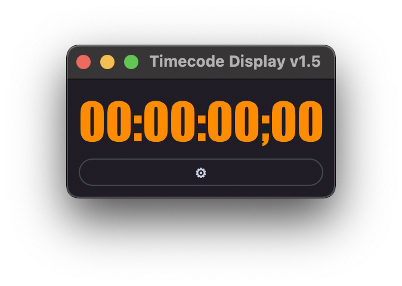

Timecode Display Sample
=======================

.. versionadded:: 1.5

..  code-block:: python
    :caption: timecode_display sample
    :name: timecode_display

    def create_main_window():
        # define the window UI layout
        win_timecode = dispatcher.AddWindow({
            'ID': "tc_display",
            'Geometry': [ 400,200,225,100 ],
            'WindowTitle': "Timecode Display v" + __version__,
            'BackgroundColor': {"R":0.1, "G":0.1, "B":0.2, "A":0.3}
            },
            ui.VGroup([
                ui.Label({ 'ID': 'timecodeID', 'Text': convert_tc(projectFPS),
                    'Weight': 0,
                    'StyleSheet' : update_css_label()
                }),
                ui.Button({ 'ID': 'open_prefs_btn', 'Text': u"\u2699",
                    'Weight': 0,
                    'StyleSheet' : css_prefs
                }),
            ])
        )
        win_timecode_items = win_timecode.GetItems()

        # Event handlers
        def OnClose(ev):
            dispatcher.ExitLoop()

        def OnTimer(ev):
            #   win.Find('timecodeID').Text = currentTimeline.GetCurrentTimecode()
            fps_target = fps_list[win_prefs_items["fps_selection"].CurrentText]
            win_timecode.Find('timecodeID').Text = convert_tc(fps_target)
            
        def OnPrefs(ev):
            win_prefs.Show()
            dispatcher.RunLoop()
            win_prefs.Hide()

        # assign event handlers
        win_timecode.On["tc_display"].Close = OnClose
        dispatcher['On']['Timeout'] = OnTimer
        
        win_timecode.On["open_prefs_btn"].Clicked = OnPrefs

        return win_timecode, win_timecode_items
